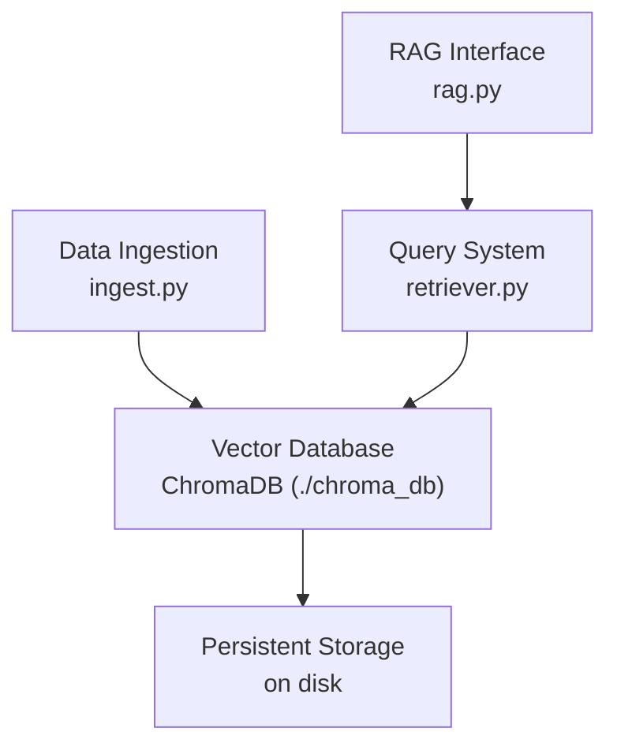
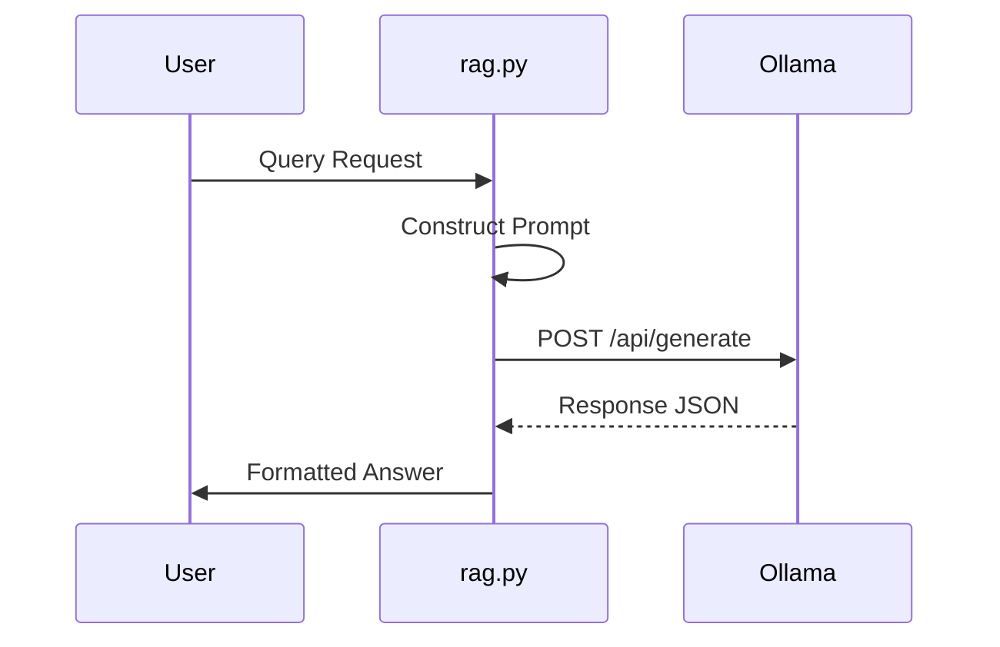

# Configuration & Setup

<cite>
**Referenced Files in This Document**   
- [requirements.txt](file://requirements.txt)
- [ingest.py](file://ingest.py)
- [rag.py](file://rag.py)
- [retriever.py](file://retriever.py)
- [seek/rag.py](file://seek/rag.py)
- [seek/app.py](file://seek/app.py)
</cite>

## Table of Contents
1. [System Configuration Overview](#system-configuration-overview)
2. [Dependency Installation](#dependency-installation)
3. [Environment Setup](#environment-setup)
4. [Configuration Parameters](#configuration-parameters)
5. [Database Configuration](#database-configuration)
6. [Model Settings](#model-settings)
7. [Scraping Configuration](#scraping-configuration)
8. [API Integration](#api-integration)
9. [Deployment Scenarios](#deployment-scenarios)
10. [Troubleshooting Guide](#troubleshooting-guide)
11. [Security Considerations](#security-considerations)

## System Configuration Overview

The vendor-rag-model system is a Retrieval-Augmented Generation (RAG) pipeline designed for construction procurement, enabling users to query product and vendor information from IndiaMART's database. The system integrates multiple components including data ingestion, vector storage, semantic search, and natural language generation. Configuration involves setting up dependencies, database paths, model parameters, and API connections to ensure seamless operation across different deployment environments.

**Section sources**
- [requirements.txt](file://requirements.txt#L1-L168)
- [ingest.py](file://ingest.py#L1-L94)
- [rag.py](file://rag.py#L1-L71)

## Dependency Installation

To install all required dependencies for the vendor-rag-model system, use the provided requirements.txt file which contains a comprehensive list of Python packages. Execute the following command in your terminal:

```bash
pip install -r requirements.txt
```

Key dependencies include:
- **chromadb==1.0.20**: Vector database for storing and retrieving embeddings
- **faiss-cpu==1.12.0**: Facebook AI Similarity Search library used in the seek module
- **sentence-transformers==5.1.0**: For generating text embeddings using 'all-MiniLM-L6-v2' model
- **ollama==0.5.3**: Interface to the local LLM serving system
- **Flask==3.1.1**: Web framework used in application interfaces
- **pandas==2.3.1**: Data manipulation and analysis
- **numpy==2.3.2**: Numerical computing
- **streamlit==1.49.1**: Used in the seek/app.py interface

The system also requires Ollama to be installed and running locally for LLM inference. Install Ollama by following the instructions at https://ollama.com/ before proceeding with Python dependencies.

**Section sources**
- [requirements.txt](file://requirements.txt#L62-L122)
- [ingest.py](file://ingest.py#L2-L4)
- [retriever.py](file://retriever.py#L1-L3)

## Environment Setup

The system requires specific environment configurations to operate correctly. No explicit environment variables file is present, but critical paths and settings are hardcoded in the source files. The primary configuration involves ensuring proper directory structure and service availability:

1. Ensure the JSON data directory exists at `/json` relative to the project root (or as specified in the code)
2. Verify that Ollama is running on localhost:11434
3. Create a `chroma_db` directory for persistent vector storage
4. Ensure all scraped JSON files are placed in the json/ directory

For the seek module specifically, the system expects JSON files to be located at `/home/subi/Documents/rag/vendor-rag-model/json`, which should be modified for different deployment environments.

**Section sources**
- [seek/rag.py](file://seek/rag.py#L13)
- [ingest.py](file://ingest.py#L23)
- [retriever.py](file://retriever.py#L4)

## Configuration Parameters

The system utilizes several configurable parameters across different modules:

### RAG System Parameters
- **top_k**: Number of top results to retrieve (default: 5 in rag.py, 10 in seek/rag.py)
- **max_tokens**: Maximum tokens for text chunking (400 with 50-token overlap)
- **temperature**: Generation temperature (0.7 for Ollama queries)
- **model**: LLM model identifier ("llama3:latest" by default)

### Search Parameters
- **k**: Number of search results to return
- **apply_filters**: Boolean flag to enable query-based filtering
- **overlap**: Token overlap between text chunks (50 tokens)

These parameters are primarily hardcoded in the source files rather than being environment-driven, requiring code modification for customization.

**Section sources**
- [rag.py](file://rag.py#L26)
- [ingest.py](file://ingest.py#L7)
- [seek/rag.py](file://seek/rag.py#L12)

## Database Configuration

The system uses ChromaDB for vector storage in the main RAG implementation and FAISS in the seek module. Configuration details:

### ChromaDB Configuration
- **Storage Path**: "./chroma_db" (relative to project root)
- **Collection Name**: "products"
- **Persistence**: Enabled via PersistentClient
- **Embedding Dimension**: Determined by 'all-MiniLM-L6-v2' model (384 dimensions)

### FAISS Configuration
- **Index Type**: IndexFlatL2 (exact search with L2 distance)
- **Storage**: In-memory (no persistent storage implemented)
- **Distance Metric**: L2 (Euclidean) distance

The ingest.py script initializes ChromaDB with persistent storage, while retriever.py connects to the same database for query operations.



**Diagram sources**
- [ingest.py](file://ingest.py#L23)
- [retriever.py](file://retriever.py#L4)
- [rag.py](file://rag.py#L4)

**Section sources**
- [ingest.py](file://ingest.py#L21-L24)
- [retriever.py](file://retriever.py#L4)
- [seek/rag.py](file://seek/rag.py#L95-L105)

## Model Settings

The system employs several machine learning models with specific configurations:

### Embedding Model
- **Model Name**: sentence-transformers/all-MiniLM-L6-v2
- **Framework**: Sentence Transformers
- **Embedding Dimension**: 384
- **Use Case**: Converting text to vectors for semantic search
- **Initialization**: Loaded in both ingest.py and retriever.py

### Language Model
- **Model Name**: llama3:latest
- **Framework**: Ollama
- **Endpoint**: http://localhost:11434/api/generate
- **Parameters**: 
  - temperature: 0.7
  - max_tokens: 300
  - stream: False

### Text Chunking
- **Tokenizer**: AutoTokenizer from transformers
- **Max Tokens per Chunk**: 400
- **Overlap**: 50 tokens
- **Purpose**: Ensuring text fits within model context limits

The embedding model is used consistently across ingestion and retrieval phases to maintain vector space compatibility.

**Section sources**
- [ingest.py](file://ingest.py#L21-L22)
- [retriever.py](file://retriever.py#L6)
- [rag.py](file://rag.py#L4-L10)

## Scraping Configuration

The system relies on pre-scraped product data stored in JSON files within the json/ directory. Key aspects of the scraping configuration:

- **Data Directory**: json/ (relative path)
- **File Format**: JSON containing product information with fields like title, description, details, company_info, seller_info, and reviews
- **File Naming Convention**: Category-specific files (e.g., cement.json, chillers_links.json)
- **Data Structure**: Either a single product object or an array of product objects

The system processes all JSON files in the json/ directory during ingestion. No active scraping configuration is present in the current codebase, suggesting that scraping is performed externally and results are stored as JSON files.

**Section sources**
- [ingest.py](file://ingest.py#L25)
- [seek/rag.py](file://seek/rag.py#L13)
- [json](file://json)

## API Integration

The system integrates with Ollama's API for language model inference. Configuration details:

- **API Endpoint**: http://localhost:11434/api/generate
- **HTTP Method**: POST
- **Request Format**: JSON payload with model, prompt, stream flag, and options
- **Response Handling**: Error handling for RequestException with fallback response
- **Timeout**: Not explicitly set (uses requests library defaults)

The query_ollama function in rag.py handles all API interactions, constructing the appropriate payload and processing responses. The system assumes Ollama is running locally and accessible on the default port.



**Diagram sources**
- [rag.py](file://rag.py#L8-L10)
- [seek/rag.py](file://seek/rag.py#L8)

**Section sources**
- [rag.py](file://rag.py#L4-L24)
- [seek/rag.py](file://seek/rag.py#L8)

## Deployment Scenarios

### Local Development Setup
1. Install Python dependencies: `pip install -r requirements.txt`
2. Install and start Ollama service
3. Pull the llama3 model: `ollama pull llama3`
4. Place JSON data files in the json/ directory
5. Run ingestion: `python ingest.py`
6. Test the RAG system: `python rag.py`

### Production Considerations
- **Database**: Use persistent ChromaDB storage with regular backups
- **Model Serving**: Consider using a more robust LLM serving solution than Ollama for production
- **API Endpoint**: The seek/app.py provides a Streamlit interface that could be deployed using Streamlit Sharing or a similar service
- **Scalability**: The current FAISS implementation in seek/rag.py uses in-memory storage, which may need modification for large datasets
- **Security**: Implement authentication and rate limiting for public APIs

### Seek Module Specifics
The seek module (seek/app.py and seek/rag.py) represents a specialized deployment scenario with:
- Streamlit-based web interface
- Pre-trained LightGBM models (lgb_classifier.pkl, lgb_regressor.pkl)
- Label encoder and deterministic mapping files
- CSV data files for preprocessing (clean_train_c.csv, clean_train_r.csv)

**Section sources**
- [ingest.py](file://ingest.py)
- [rag.py](file://rag.py)
- [seek/app.py](file://seek/app.py)
- [seek/rag.py](file://seek/rag.py)

## Troubleshooting Guide

### Missing Dependencies
**Symptom**: ModuleNotFoundError or ImportError
**Solution**: 
1. Verify all packages are installed: `pip install -r requirements.txt`
2. Check for platform-specific issues with packages like faiss-cpu
3. Ensure Ollama is installed and running

### Database Connection Errors
**Symptom**: ChromaDB or FAISS initialization failures
**Solution**:
1. Verify the chroma_db directory exists and is writable
2. Check file permissions for the database directory
3. Ensure no other process is locking the database files
4. For FAISS, verify sufficient memory is available

### Model Loading Failures
**Symptom**: Ollama API errors or model not found
**Solution**:
1. Verify Ollama service is running: `ollama serve`
2. Check if the model is downloaded: `ollama list`
3. Pull the required model: `ollama pull llama3`
4. Verify network connectivity to localhost:11434

### Data Ingestion Issues
**Symptom**: No documents indexed or JSON parsing errors
**Solution**:
1. Verify JSON files are in the json/ directory
2. Check JSON file validity using a JSON validator
3. Ensure files have .json extension
4. Verify file encoding is UTF-8

### Empty Search Results
**Symptom**: Queries return no relevant products
**Solution**:
1. Verify ingestion completed successfully
2. Check that the ChromaDB collection contains documents
3. Test with simple queries first
4. Verify embedding model consistency between ingestion and retrieval

**Section sources**
- [ingest.py](file://ingest.py#L30-L35)
- [rag.py](file://rag.py#L20-L24)
- [retriever.py](file://retriever.py#L10-L18)

## Security Considerations

### Configuration Management
- **Hardcoded Paths**: The system contains hardcoded paths (e.g., seek/rag.py references a specific home directory path) which should be parameterized in production
- **No Environment Variables**: Sensitive configuration is not separated from code, making it difficult to manage across environments
- **API Endpoint Exposure**: The Ollama API is accessed directly without authentication

### Data Security
- **Local Storage**: All data is stored locally without encryption
- **No Access Controls**: The system lacks user authentication and authorization mechanisms
- **Input Validation**: Limited input validation on queries, potentially vulnerable to prompt injection attacks

### Recommendations
1. Externalize configuration using environment variables or configuration files
2. Implement proper error handling that doesn't expose system details
3. Add input sanitization to prevent prompt injection
4. Use HTTPS and authentication for any exposed APIs
5. Implement logging with appropriate log levels and rotation
6. Regularly update dependencies to address security vulnerabilities
7. Consider encrypting sensitive data at rest

The current configuration prioritizes functionality over security, which is appropriate for a development environment but requires enhancement for production deployment.

**Section sources**
- [seek/rag.py](file://seek/rag.py#L13)
- [rag.py](file://rag.py#L8)
- [requirements.txt](file://requirements.txt)