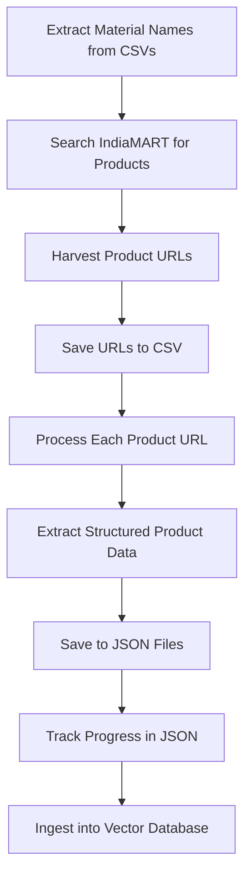
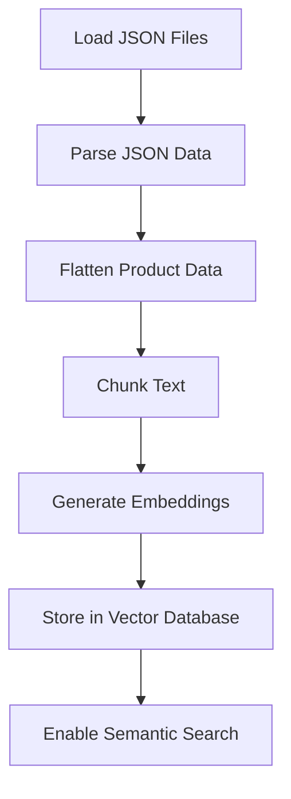

# Data Acquisition Module

<cite>
**Referenced Files in This Document**   
- [link-scrap.py](file://link-scrap.py)
- [details.py](file://details.py)
- [scraping_progress.json](file://scraping_progress.json)
- [all_products.json](file://all_products.json)
- [ingest.py](file://ingest.py)
</cite>

## Table of Contents
1. [Introduction](#introduction)
2. [Scraping Workflow Overview](#scraping-workflow-overview)
3. [Link Harvesting with link-scrap.py](#link-harvesting-with-link-scrapy)
4. [Product Data Extraction with details.py](#product-data-extraction-with-detailspy)
5. [Data Normalization and Storage](#data-normalization-and-storage)
6. [Progress Tracking and Error Handling](#progress-tracking-and-error-handling)
7. [Rate Limiting and Anti-Blocking Measures](#rate-limiting-and-anti-blocking-measures)
8. [Downstream Processing Pipeline](#downstream-processing-pipeline)
9. [Common Issues and Mitigation Strategies](#common-issues-and-mitigation-strategies)
10. [Conclusion](#conclusion)

## Introduction
The data acquisition system is designed to systematically harvest product information from IndiaMART, a leading B2B marketplace in India. This document details the implementation of two core scripts—`link-scrap.py` for harvesting product URLs from search results and `details.py` for extracting structured product information from individual vendor pages. The system enables comprehensive data collection for construction materials and other products, supporting downstream analysis and retrieval-augmented generation (RAG) applications.

**Section sources**
- [link-scrap.py](file://link-scrap.py#L1-L162)
- [details.py](file://details.py#L1-L344)

## Scraping Workflow Overview
The data acquisition process follows a two-stage workflow: first harvesting product listing URLs from search results, then extracting detailed information from each product page. The workflow begins with `link-scrap.py`, which searches for construction materials using keywords extracted from CSV files, navigates through paginated search results, and collects product URLs. These URLs are then processed by `details.py`, which scrapes detailed product information, seller details, company information, and customer reviews. The entire process is tracked in `scraping_progress.json`, and results are consolidated into structured JSON files for downstream processing.

**Diagram sources**
- [link-scrap.py](file://link-scrap.py#L107-L158)
- [details.py](file://details.py#L1-L344)
- [scraping_progress.json](file://scraping_progress.json#L1-L100)

## Link Harvesting with link-scrap.py
The `link-scrap.py` script implements a robust link harvesting mechanism that systematically searches for construction materials on IndiaMART and collects product URLs. The script begins by extracting material names from two CSV files (`facility_construction_summary.csv` and `construction_materials_by_facility.csv`), combining them into a deduplicated list of search queries. For each material, the script performs a search on IndiaMART, navigates through paginated results, and extracts URLs of product detail pages.

The script uses Selenium with Chrome WebDriver to interact with the website, employing headless mode for background execution. It includes anti-detection measures such as disabling automation flags and modifying the navigator.webdriver property to avoid bot detection. The harvested links are stored in `indiamart_anchor_links.csv` with associated metadata including the search query, URL, and product title.

**Section sources**
- [link-scrap.py](file://link-scrap.py#L1-L162)

## Product Data Extraction with details.py
The `details.py` script extracts comprehensive product information from individual vendor pages on IndiaMART. It reads the URLs collected by `link-scrap.py` from `indiamart_anchor_links.csv` and processes each page to extract structured data. The extraction process captures multiple categories of information:

- **Product details**: Price, price unit, and key-value pairs from product specification tables
- **Product description**: Detailed product descriptions from the product page
- **Seller information**: Seller name, location, GST number, TrustSEAL verification status, years of experience, rating, number of reviews, response rate, contact person, full address, and website
- **Company information**: Company details from the "About the Company" section including GST registration date, legal status, nature of business, number of employees, annual turnover, and company description
- **Reviews**: Overall rating, rating distribution, performance metrics, and individual customer reviews with ratings, reviewer information, dates, and review text

The script uses Selenium to navigate to each product page and WebDriverWait to ensure elements are loaded before extraction. It employs multiple CSS selectors and XPath expressions to locate and extract the required information, with comprehensive error handling to manage missing or malformed data.

**Section sources**
- [details.py](file://details.py#L1-L344)

## Data Normalization and Storage
The extracted product data is normalized into a consistent JSON structure and saved to multiple JSON files. Each product entry includes all collected information in a structured format with standardized field names. The data is organized into nested objects for different categories (details, seller_info, company_info, reviews), with consistent data types and formatting.

The primary output is saved to `all_products.json`, which contains an array of all scraped products. Additionally, category-specific JSON files are created in the `json/` directory (e.g., `cement_links.json`, `cctv_links.json`) containing products related to specific material types. The JSON output uses UTF-8 encoding with ensure_ascii=False to preserve non-ASCII characters, and indentation for readability.

The data structure includes:
- **url**: The product page URL
- **title**: Product title
- **price**: Numeric price value
- **price_unit**: Unit of price (e.g., "Piece")
- **details**: Key-value pairs from product specifications
- **description**: Product description text
- **seller_info**: Seller-related information
- **company_info**: Company-related information
- **reviews**: Array of review objects with various types (overall_rating, rating_distribution, performance_metric, individual_review)

**Section sources**
- [details.py](file://details.py#L331-L344)
- [all_products.json](file://all_products.json#L1-L1534)

## Progress Tracking and Error Handling
The system implements comprehensive progress tracking and error handling to ensure reliability and facilitate recovery from interruptions. The scraping progress is tracked in `scraping_progress.json`, which records the current processing index, total processed count, successful and failed scrapes, start time, last update time, completed URLs, and failed URLs.

The scripts include multiple layers of error handling:
- Try-except blocks around critical operations to catch and log exceptions
- Timeout handling for WebDriverWait operations
- NoSuchElementException handling for missing page elements
- CSV and JSON file operation error handling
- Graceful driver shutdown in finally blocks

The progress tracking enables the system to resume from the last completed URL in case of interruptions, avoiding redundant scraping of already processed pages. The error handling ensures that individual page scraping failures do not terminate the entire process, allowing the system to continue with subsequent URLs.

**Section sources**
- [scraping_progress.json](file://scraping_progress.json#L1-L100)
- [details.py](file://details.py#L200-L344)

## Rate Limiting and Anti-Blocking Measures
To avoid being blocked by IndiaMART's anti-bot systems, the data acquisition system implements several rate limiting and anti-detection measures. The `link-scrap.py` script includes a 2-second delay between search queries to prevent overwhelming the server with rapid requests. Both scripts use Selenium with Chrome WebDriver configured in headless mode, which reduces resource consumption and allows for background execution.

The system employs various anti-detection techniques:
- Headless browser execution with `--headless` argument
- Disabling of automation-controlled features with `--disable-blink-features=AutomationControlled`
- Exclusion of automation switches with `excludeSwitches` experimental option
- Disabling of automation extensions with `useAutomationExtension` experimental option
- Modification of the navigator.webdriver property via execute_script to hide automation indicators

These measures help the scraper appear more like a legitimate user, reducing the likelihood of detection and blocking by IndiaMART's security systems.

**Section sources**
- [link-scrap.py](file://link-scrap.py#L11-L24)
- [details.py](file://details.py#L4-L15)

## Downstream Processing Pipeline
The harvested product data feeds into a downstream processing pipeline implemented in `ingest.py`, which prepares the data for retrieval-augmented generation (RAG) applications. The pipeline loads JSON files from the `json/` directory, processes each product entry, and converts the structured data into text chunks suitable for embedding.

The ingestion process:
1. Loads all JSON files from the `json/` directory
2. Parses JSON content, handling both single objects and arrays
3. Flattens product data into a textual representation by concatenating title, description, details, company information, seller information, and reviews
4. Splits long texts into chunks of approximately 400 tokens with overlap to ensure context continuity
5. Generates embeddings using the SentenceTransformer model 'all-MiniLM-L6-v2'
6. Stores embeddings, text chunks, and metadata in a ChromaDB vector database

The processed data enables semantic search and retrieval capabilities, supporting applications such as product recommendation, vendor comparison, and market analysis.

**Diagram sources**
- [ingest.py](file://ingest.py#L1-L94)

## Common Issues and Mitigation Strategies
The data acquisition system faces several common challenges when scraping IndiaMART, including CAPTCHAs, dynamic content loading, IP blocking, and inconsistent page structures. The following mitigation strategies are implemented:

**CAPTCHAs**: While not explicitly handled in the current implementation, potential solutions include:
- Implementing CAPTCHA solving services (e.g., 2Captcha, Anti-Captcha)
- Using residential proxy networks to rotate IP addresses
- Reducing request frequency to avoid triggering CAPTCHA challenges

**Dynamic Content Loading**: Addressed through:
- WebDriverWait to wait for elements to load before extraction
- Explicit waits for specific elements (e.g., product tables)
- Time.sleep() delays to allow JavaScript execution

**IP Blocking**: Mitigated by:
- Rate limiting with 2-second delays between requests
- Headless browser with anti-detection measures
- Potential future implementation of proxy rotation

**Inconsistent Page Structures**: Handled through:
- Comprehensive try-except blocks around element extraction
- Multiple fallback selectors for critical elements
- Graceful handling of missing data (setting default values like "N/A")
- Robust error logging to identify problematic pages

**Data Quality Issues**: Managed by:
- Validation of extracted data before storage
- Deduplication of material names in the harvesting phase
- Consistent data normalization in the output JSON
- Comprehensive logging of scraping errors for later analysis

**Section sources**
- [link-scrap.py](file://link-scrap.py#L48-L105)
- [details.py](file://details.py#L200-L344)

## Conclusion
The data acquisition system effectively harvests product information from IndiaMART through a two-stage process of link harvesting and detailed data extraction. The implementation demonstrates robust handling of web scraping challenges, including anti-bot detection, dynamic content, and error resilience. The structured output in JSON format enables seamless integration with downstream processing pipelines for retrieval-augmented generation applications. Future enhancements could include CAPTCHA solving, proxy rotation for IP blocking mitigation, and more sophisticated rate limiting based on server response times.