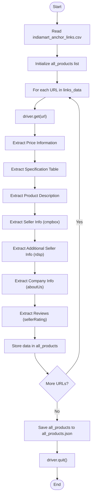
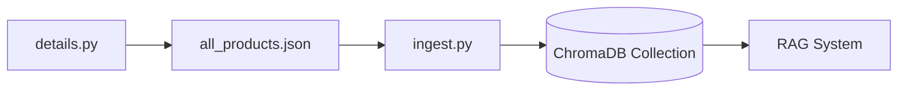

# Details Scraping

<cite>
**Referenced Files in This Document**   
- [details.py](file://details.py)
- [indiamart_anchor_links.csv](file://indiamart_anchor_links.csv)
- [all_products.json](file://all_products.json)
- [ingest.py](file://ingest.py)
</cite>

## Table of Contents
1. [Introduction](#introduction)
2. [Core Components](#core-components)
3. [Data Extraction Process](#data-extraction-process)
4. [Error Handling and Robustness](#error-handling-and-robustness)
5. [Data Normalization and Output](#data-normalization-and-output)
6. [Integration with Downstream Components](#integration-with-downstream-components)
7. [Performance and Scalability Considerations](#performance-and-scalability-considerations)
8. [Troubleshooting Guide](#troubleshooting-guide)

## Introduction
The `details.py` script is a critical component of the vendor-RAG system, responsible for extracting structured product information from individual vendor pages on IndiaMART. It processes a list of URLs from the `indiamart_anchor_links.csv` file, scrapes detailed product data using Selenium, and outputs a consolidated JSON file (`all_products.json`) that serves as the foundation for downstream RAG operations. This document provides a comprehensive analysis of the implementation, focusing on data extraction logic, error handling, normalization, and integration with the ingestion pipeline.

## Core Components

The `details.py` script implements a Selenium-based web scraper that systematically visits product pages and extracts structured data. It initializes a Chrome WebDriver instance with default options (headless mode is commented out), reads product URLs from `indiamart_anchor_links.csv`, and iterates through each URL to scrape product details. The script constructs a hierarchical data structure for each product, including pricing, specifications, descriptions, seller and company information, and customer reviews. All collected data is aggregated into a list and serialized to `all_products.json` upon completion.

**Section sources**
- [details.py](file://details.py#L1-L344)

## Data Extraction Process

The script extracts data from multiple sections of the IndiaMART product page using CSS selectors and XPath expressions. For product pricing, it targets the element with ID `askprice_pg-1` and parses the price value and unit from its child elements. Product specifications are extracted from a table with the CSS class `.fs14.color.tabledesc`, where each row is processed to create key-value pairs stored in the `details` dictionary. The product description is retrieved from the element with class `.pro-descN`.

Seller information is gathered from two distinct sections: the `cmpbox` and `rdsp` elements. The `cmpbox` contains the seller's location, name, GST number, TrustSEAL verification status, years of experience, rating, number of reviews, and response rate. The `rdsp` section provides additional details such as the contact person's name, full address, and website URL. Company information is extracted from the "About the Company" section (ID `aboutUs`), which includes company details and description. Customer reviews are collected from the "Ratings & Reviews" section (ID `sellerRating`), including overall ratings, rating distribution, performance metrics, and individual reviews with their associated metadata.

**Diagram sources**
- [details.py](file://details.py#L15-L344)

## Error Handling and Robustness

The script implements comprehensive error handling to manage missing elements and dynamic content loading. Each data extraction block is wrapped in a try-except block to catch `NoSuchElementException` and other exceptions. When an element is not found, the corresponding field is set to 'N/A' or a default value, ensuring the scraping process continues uninterrupted. The script uses `WebDriverWait` with `EC.presence_of_element_located` to wait for the specification table to load, preventing timing issues. Specific selectors are used for dynamic content, such as the response rate in the seller information section, which uses an XPath expression to locate text containing "Response Rate". This robust error handling ensures that the script can process hundreds of product pages even when some data points are missing or the page structure varies.

**Section sources**
- [details.py](file://details.py#L15-L344)

## Data Normalization and Output

The extracted data is normalized into a consistent JSON schema. The script creates a dictionary for each product with standardized keys such as `url`, `title`, `price`, `price_unit`, `details`, `description`, `seller_info`, `company_info`, and `reviews`. The `details` dictionary stores product specifications as key-value pairs, with keys converted to lowercase and spaces replaced with underscores. Nested structures like `seller_info` and `company_info` are populated with data from their respective sections. The `reviews` list contains objects of different types, including overall ratings, rating distribution, performance metrics, and individual reviews. After processing all URLs, the aggregated data is written to `all_products.json` with proper indentation and UTF-8 encoding, ensuring compatibility with downstream components.

**Section sources**
- [details.py](file://details.py#L15-L344)
- [all_products.json](file://all_products.json)

## Integration with Downstream Components

The `all_products.json` file generated by `details.py` serves as the primary input for the `ingest.py` script, which prepares the data for vector indexing. The ingestion process flattens the structured product data into text chunks, combining the title, description, specifications, seller information, company information, and top reviews into a single text representation. This text is then chunked using a tokenizer and embedded with a SentenceTransformer model. The resulting embeddings are stored in a ChromaDB collection, enabling efficient similarity search and retrieval. This integration allows the RAG system to leverage detailed product information for generating accurate and context-rich responses to user queries.

**Diagram sources**
- [details.py](file://details.py#L15-L344)
- [ingest.py](file://ingest.py#L0-L94)
- [all_products.json](file://all_products.json)

## Performance and Scalability Considerations

The script manages browser resource usage by reusing a single WebDriver instance for all page visits, reducing overhead. However, it uses a fixed 3-second sleep after each page load, which may be inefficient for fast-loading pages and insufficient for slow ones. A more scalable approach would use dynamic waits with timeouts. The script processes URLs sequentially, which can be slow for large datasets. Parallel processing with multiple WebDriver instances could improve performance but would increase resource consumption. The current implementation is suitable for moderate-scale scraping but may require optimization for very large datasets or high-frequency updates.

**Section sources**
- [details.py](file://details.py#L15-L344)

## Troubleshooting Guide

Common issues in the scraping process include CAPTCHA challenges, dynamic content loading, and inconsistent HTML structures across vendors. To address these, ensure the WebDriver is properly configured to handle dynamic content with explicit waits. For CAPTCHA issues, consider implementing headless mode with stealth plugins or using proxy rotation. Debug failed extractions by inspecting the page source and verifying CSS selectors and XPath expressions. Use the `scraper_log.txt` file to identify patterns in failures. For performance issues, optimize wait times and consider parallel processing. Regularly validate the output JSON schema to ensure consistency with downstream components.

**Section sources**
- [details.py](file://details.py#L15-L344)
- [scraper_log.txt](file://scraper_log.txt)