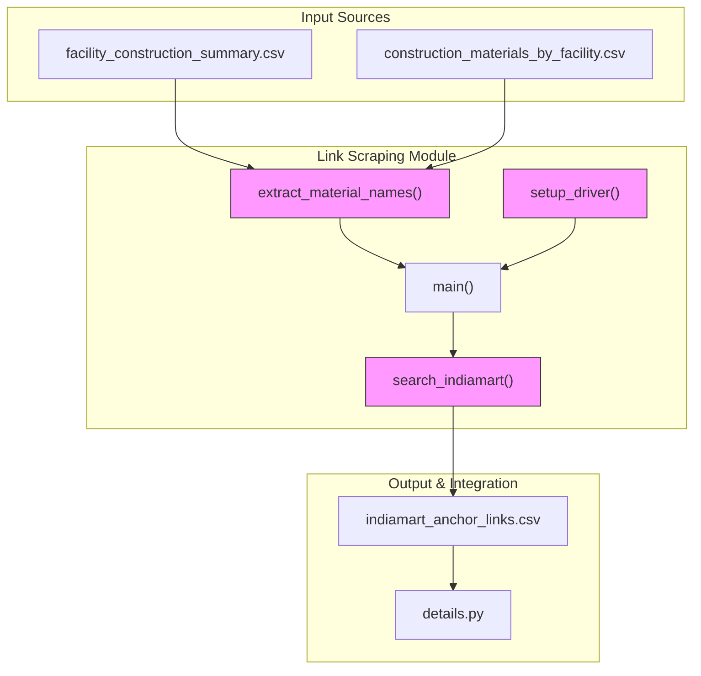
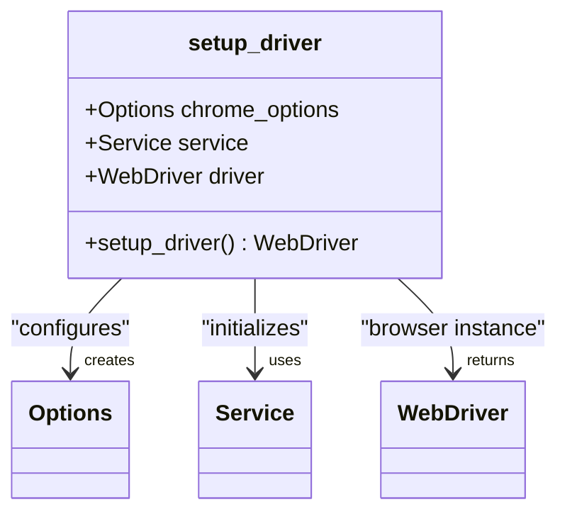
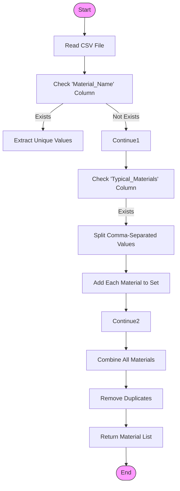
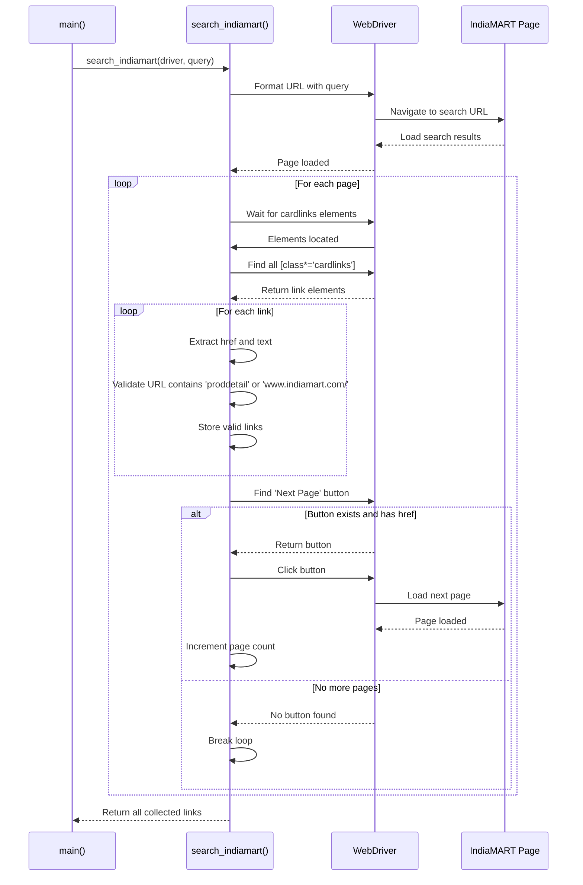
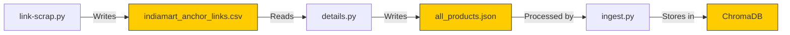

# Link Scraping

<cite>
**Referenced Files in This Document**   
- [link-scrap.py](file://link-scrap.py)
- [details.py](file://details.py)
- [indiamart_anchor_links.csv](file://indiamart_anchor_links.csv)
- [ingest.py](file://ingest.py)
- [scraper_log.txt](file://scraper_log.txt)
</cite>

## Table of Contents
1. [Introduction](#introduction)
2. [Core Components](#core-components)
3. [Architecture Overview](#architecture-overview)
4. [Detailed Component Analysis](#detailed-component-analysis)
5. [Integration with Data Pipeline](#integration-with-data-pipeline)
6. [Anti-Detection and Evasion Strategies](#anti-detection-and-evasion-strategies)
7. [Error Handling and Troubleshooting](#error-handling-and-troubleshooting)
8. [Performance Optimization](#performance-optimization)
9. [Conclusion](#conclusion)

## Introduction

The link scraping component, implemented in `link-scrap.py`, serves as the initial data acquisition stage in a multi-phase web scraping pipeline targeting IndiaMART, a major B2B marketplace. This module automates the process of discovering product listing pages by programmatically searching for construction materials and extracting valid product URLs. The collected links are stored in a structured CSV format for subsequent processing by downstream components that extract detailed product information. The scraper employs Selenium with Chrome WebDriver to handle dynamic content loading and implements various anti-detection measures to minimize the risk of IP blocking and CAPTCHA challenges.

## Core Components

The link scraping module consists of three primary functions that work in concert to discover and collect product URLs from IndiaMART. The `setup_driver()` function configures a headless Chrome browser with anti-automation detection settings, `extract_material_names()` processes CSV inputs to identify search terms, and `search_indiamart()` performs the actual web scraping of search results across multiple pages.

**Section sources**
- [link-scrap.py](file://link-scrap.py#L11-L105)

## Architecture Overview

**Diagram sources **
- [link-scrap.py](file://link-scrap.py#L11-L105)
- [details.py](file://details.py#L1-L344)

## Detailed Component Analysis

### Driver Configuration and Anti-Detection

The `setup_driver()` function creates a Chrome WebDriver instance configured for headless operation with multiple anti-detection measures. These settings are crucial for mimicking human browsing behavior and avoiding automated bot detection systems employed by websites like IndiaMART.

**Diagram sources **
- [link-scrap.py](file://link-scrap.py#L11-L24)

#### Key Anti-Detection Measures
- **Headless Mode**: The `--headless` argument runs Chrome without a GUI, reducing resource consumption while maintaining functionality
- **Sandbox Disabling**: `--no-sandbox` and `--disable-dev-shm-usage` arguments help prevent detection in containerized environments
- **Automation Flag Removal**: The `--disable-blink-features=AutomationControlled` argument and experimental options disable Chrome's automation indicators
- **WebDriver Property Spoofing**: JavaScript execution redefines the `navigator.webdriver` property to `undefined`, concealing automation

**Section sources**
- [link-scrap.py](file://link-scrap.py#L11-L24)

### Material Name Extraction

The `extract_material_names()` function processes CSV files to extract material names for use as search queries. It handles two potential column formats: a direct 'Material_Name' column and a comma-separated 'Typical_Materials' column, ensuring comprehensive coverage of potential search terms.

**Diagram sources **
- [link-scrap.py](file://link-scrap.py#L26-L46)

**Section sources**
- [link-scrap.py](file://link-scrap.py#L26-L46)

### Search and Pagination Logic

The `search_indiamart()` function implements the core scraping logic, navigating IndiaMART search results and extracting product links across multiple pages. It handles dynamic content loading through explicit waits and implements pagination by detecting and clicking the "Next Page" button.

**Diagram sources **
- [link-scrap.py](file://link-scrap.py#L48-L105)

**Section sources**
- [link-scrap.py](file://link-scrap.py#L48-L105)

## Integration with Data Pipeline

The link scraping component integrates seamlessly with the broader data acquisition pipeline. After collecting product URLs, it saves them to `indiamart_anchor_links.csv`, which serves as the input for `details.py`, the subsequent module responsible for extracting detailed product information from each individual product page.

**Diagram sources **
- [link-scrap.py](file://link-scrap.py#L107-L162)
- [details.py](file://details.py#L1-L344)
- [ingest.py](file://ingest.py#L1-L94)

The scraper log file `scraper_log.txt` provides runtime diagnostics, including warnings about CAPTCHA detection, which helps monitor the scraping process and identify potential issues.

**Section sources**
- [link-scrap.py](file://link-scrap.py#L107-L162)
- [details.py](file://details.py#L1-L344)
- [ingest.py](file://ingest.py#L1-L94)
- [scraper_log.txt](file://scraper_log.txt#L1-L8)

## Anti-Detection and Evasion Strategies

The scraper employs multiple strategies to avoid detection and maintain reliable operation. These include headless browser operation, request throttling, and browser fingerprint spoofing.

### Headless Mode Benefits
- Reduced memory and CPU usage compared to GUI browsers
- Faster execution without rendering overhead
- Suitable for server environments without display systems

### Request Throttling
The implementation includes deliberate delays between operations:
- 3-second wait after page navigation to allow content loading
- 2-second delay between search queries to prevent rate limiting
- Explicit WebDriverWait for critical elements before interaction

### Browser Fingerprint Spoofing
The configuration actively conceals automation indicators:
- Disabling Chrome's automation extension and switches
- Modifying the navigator.webdriver property via JavaScript execution
- Using standard browser arguments that mimic typical user configurations

**Section sources**
- [link-scrap.py](file://link-scrap.py#L11-L24)
- [scraper_log.txt](file://scraper_log.txt#L1-L8)

## Error Handling and Troubleshooting

The scraper includes comprehensive error handling to manage common web scraping challenges. The log file reveals that CAPTCHA detection is a recurring issue, with entries indicating "CAPTCHA detected for Acoustic Barriers. Skipping." This suggests the scraper detects CAPTCHA challenges and gracefully skips problematic queries rather than failing entirely.

### Common Issues and Mitigation
- **Timeout Errors**: Addressed through WebDriverWait with 10-second timeouts and fallback logic
- **Missing Elements**: Handled with try-catch blocks that continue processing when expected elements are absent
- **CAPTCHA Challenges**: Detected through pattern recognition in page content, with automatic query skipping
- **IP Blocking**: Mitigated through request delays and headless browser configuration

### Troubleshooting Guidance
When the scraper fails to collect expected links:
1. Verify CSV input files contain valid material names in expected columns
2. Check `scraper_log.txt` for CAPTCHA warnings or timeout messages
3. Ensure chromedriver is available in the system PATH
4. Validate internet connectivity and IndiaMART accessibility
5. Consider increasing delay times if rate limiting is suspected

**Section sources**
- [link-scrap.py](file://link-scrap.py#L1-L162)
- [scraper_log.txt](file://scraper_log.txt#L1-L8)

## Performance Optimization

The implementation balances thoroughness with efficiency through several optimization techniques. Headless mode significantly reduces resource consumption, while the use of WebDriverWait ensures elements are fully loaded before interaction, preventing premature timeouts.

### Efficient Waiting Strategies
- **Explicit Waits**: Using WebDriverWait with expected_conditions for specific elements rather than fixed sleep durations
- **Conditional Processing**: Skipping materials shorter than 3 characters to avoid irrelevant searches
- **Batch Processing**: Collecting all links in memory before writing to CSV to minimize I/O operations

### Resource Management
- Proper driver cleanup using try-finally blocks to ensure browser instances are terminated
- Memory-efficient data structures (sets for deduplication) during material name extraction
- Streamlined CSV writing with DictWriter for consistent output formatting

**Section sources**
- [link-scrap.py](file://link-scrap.py#L1-L162)

## Conclusion

The link scraping component effectively automates the discovery of product URLs from IndiaMART through a robust implementation of Selenium with comprehensive anti-detection measures. By processing material names from CSV inputs, navigating search results with proper pagination handling, and storing links for downstream processing, this module forms the critical first stage of a multi-phase data acquisition pipeline. The integration with `details.py` and subsequent ingestion into ChromaDB enables the creation of a comprehensive product knowledge base. While challenges like CAPTCHA detection require ongoing attention, the current implementation provides a solid foundation for scalable web scraping with appropriate error handling and performance optimizations.