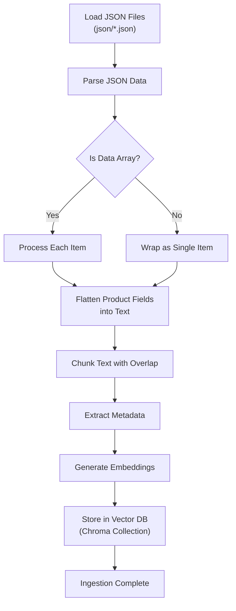
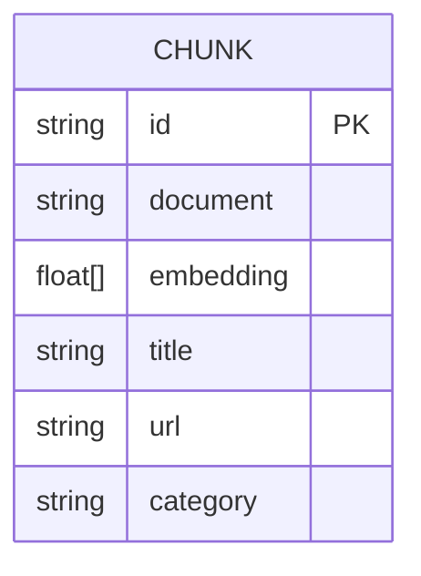
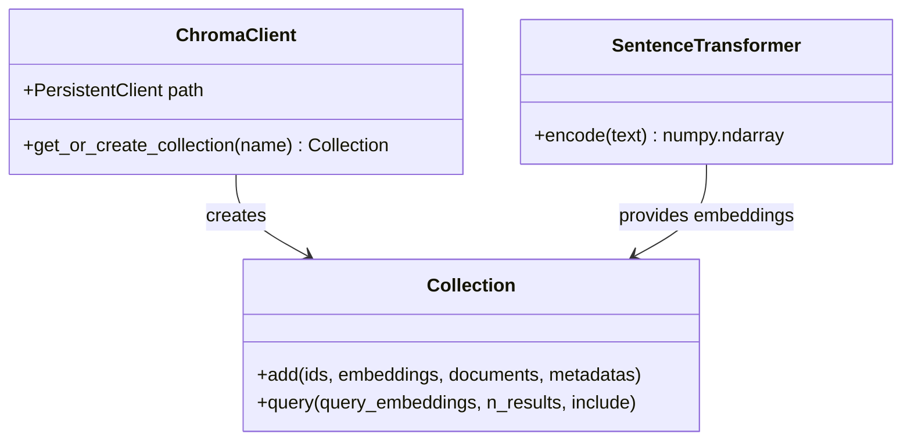
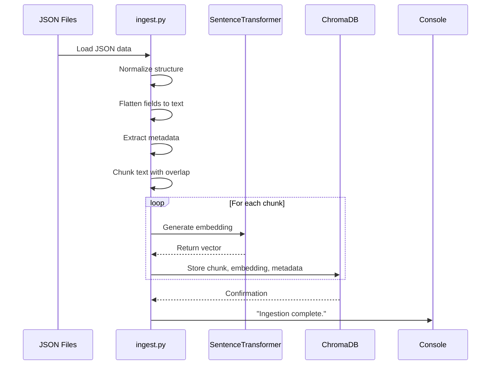

# Data Processing Module

<cite>
**Referenced Files in This Document**   
- [ingest.py](file://ingest.py)
- [details.py](file://details.py)
- [retriever.py](file://retriever.py)
- [rag.py](file://rag.py)
- [json/all_products.json](file://json/all_products.json)
</cite>

## Table of Contents
1. [Introduction](#introduction)
2. [Data Processing Pipeline Overview](#data-processing-pipeline-overview)
3. [Text Chunking Strategy](#text-chunking-strategy)
4. [Metadata Enrichment Process](#metadata-enrichment-process)
5. [Data Validation and Error Handling](#data-validation-and-error-handling)
6. [Vector Database Integration](#vector-database-integration)
7. [End-to-End Data Flow](#end-to-end-data-flow)
8. [Conclusion](#conclusion)

## Introduction

The data processing module is responsible for transforming raw JSON product data from IndiaMART into vector-ready documents suitable for retrieval-augmented generation (RAG) applications. This document details the ingestion process implemented in `ingest.py`, which systematically cleans, normalizes, and structures product information for optimal indexing in a vector database. The module ensures that product attributes such as vendor name, location, specifications, and reviews are preserved and made searchable, enabling accurate and context-rich responses to user queries.

**Section sources**
- [ingest.py](file://ingest.py#L1-L94)

## Data Processing Pipeline Overview

The data processing pipeline begins with raw JSON files containing product information scraped from IndiaMART. The `ingest.py` script orchestrates the transformation of this data into a format optimized for semantic search and retrieval. The pipeline follows a structured sequence: loading JSON data, flattening hierarchical fields into coherent text, chunking long text segments, enriching with metadata, and finally embedding and storing in a vector database.

The process handles both single JSON objects and arrays of products, ensuring consistent processing regardless of input structure. Text content is constructed by concatenating key product fields including title, description, detailed specifications, company information, seller details, and reviews. This comprehensive text representation captures the full context of each product, enabling rich semantic understanding during retrieval.



**Diagram sources**
- [ingest.py](file://ingest.py#L26-L94)

**Section sources**
- [ingest.py](file://ingest.py#L26-L94)
- [details.py](file://details.py#L1-L345)

## Text Chunking Strategy

The text chunking strategy is designed to balance context preservation with model limitations. The `chunk_text` function splits product descriptions and details into manageable segments that fit within the token constraints of the embedding model while maintaining semantic coherence through overlapping windows.

```python
def chunk_text(text, tokenizer, max_tokens=400, overlap=50):
    tokens = tokenizer.encode(text, add_special_tokens=False)
    chunks = []
    for i in range(0, len(tokens), max_tokens - overlap):
        chunk_tokens = tokens[i:i + max_tokens]
        chunk = tokenizer.decode(chunk_tokens)
        chunks.append(chunk)
    return chunks
```

The algorithm uses a sliding window approach with a stride of `max_tokens - overlap` (350 tokens) to create overlapping segments. Each chunk contains up to 400 tokens, with a 50-token overlap between consecutive chunks. This overlap ensures that sentences or concepts spanning chunk boundaries are represented in multiple segments, improving retrieval accuracy. The tokenizer from the `all-MiniLM-L6-v2` model is used to ensure accurate token counting and decoding, maintaining consistency between ingestion and retrieval phases.

This strategy is particularly effective for product data, where key specifications might appear at the boundary between logical sections. The overlap provides redundancy that increases the likelihood of capturing complete product attributes in at least one chunk, even when they span natural text breaks.

**Diagram sources**
- [ingest.py](file://ingest.py#L7-L18)

**Section sources**
- [ingest.py](file://ingest.py#L7-L18)

## Metadata Enrichment Process

During processing, each text chunk is enriched with metadata that preserves critical product context for filtering and attribution. The metadata extraction process captures essential product attributes that remain intact throughout the chunking and embedding process.

The metadata dictionary includes:
- **Title**: Product name for identification
- **URL**: Source link for traceability
- **Category**: Product classification from details



This metadata is preserved alongside the embedded text in the ChromaDB collection, enabling post-retrieval filtering and source attribution. When queries are processed, the metadata allows the system to identify which products and vendors are referenced in the retrieved context, ensuring accurate citation in the final response.

The enrichment process occurs during the main ingestion loop, where metadata is extracted from the original JSON structure before chunking. Category information is specifically pulled from the `details` object, maintaining the product classification hierarchy from the source data.

**Section sources**
- [ingest.py](file://ingest.py#L75-L80)

## Data Validation and Error Handling

The data processing module implements robust validation and error handling to ensure data integrity throughout the ingestion pipeline. The system gracefully handles malformed JSON files and empty text segments, preventing pipeline failures while maintaining data quality.

When loading JSON files, the process wraps `json.load()` in a try-except block that catches `JSONDecodeError` exceptions. Files that fail to parse are skipped with a console message, allowing the pipeline to continue processing valid files:

```python
try:
    data = json.load(f)
except json.JSONDecodeError:
    print(f"Skipping invalid JSON: {file_path}")
    continue
```

Additional validation occurs during chunk processing, where empty or whitespace-only chunks are filtered out before embedding:

```python
if not chunk.strip():
    continue
```

This prevents the storage of meaningless embeddings that would waste database space and potentially affect retrieval performance. The system also handles both array and object JSON structures by normalizing inputs into a consistent list format, ensuring uniform processing regardless of source data structure.

These validation mechanisms ensure that only clean, meaningful data enters the vector database, maintaining the quality of the retrieval system while providing visibility into data issues through console logging.

**Section sources**
- [ingest.py](file://ingest.py#L30-L34)
- [ingest.py](file://ingest.py#L85-L87)

## Vector Database Integration

The processed data is integrated into a persistent ChromaDB vector database, enabling efficient similarity search for the RAG application. The integration process creates embeddings using the SentenceTransformer model and stores them with their corresponding text and metadata.



The embedding model `all-MiniLM-L6-v2` generates 384-dimensional vectors that capture the semantic meaning of each text chunk. Each document is assigned a unique ID combining the source file name, item index, and chunk index, enabling precise traceability. The ChromaDB collection is configured for persistent storage at `./chroma_db`, ensuring data persistence across application restarts.

This integration creates a searchable index where product information can be retrieved based on semantic similarity rather than keyword matching, enabling natural language queries about product features, vendor qualifications, and customer reviews.

**Diagram sources**
- [ingest.py](file://ingest.py#L21-L24)
- [ingest.py](file://ingest.py#L88-L93)
- [retriever.py](file://retriever.py#L1-L6)

**Section sources**
- [ingest.py](file://ingest.py#L21-L24)
- [ingest.py](file://ingest.py#L88-L93)

## End-to-End Data Flow

The complete data flow from raw JSON to retrievable vector embeddings demonstrates the cohesive operation of the processing pipeline. Starting with JSON files in the `json/` directory, the system processes each file through a series of transformations that prepare the data for semantic search.



The processed data feeds directly into the retrieval system implemented in `retriever.py` and `rag.py`. When a user query is received, the same embedding model generates a query vector that is compared against the stored document vectors using cosine similarity. The top-k most similar chunks are retrieved and used as context for the language model, ensuring that responses are grounded in accurate product information.

This end-to-end flow ensures consistency between ingestion and retrieval, as both processes use the same embedding model and text processing assumptions. The chunking strategy, metadata enrichment, and error handling work together to create a reliable foundation for the RAG application, where retrieval accuracy depends on the quality of preprocessing.

**Diagram sources**
- [ingest.py](file://ingest.py#L1-L94)
- [retriever.py](file://retriever.py#L8-L18)
- [rag.py](file://rag.py#L20-L45)

**Section sources**
- [ingest.py](file://ingest.py#L1-L94)
- [retriever.py](file://retriever.py#L8-L18)
- [rag.py](file://rag.py#L20-L45)

## Conclusion

The data processing module effectively transforms raw product JSON into a structured, searchable knowledge base optimized for retrieval-augmented generation. By implementing careful text chunking with overlap, comprehensive metadata enrichment, and robust error handling, the system ensures high-quality input to the vector database. The consistent preprocessing pipeline preserves critical product attributes while enabling semantic search across vendor information, product specifications, and customer reviews. This foundation supports accurate and context-rich responses to natural language queries, making it a critical component of the overall RAG architecture.