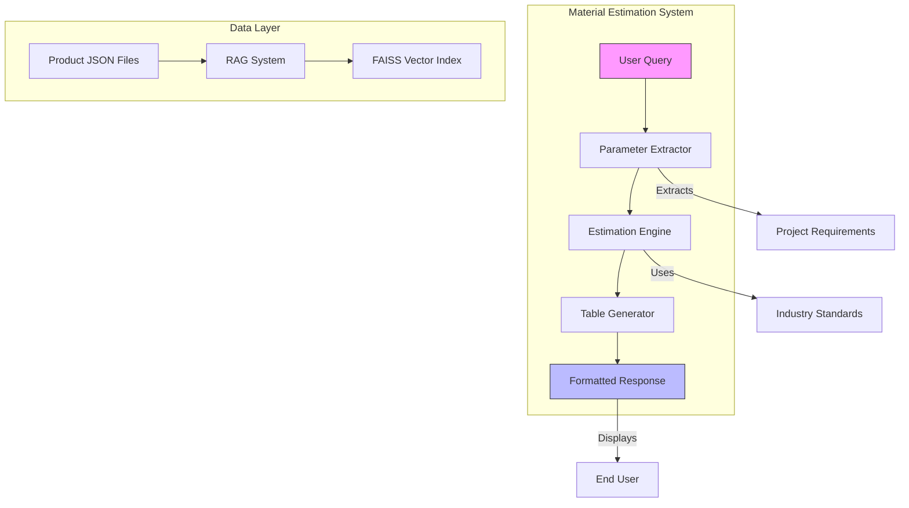
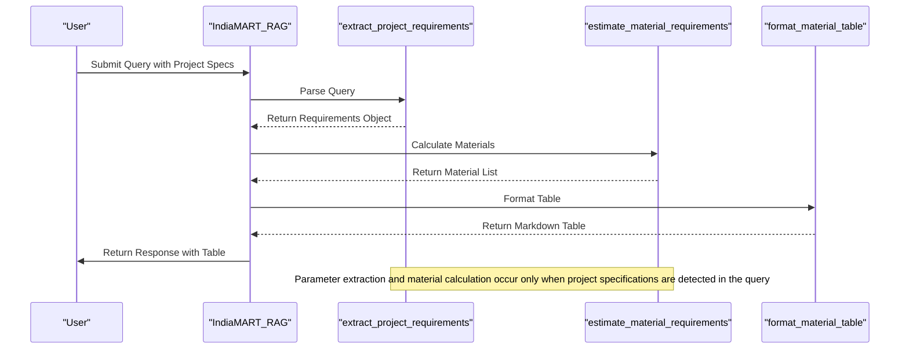
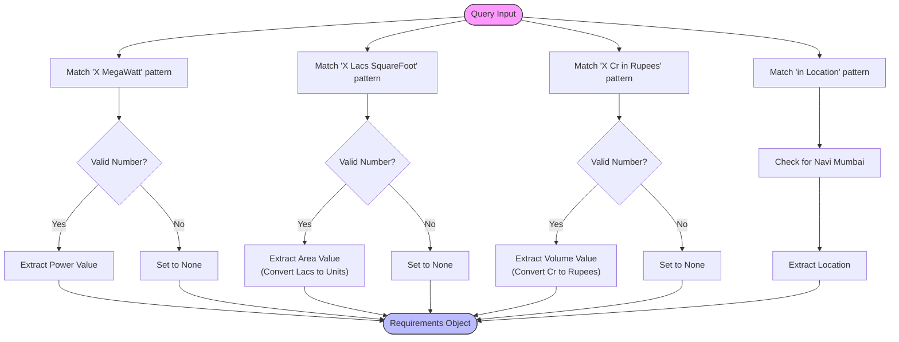
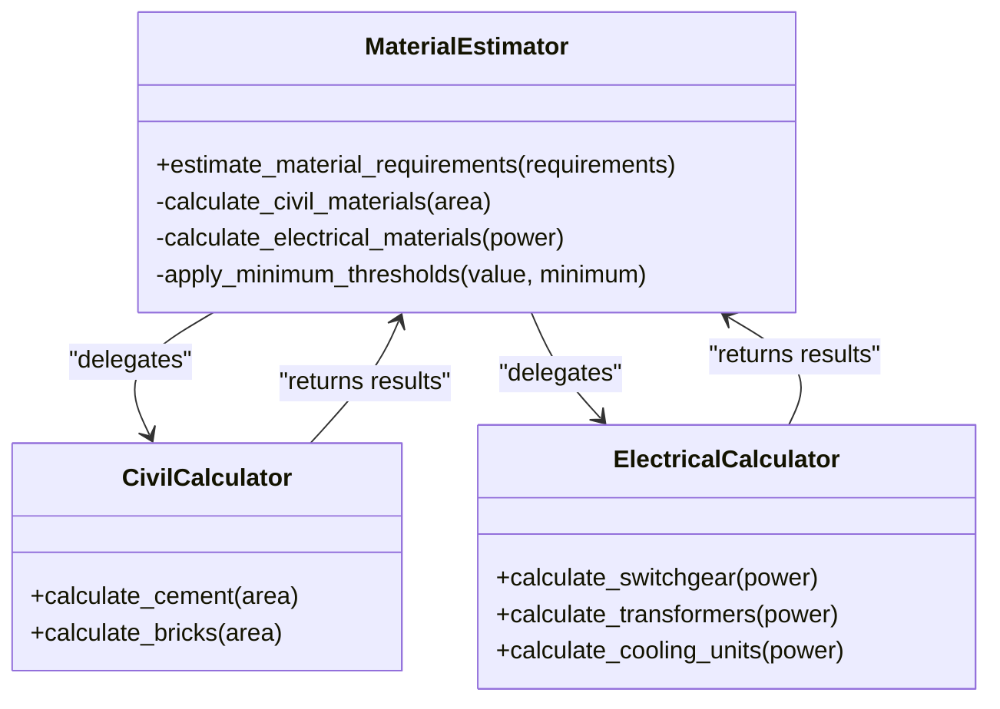
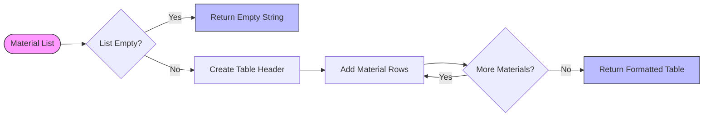
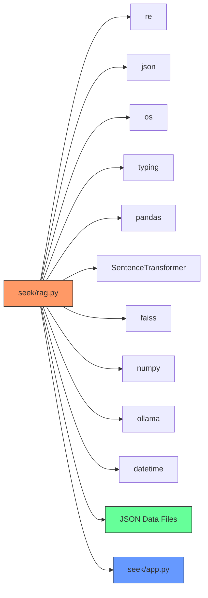

<cite>
**Referenced Files in This Document**   
- [seek/rag.py](file://seek/rag.py)
- [seek/app.py](file://seek/app.py)
</cite>

# Material Estimation Engine

## Table of Contents
1. [Introduction](#introduction)
2. [Project Structure](#project-structure)
3. [Core Components](#core-components)
4. [Architecture Overview](#architecture-overview)
5. [Detailed Component Analysis](#detailed-component-analysis)
6. [Dependency Analysis](#dependency-analysis)
7. [Performance Considerations](#performance-considerations)
8. [Troubleshooting Guide](#troubleshooting-guide)
9. [Conclusion](#conclusion)

## Introduction
The Material Estimation Engine is a specialized component within the vendor-rag-model system designed to extract project specifications from user queries and convert them into detailed material requirement estimates. This engine leverages natural language processing techniques to identify key project parameters such as power capacity, built-up area, and budget, then applies industry-standard formulas to calculate material quantities across different construction domains. The system is particularly focused on providing accurate estimations for both civil construction materials and electrical infrastructure components, with results formatted in a clear table structure for easy interpretation.

## Project Structure
The material estimation functionality is primarily contained within the `seek` directory of the vendor-rag-model repository. The core logic resides in the `rag.py` file, which implements the RAG (Retrieval-Augmented Generation) system with integrated material estimation capabilities. Supporting files include various JSON data files containing product information and links, while the `app.py` file provides a Streamlit interface for project prediction. The system follows a modular structure with clear separation between input parsing, calculation logic, and output formatting components.

**Diagram sources**
- [seek/rag.py](file://seek/rag.py#L207-L241)
- [seek/rag.py](file://seek/rag.py#L243-L301)

**Section sources**
- [seek/rag.py](file://seek/rag.py#L11-L409)
- [seek/app.py](file://seek/app.py#L1-L110)

## Core Components
The material estimation system comprises three primary components working in concert: the project requirements extractor, the material estimation calculator, and the table formatter. These components are implemented as methods within the `IndiaMART_RAG` class in the `seek/rag.py` file. The system processes user queries containing project specifications, extracts relevant parameters using regular expressions, applies domain-specific calculation algorithms, and presents the results in a structured format. The integration with the RAG system allows for additional context retrieval from product databases, enhancing the estimation with real-world vendor information.

**Section sources**
- [seek/rag.py](file://seek/rag.py#L207-L370)

## Architecture Overview
The Material Estimation Engine operates as an integrated module within the larger RAG-based procurement assistance system. When a user submits a query containing project specifications, the system first parses the natural language input to extract quantitative parameters. These parameters are then fed into specialized calculation algorithms that apply industry-standard norms to estimate material requirements. The results are formatted into a markdown table and incorporated into the final response, which may also include retrieved product information from the vendor database. The architecture follows a pipeline pattern with clear separation between parsing, calculation, and presentation layers, allowing for modular updates and maintenance.

**Diagram sources**
- [seek/rag.py](file://seek/rag.py#L207-L241)
- [seek/rag.py](file://seek/rag.py#L243-L301)
- [seek/rag.py](file://seek/rag.py#L357-L370)

## Detailed Component Analysis

### Project Requirements Extraction
The system employs regular expression patterns to extract key project parameters from unstructured user queries. This parsing mechanism identifies numerical values associated with specific units and converts them into standardized formats for downstream processing. The extraction process handles multiple parameter types including power capacity in megawatts, built-up area in square feet (expressed in lacs), project volume in crores of rupees, and geographical location. Special handling is implemented for specific locations like Navi Mumbai to ensure accurate extraction even when mentioned in different formats.

**Diagram sources**
- [seek/rag.py](file://seek/rag.py#L207-L241)

**Section sources**
- [seek/rag.py](file://seek/rag.py#L207-L241)

### Material Estimation Algorithms
The calculation engine applies domain-specific formulas to convert project parameters into material quantities. For civil construction projects, the system uses standard norms such as 0.4 cement bags per square foot and 8 bricks per square foot. For electrical infrastructure projects, the calculations are based on power capacity, with formulas like one medium voltage switchgear lineup per 2.5 MW and one transformer per 5 MW. The system also estimates cooling equipment at a rate of two units per MW of power capacity. These algorithms incorporate minimum thresholds to ensure practical estimates (e.g., minimum of 5 switchgear lineups regardless of calculated value).

**Diagram sources**
- [seek/rag.py](file://seek/rag.py#L243-L301)

**Section sources**
- [seek/rag.py](file://seek/rag.py#L243-L301)

### Table Formatting System
The output formatting component converts the calculated material estimates into a structured markdown table for clear presentation. The system creates a three-column table with headers for Material/Equipment, Quantity, and Unit Cost (Rupees). Each material entry is formatted with appropriate units and cost expressions (e.g., "Cubic Meters" for cement, "Crores" for high-value items). The formatter handles empty results gracefully by returning an empty string, ensuring that tables are only generated when material estimates are available. This component integrates seamlessly with the main query processing pipeline to include the formatted table in the final response.

**Diagram sources**
- [seek/rag.py](file://seek/rag.py#L357-L370)

**Section sources**
- [seek/rag.py](file://seek/rag.py#L357-L370)

## Dependency Analysis
The material estimation system has minimal external dependencies, relying primarily on standard Python libraries for regular expression processing and data handling. The core functionality is contained within the `IndiaMART_RAG` class, with methods that have clear input-output relationships. The system depends on the availability of product data in JSON format, which is processed to build the FAISS vector index for retrieval operations. While the estimation algorithms are self-contained, the final response generation incorporates retrieved product information, creating a dependency on the successful indexing of the JSON data files.

**Diagram sources**
- [seek/rag.py](file://seek/rag.py#L1-L20)
- [seek/rag.py](file://seek/rag.py#L11-L409)

**Section sources**
- [seek/rag.py](file://seek/rag.py#L1-L409)

## Performance Considerations
The material estimation engine is designed for efficiency with lightweight calculation algorithms that execute in constant time relative to input size. The use of regular expressions for parameter extraction ensures fast parsing of user queries, while the calculation methods involve simple arithmetic operations without complex iterations. The system's performance is primarily influenced by the underlying RAG infrastructure, particularly the FAISS vector search operations. However, the material estimation components themselves add minimal overhead to the overall response generation process. The implementation avoids expensive operations like database queries or external API calls within the estimation pipeline, ensuring responsive performance even under load.

## Troubleshooting Guide
When the material estimation system fails to produce expected results, the most common issues relate to input parsing rather than calculation errors. Verify that user queries use the exact terminology expected by the regular expressions (e.g., "MegaWatt" not "MW", "Lacs SquareFoot" not "square feet"). Check that numerical values are properly formatted without commas or other separators. If material estimates are missing from responses, confirm that the query contains at least one recognized project parameter (power capacity, built-up area, or project volume). For cost calculation discrepancies, review the unit conversion factors and pricing assumptions embedded in the code, which may need adjustment based on current market rates.

**Section sources**
- [seek/rag.py](file://seek/rag.py#L207-L241)
- [seek/rag.py](file://seek/rag.py#L243-L301)

## Conclusion
The Material Estimation Engine provides a robust solution for converting natural language project specifications into structured material requirement estimates. By combining pattern-based parameter extraction with domain-specific calculation algorithms, the system delivers practical estimates for both civil construction and electrical infrastructure projects. The modular design allows for easy extension to additional material categories and calculation methodologies. Integration with the RAG system enhances the estimates with real-world product information, creating a comprehensive procurement assistance tool. Future improvements could include more sophisticated parsing techniques, expanded material categories, and dynamic pricing based on market data rather than fixed assumptions.