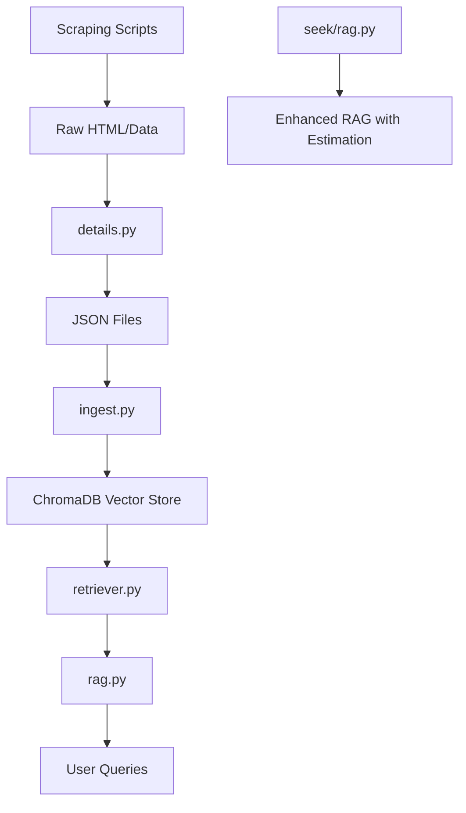
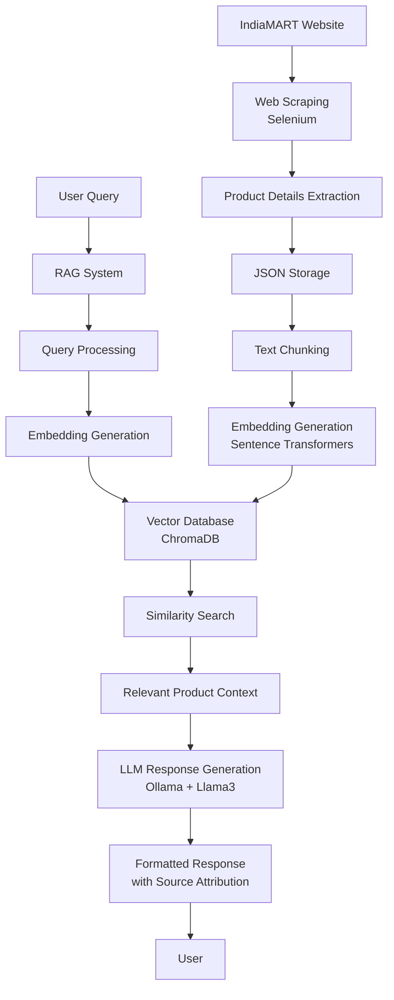
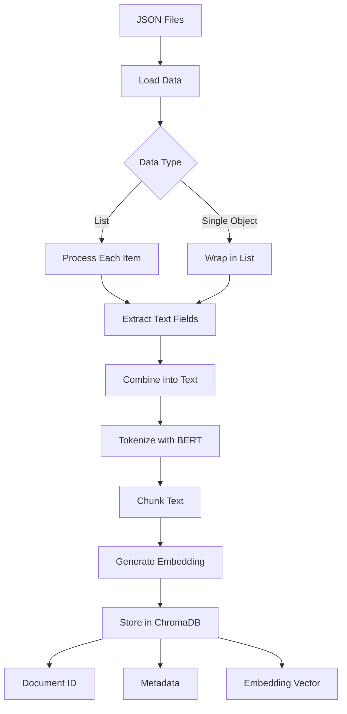
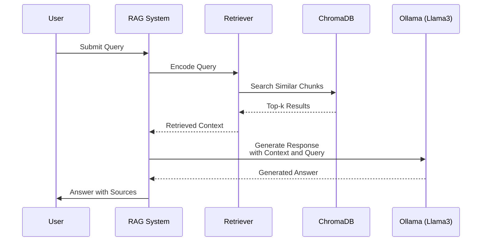
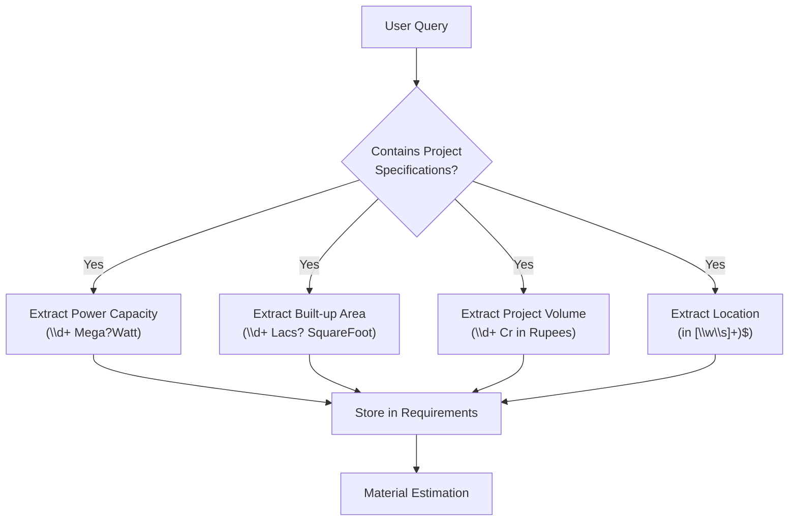
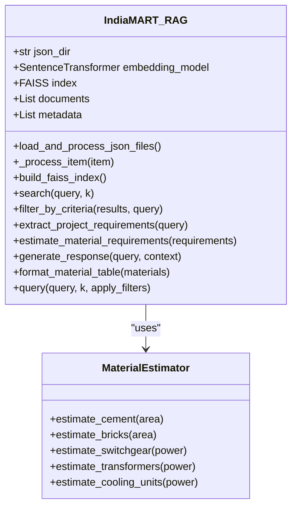
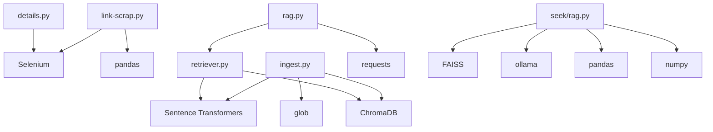

# Project Overview

<cite>
**Referenced Files in This Document**   
- [link-scrap.py](file://link-scrap.py)
- [details.py](file://details.py)
- [ingest.py](file://ingest.py)
- [retriever.py](file://retriever.py)
- [rag.py](file://rag.py)
- [seek/rag.py](file://seek/rag.py)
- [json/*.json](file://json/)
</cite>

## Table of Contents
1. [Introduction](#introduction)
2. [Project Structure](#project-structure)
3. [Core Components](#core-components)
4. [Architecture Overview](#architecture-overview)
5. [Detailed Component Analysis](#detailed-component-analysis)
6. [Dependency Analysis](#dependency-analysis)
7. [Performance Considerations](#performance-considerations)
8. [Troubleshooting Guide](#troubleshooting-guide)
9. [Conclusion](#conclusion)

## Introduction
The vendor-rag-model project is a Retrieval-Augmented Generation (RAG)-based procurement assistant designed specifically for construction materials. It leverages vendor data from IndiaMART to provide intelligent, context-aware responses with integrated material estimation capabilities. The system transforms unstructured vendor listings into actionable procurement insights by combining web scraping, semantic search, and large language model (LLM) technologies. This enables construction project managers to efficiently source materials, evaluate vendors based on multiple criteria, and estimate material requirements directly from natural language queries.

## Project Structure
The project follows a modular structure with distinct components for data acquisition, processing, retrieval, and response generation. The root directory contains core scripts for scraping and ingestion, while the `json` directory stores structured product data. The `seek` subdirectory contains an enhanced RAG implementation with material estimation capabilities. Configuration files and logs support the scraping process, and the overall organization reflects a pipeline from raw data collection to intelligent query response.

**Diagram sources**
- [link-scrap.py](file://link-scrap.py)
- [details.py](file://details.py)
- [ingest.py](file://ingest.py)
- [retriever.py](file://retriever.py)
- [rag.py](file://rag.py)
- [seek/rag.py](file://seek/rag.py)

**Section sources**
- [link-scrap.py](file://link-scrap.py)
- [details.py](file://details.py)
- [ingest.py](file://ingest.py)
- [retriever.py](file://retriever.py)
- [rag.py](file://rag.py)
- [seek/rag.py](file://seek/rag.py)

## Core Components
The system comprises several core components that work together to deliver procurement intelligence. The data pipeline begins with web scraping of IndiaMART vendor listings, followed by structured data extraction and storage in JSON format. These product details are then processed through a vector ingestion pipeline that creates embeddings for semantic search. The retrieval component uses these embeddings to find relevant products based on user queries, while the RAG system combines this context with LLM-powered response generation to produce informative answers with source attribution.

**Section sources**
- [link-scrap.py](file://link-scrap.py)
- [details.py](file://details.py)
- [ingest.py](file://ingest.py)
- [retriever.py](file://retriever.py)
- [rag.py](file://rag.py)

## Architecture Overview
The vendor-rag-model architecture follows a multi-stage pipeline that transforms unstructured vendor data into an intelligent procurement assistant. The system begins with data acquisition through web scraping of IndiaMART product listings, extracting detailed information about construction materials and their suppliers. This data is structured and stored in JSON format, then processed through an embedding pipeline that converts text into vector representations. These vectors are stored in a ChromaDB vector database for efficient similarity search. When a user submits a query, the system retrieves relevant product information, combines it with the query context, and generates a comprehensive response using a local LLM via Ollama.

**Diagram sources**
- [link-scrap.py](file://link-scrap.py)
- [details.py](file://details.py)
- [ingest.py](file://ingest.py)
- [retriever.py](file://retriever.py)
- [rag.py](file://rag.py)

## Detailed Component Analysis

### Data Acquisition and Processing
The data acquisition process begins with `link-scrap.py`, which uses Selenium to navigate IndiaMART and collect product listing URLs based on material names from CSV files. This script handles pagination and extracts anchor links for detailed product pages. The `details.py` script then visits each product URL to scrape comprehensive information including pricing, specifications, seller details, company information, and customer reviews. This data is structured and saved in JSON format, creating a rich dataset of construction material vendors.

**Section sources**
- [link-scrap.py](file://link-scrap.py)
- [details.py](file://details.py)

### Vector Ingestion Pipeline
The `ingest.py` script processes the scraped JSON data into a vector database for semantic retrieval. It uses the Sentence Transformers library to generate embeddings of product information, which includes titles, descriptions, specifications, seller information, and reviews. The text is chunked to fit within model token limits, and each chunk is stored in ChromaDB with associated metadata. This enables efficient similarity-based retrieval of relevant product information when responding to user queries.

**Diagram sources**
- [ingest.py](file://ingest.py)

### Retrieval and Response Generation
The retrieval system in `retriever.py` uses the same embedding model to convert user queries into vectors and search for similar product chunks in the ChromaDB collection. The `rag.py` script orchestrates the complete RAG pipeline, combining retrieved context with a carefully crafted prompt for the LLM. The system queries a local Ollama instance running the Llama3 model to generate responses that are grounded in the retrieved vendor data. Responses include source URLs for transparency and traceability.

#### RAG Pipeline Flow

**Diagram sources**
- [retriever.py](file://retriever.py)
- [rag.py](file://rag.py)

### Enhanced RAG with Material Estimation
The `seek/rag.py` implementation extends the basic RAG system with advanced features for construction project management. This enhanced version includes project specification extraction from natural language queries, material quantity estimation based on project parameters, and more sophisticated filtering capabilities. The system can parse queries containing power capacity, built-up area, project volume, and location to generate comprehensive material requirements tables alongside vendor recommendations.

#### Project Specification Extraction

**Diagram sources**
- [seek/rag.py](file://seek/rag.py)

#### Material Estimation Logic
The system applies standard construction norms to estimate material requirements based on extracted project specifications. For example, it calculates cement requirements at 0.4 bags per square foot, brick requirements at 8 bricks per square foot, and electrical equipment based on power capacity. These estimates are formatted into a table and included in the final response, providing project managers with both vendor information and material planning data.

**Diagram sources**
- [seek/rag.py](file://seek/rag.py)

## Dependency Analysis
The system has a clear dependency hierarchy with minimal circular dependencies. The core dependencies include Selenium for web scraping, Sentence Transformers for embedding generation, ChromaDB for vector storage, and Ollama for LLM inference. The Python standard library modules for JSON handling, file operations, and regular expressions are used throughout the codebase. The `seek` subdirectory represents an alternative implementation with additional dependencies on FAISS for vector indexing and the ollama Python package for LLM interaction.

**Diagram sources**
- [link-scrap.py](file://link-scrap.py)
- [details.py](file://details.py)
- [ingest.py](file://ingest.py)
- [retriever.py](file://retriever.py)
- [rag.py](file://rag.py)
- [seek/rag.py](file://seek/rag.py)

## Performance Considerations
The system architecture balances performance and functionality through several design choices. Text chunking in the ingestion pipeline ensures compatibility with model token limits while preserving context. The use of ChromaDB provides efficient similarity search for retrieval operations. The separation of concerns between data acquisition, processing, and query response allows for independent optimization of each component. For production use, considerations include rate limiting during scraping to avoid IP blocking, batching of embedding operations for efficiency, and caching of frequent queries to reduce LLM inference costs.

## Troubleshooting Guide
Common issues in the vendor-rag-model system typically relate to web scraping, data processing, or LLM connectivity. Scraping failures may occur due to changes in IndiaMART's website structure or anti-bot measures, which can be mitigated by updating selectors and implementing more robust error handling. Data processing issues might arise from malformed JSON files, which the ingestion script handles with try-catch blocks. LLM connectivity problems can occur if the Ollama server is not running or accessible, requiring verification of the service status and network configuration.

**Section sources**
- [link-scrap.py](file://link-scrap.py)
- [details.py](file://details.py)
- [ingest.py](file://ingest.py)
- [rag.py](file://rag.py)

## Conclusion
The vendor-rag-model project successfully integrates web scraping, vector databases, and large language models to create an intelligent procurement assistant for construction materials. By leveraging IndiaMART vendor data, the system provides construction project managers with a powerful tool for sourcing materials, evaluating suppliers, and estimating requirements. The architecture demonstrates a practical application of RAG technology, transforming unstructured vendor listings into actionable insights through semantic search and natural language generation. The inclusion of material estimation capabilities in the enhanced `seek/rag.py` implementation further increases the system's value for construction project planning and budgeting.