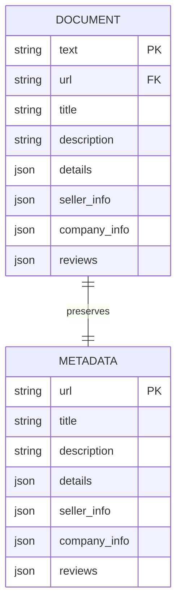

# Context Extraction

<cite>
**Referenced Files in This Document**   
- [seek/rag.py](file://seek/rag.py)
- [ingest.py](file://ingest.py)
</cite>

## Table of Contents
1. [Introduction](#introduction)
2. [Core Components](#core-components)
3. [Text Preprocessing Logic](#text-preprocessing-logic)
4. [Metadata Preservation](#metadata-preservation)
5. [Impact on Retrieval Accuracy](#impact-on-retrieval-accuracy)
6. [Potential Issues and Scalability](#potential-issues-and-scalability)
7. [Best Practices for Document Formatting](#best-practices-for-document-formatting)

## Introduction

The context extraction functionality within the RAG Core Engine is responsible for transforming raw JSON product data into searchable text embeddings. This process is critical for enabling semantic search capabilities across a diverse range of construction materials and equipment. The system processes structured data from multiple JSON files, extracting key information from fields such as title, details, seller_info, and company_info to create coherent document representations. This documentation provides a comprehensive analysis of the `load_and_process_json_files` and `_process_item` methods that form the core of this transformation pipeline.

## Core Components

The context extraction functionality is implemented primarily through two key methods: `load_and_process_json_files` and `_process_item`. These methods work in tandem to load JSON data from multiple files and transform each product entry into a text representation suitable for embedding and semantic search.

The `load_and_process_json_files` method serves as the entry point for the data ingestion process. It scans the designated JSON directory, loads each file, and handles both single objects and arrays of objects. For each JSON entry, it delegates the processing to the `_process_item` method, which is responsible for creating the actual text representation.

The `_process_item` method systematically extracts information from various structured fields and combines them into a cohesive text document. It processes the title, details, description, seller information, and company information, applying specific formatting rules and filtering logic to ensure high-quality text representations.

**Section sources**
- [seek/rag.py](file://seek/rag.py#L20-L43)
- [seek/rag.py](file://seek/rag.py#L45-L96)

## Text Preprocessing Logic

The text preprocessing logic implemented in the `_process_item` method follows a systematic approach to transform structured JSON data into natural language text suitable for semantic search. The process begins by creating a list of text parts that will be combined into the final document representation.

The method first extracts the product title, if available, and formats it as "Title: [value]". This ensures that the most important identifier is prominently featured in the text representation. Next, it processes the details field, which contains a dictionary of product specifications. Each key-value pair is converted to a format like "[key]: [value]", with empty values filtered out to maintain text quality.

The description field is incorporated as "Description: [value]" when present, providing additional context about the product. Seller information receives special handling, with the method filtering out error messages and placeholder text like "Seller information not available". Each valid seller information field is prefixed with "Seller" (e.g., "Seller name: ABC Company") to distinguish it from other information.

Company information is processed similarly, with each field prefixed with "Company" to maintain clear attribution. The method applies consistent filtering to exclude empty values, ensuring that only meaningful information contributes to the final text representation.

All text parts are then joined with spaces to create a single cohesive document string. The method includes a final validation step, only adding the text to the documents collection if it contains meaningful content after stripping whitespace.

```mermaid
flowchart TD
Start([Start Processing Item]) --> ExtractTitle["Extract Title Field"]
ExtractTitle --> TitleValid{"Title Exists?"}
TitleValid --> |Yes| AddTitle["Add 'Title: [value]'"]
TitleValid --> |No| SkipTitle
AddTitle --> ExtractDetails["Extract Details Object"]
SkipTitle --> ExtractDetails
ExtractDetails --> DetailsValid{"Details Exists & Is Dict?"}
DetailsValid --> |Yes| ProcessDetails["For each key-value: Add '[key]: [value]'"]
DetailsValid --> |No| SkipDetails
ProcessDetails --> ExtractDescription["Extract Description"]
SkipDetails --> ExtractDescription
ExtractDescription --> DescValid{"Description Exists?"}
DescValid --> |Yes| AddDescription["Add 'Description: [value]'"]
DescValid --> |No| SkipDescription
AddDescription --> ExtractSeller["Extract Seller Info"]
SkipDescription --> ExtractSeller
ExtractSeller --> SellerValid{"Seller Info Exists & Is Dict?"}
SellerValid --> |Yes| ProcessSeller["For each key-value: If not error/placeholder, Add 'Seller [key]: [value]'"]
SellerValid --> |No| SkipSeller
ProcessSeller --> ExtractCompany["Extract Company Info"]
SkipSeller --> ExtractCompany
ExtractCompany --> CompanyValid{"Company Info Exists & Is Dict?"}
CompanyValid --> |Yes| ProcessCompany["For each key-value: Add 'Company [key]: [value]'"]
CompanyValid --> |No| SkipCompany
ProcessCompany --> CombineText["Combine All Text Parts with Spaces"]
SkipCompany --> CombineText
CombineText --> HasContent{"Text Has Content?"}
HasContent --> |Yes| StoreDocument["Store Document and Metadata"]
HasContent --> |No| SkipStore
StoreDocument --> End([End Processing])
SkipStore --> End
```

**Diagram sources**
- [seek/rag.py](file://seek/rag.py#L45-L96)

**Section sources**
- [seek/rag.py](file://seek/rag.py#L45-L96)

## Metadata Preservation

While transforming structured data into text representations for embedding, the system maintains a parallel metadata structure to preserve the original structured information. This dual approach allows for both semantic search capabilities and structured data retrieval.

The metadata preservation mechanism is implemented in the `_process_item` method, which stores a comprehensive metadata dictionary alongside each text document. This metadata includes the original URL, title, description, and the complete details, seller_info, and company_info objects in their structured form. Additionally, it preserves the reviews array, enabling access to customer feedback data.

The ingest.py file reveals an alternative approach to metadata preservation used in a different ingestion pipeline. This implementation extracts a more limited set of metadata fields, including title, URL, and category (extracted from the details object). This suggests that different ingestion strategies may be employed depending on the specific requirements of the search system.

The metadata preservation strategy enables several important capabilities:
- Filtering search results based on structured criteria (e.g., location, availability, ratings)
- Presenting structured information in search results while searching on semantic content
- Maintaining data integrity by preserving the original structured format
- Supporting faceted search and advanced filtering options

**Diagram sources**
- [seek/rag.py](file://seek/rag.py#L85-L95)
- [ingest.py](file://ingest.py#L80-L85)

**Section sources**
- [seek/rag.py](file://seek/rag.py#L85-L95)
- [ingest.py](file://ingest.py#L80-L85)

## Impact on Retrieval Accuracy

The quality of text representation directly impacts retrieval accuracy and relevance in the RAG system. The preprocessing approach implemented in the `_process_item` method is designed to optimize semantic search performance by creating coherent, informative text documents that capture the essential characteristics of each product.

The concatenation strategy, which combines multiple structured fields into a single text document, enables the embedding model to understand the relationships between different product attributes. For example, by including both product specifications and company information in the same text representation, the model can learn associations between product features and vendor characteristics.

The filtering of empty values and placeholder text improves retrieval quality by reducing noise in the text representations. This ensures that the embedding space is populated with meaningful content, making it easier for the search algorithm to identify relevant matches. The exclusion of error messages and unavailable information prevents the system from learning incorrect associations.

The use of descriptive prefixes (e.g., "Seller name:", "Company address:") provides contextual cues that help the embedding model understand the meaning and significance of different text segments. This structured formatting approach enhances the semantic richness of the text representations, leading to more accurate similarity calculations during search.

However, the current implementation has limitations that could affect retrieval accuracy. The simple concatenation of text parts with spaces may not optimally represent the hierarchical relationships between different information categories. Additionally, the lack of normalization for certain fields (such as units of measurement or product categories) could lead to suboptimal similarity calculations for products with equivalent specifications expressed in different formats.

## Potential Issues and Scalability

The context extraction functionality faces several potential issues and scalability challenges when processing large JSON files and diverse product categories.

One significant issue is information loss during the processing of nested JSON structures. The current implementation flattens nested objects by concatenating key-value pairs, but this approach may not preserve the hierarchical relationships between nested attributes. For example, technical specifications with multiple levels of categorization may lose their structural context when flattened into a linear text representation.

The system's handling of large JSON files could present scalability challenges. While the code processes files sequentially, there is no explicit mechanism for handling very large files that might exceed memory constraints. The absence of streaming JSON parsing could limit the system's ability to process extremely large product catalogs efficiently.

Another potential issue is the inconsistent handling of missing or null values across different fields. While the code filters out empty values for most fields, the specific filtering rules vary (e.g., seller information has additional checks for error messages). This inconsistency could lead to unpredictable behavior when processing products with incomplete data.

The current implementation processes all JSON files in a single directory without categorization or prioritization. As the number of product categories grows (evident from the extensive list of *links.json files), this approach may become inefficient and could benefit from a more organized processing strategy.

Additionally, the system lacks explicit error handling for malformed JSON structures beyond the basic exception catch. More robust validation of JSON schema would help ensure data quality and prevent processing errors for products with unexpected data formats.

## Best Practices for Document Formatting

To maintain consistency in document formatting across diverse product categories, several best practices should be followed:

1. **Standardized Field Ordering**: Maintain a consistent order of fields in the text representation (e.g., Title → Details → Description → Seller Info → Company Info) to ensure predictable document structure.

2. **Consistent Prefixing**: Use standardized prefixes for different information categories (e.g., "Product [field]:", "Vendor [field]:") to provide clear context for the embedding model.

3. **Value Normalization**: Implement normalization for common fields such as units of measurement, product categories, and technical specifications to ensure consistent representation across similar products.

4. **Hierarchical Representation**: For nested JSON structures, consider using delimiter-separated paths (e.g., "specifications.electrical.voltage: 230V") to preserve hierarchical relationships while maintaining flat text format.

5. **Controlled Vocabulary**: Establish a controlled vocabulary for product categories and attributes to minimize variations in terminology across different suppliers.

6. **Comprehensive Filtering**: Apply consistent filtering rules across all fields to exclude empty values, placeholder text, and error messages.

7. **Length Management**: Implement text length limits and truncation strategies for extremely detailed products to maintain balanced document representations.

8. **Metadata Synchronization**: Ensure that the text representation and structured metadata remain synchronized, with any updates to one reflected in the other.

9. **Category-Specific Templates**: Develop category-specific formatting templates that highlight the most relevant attributes for each product type (e.g., electrical specifications for power equipment, material composition for construction materials).

10. **Validation and Testing**: Implement automated validation and testing to ensure formatting consistency across all product categories and detect anomalies in the processing pipeline.