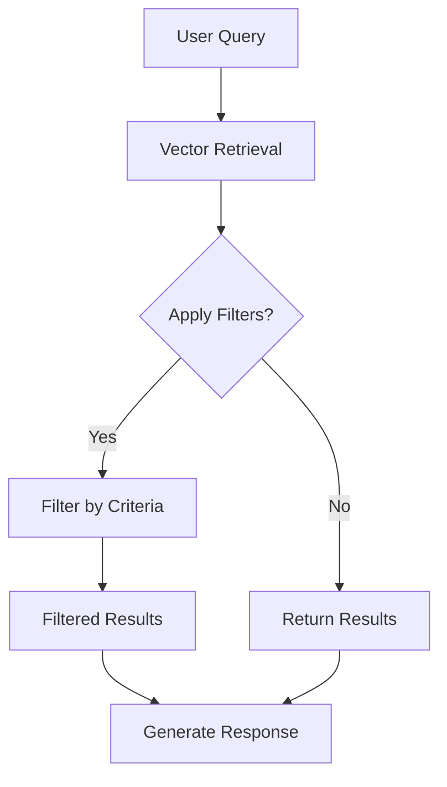

# Dynamic Filtering Mechanism

<cite>
**Referenced Files in This Document**   
- [seek/rag.py](file://seek/rag.py)
- [details.py](file://details.py)
- [retriever.py](file://retriever.py)
</cite>

## Table of Contents
1. [Introduction](#introduction)
2. [Filtering Workflow Overview](#filtering-workflow-overview)
3. [Implementation of Filter Criteria](#implementation-of-filter-criteria)
4. [Filtering Strategy and Trade-offs](#filtering-strategy-and-trade-offs)
5. [Challenges in Data Consistency](#challenges-in-data-consistency)
6. [Extending the Filter System](#extending-the-filter-system)
7. [Performance Optimization](#performance-optimization)
8. [Troubleshooting Common Issues](#troubleshooting-common-issues)

## Introduction
The RAG Core Engine implements a dynamic post-retrieval filtering mechanism to refine search results based on specific query semantics. This system operates after initial vector-based retrieval to apply precise business logic filters for location, GST registration date, product availability, fire retardancy, and vendor ratings. The filtering process enhances result relevance by enforcing strict criteria that cannot be fully captured through semantic similarity alone.

**Section sources**
- [seek/rag.py](file://seek/rag.py#L142-L205)

## Filtering Workflow Overview
The filtering mechanism is integrated into the main query pipeline through the `query` method, which orchestrates retrieval followed by optional filtering. When `apply_filters=True`, retrieved results are passed to the `filter_by_criteria` method for semantic filtering. This two-stage approach separates broad semantic matching from precise rule-based filtering, allowing flexible control over result refinement.



**Diagram sources**
- [seek/rag.py](file://seek/rag.py#L372-L409)

**Section sources**
- [seek/rag.py](file://seek/rag.py#L372-L409)

## Implementation of Filter Criteria
The `filter_by_criteria` method evaluates each result against multiple filter types based on query content. Each filter type uses specific data fields and validation logic:

### Location Filtering
Location filtering uses regex pattern matching to extract location terms from queries containing "in [location]" or explicit mentions like "navi mumbai". The system searches both company and seller address fields in metadata, performing case-insensitive substring matching.

```mermaid
flowchart TD
A[Query Contains "in "?] --> |Yes| B[Extract Location via Regex]
A --> |No| C[Check for Navi Mumbai]
C --> |Present| D[Set Location = Navi Mumbai]
B --> E[Combine Company and Seller Addresses]
D --> E
E --> F[Case-Insensitive Match]
F --> G{Location Found?}
G --> |No| H[Skip Result]
G --> |Yes| I[Include Result]
```

**Diagram sources**
- [seek/rag.py](file://seek/rag.py#L142-L158)

### GST Registration Date Filtering
The GST filter checks for "gst after 2017" in queries and validates the `gst_registration_date` field from company information. Dates are parsed from DD-MM-YYYY format and compared against the year threshold, with invalid dates causing result exclusion.

```mermaid
flowchart TD
A[Query Contains "gst after 2017"?] --> |Yes| B[Get GST Date]
B --> C{Date Exists?}
C --> |No| D[Skip Result]
C --> |Yes| E[Parse Date]
E --> F{Parse Success?}
F --> |No| D
F --> |Yes| G{Year > 2017?}
G --> |No| D
G --> |Yes| H[Include Result]
```

**Diagram sources**
- [seek/rag.py](file://seek/rag.py#L160-L170)

### Vendor Rating Filtering
Rating filtering extracts the overall rating from reviews metadata, specifically targeting entries with type "overall_rating". Results with ratings below 4.0 or missing ratings are excluded, implementing a high-quality vendor threshold.

```mermaid
flowchart TD
A[Query Contains "rating"?] --> |Yes| B[Find Overall Rating]
B --> C{Rating Found?}
C --> |No| D[Skip Result]
C --> |Yes| E[Parse Rating Value]
E --> F{Valid Number?}
F --> |No| D
F --> |Yes| G{Rating >= 4.0?}
G --> |No| D
G --> |Yes| H[Include Result]
```

**Diagram sources**
- [seek/rag.py](file://seek/rag.py#L172-L184)

### Product Availability Filtering
Availability filtering checks the details section for "in stock" mentions, converting the availability field to lowercase for case-insensitive matching. This ensures only currently available products are returned for stock-specific queries.

```mermaid
flowchart TD
A[Query Contains "in stock"?] --> |Yes| B[Get Availability Field]
B --> C[Convert to Lowercase]
C --> D{Contains "in stock"?}
D --> |No| E[Skip Result]
D --> |Yes| F[Include Result]
```

**Diagram sources**
- [seek/rag.py](file://seek/rag.py#L186-L190)

### Fire Retardancy Filtering
Fire retardancy filtering searches both product details and description fields for "fire retardant" or "fireproof" keywords, enabling comprehensive material safety filtering across multiple data sources.

```mermaid
flowchart TD
A[Query Contains Fire Terms?] --> |Yes| B[Combine Details and Description]
B --> C[Convert to Lowercase]
C --> D{Contains "fire retardant" or "fireproof"?}
D --> |No| E[Skip Result]
D --> |Yes| F[Include Result]
```

**Diagram sources**
- [seek/rag.py](file://seek/rag.py#L192-L198)

**Section sources**
- [seek/rag.py](file://seek/rag.py#L142-L205)

## Filtering Strategy and Trade-offs
The system implements post-retrieval filtering rather than retrieval-time filtering to maintain flexibility and avoid over-constraining the initial search space. This approach allows:

- **Broader initial retrieval**: Vector search captures semantically relevant results before applying strict filters
- **Composable filters**: Multiple criteria can be combined without complex indexing requirements
- **Dynamic adaptation**: Filters respond to natural language patterns without predefined query structures

However, this strategy trades off some efficiency for flexibility, as all filters are applied sequentially to every retrieved result. The alternative of filtering at retrieval time would require specialized indexes for each filter type, increasing system complexity and storage requirements.

**Section sources**
- [seek/rag.py](file://seek/rag.py#L386-L388)

## Challenges in Data Consistency
Filter accuracy depends heavily on source data quality and consistency. Key challenges include:

- **Date format variability**: GST registration dates must consistently follow DD-MM-YYYY format
- **Address standardization**: Location matching relies on consistent address formatting across vendors
- **Availability terminology**: Different vendors use varying terms for stock status
- **Missing data**: Absence of rating or GST information causes result exclusion

The data ingestion process in `details.py` attempts to standardize these fields during scraping, but inconsistencies in source data remain a primary challenge for filter reliability.

**Section sources**
- [details.py](file://details.py#L68-L99)
- [seek/rag.py](file://seek/rag.py#L160-L170)

## Extending the Filter System
New filter criteria can be added by extending the `filter_by_criteria` method with additional conditional blocks. The pattern follows:

1. Check for query keywords indicating the filter
2. Extract relevant data from metadata
3. Apply validation logic
4. Continue to next result if criteria not met

When adding filters, consider:
- Keyword variations in user queries
- Appropriate metadata fields to inspect
- Error handling for missing or malformed data
- Performance impact of complex operations

**Section sources**
- [seek/rag.py](file://seek/rag.py#L142-L205)

## Performance Optimization
Filter execution order impacts performance. Currently, filters are applied in a fixed sequence, but optimization opportunities exist:

- **Early termination**: More selective filters should run first
- **Cost-based ordering**: Expensive operations (date parsing) should follow cheaper ones (text matching)
- **Caching**: Frequently used parsed values could be cached

The current implementation processes filters in order of approximate selectivity, with location and availability checks (cheap operations) preceding date parsing and rating calculations (more expensive operations).

**Section sources**
- [seek/rag.py](file://seek/rag.py#L142-L205)

## Troubleshooting Common Issues
Common filtering issues and solutions:

### False Negatives
- **Cause**: Inconsistent data formatting or missing metadata fields
- **Solution**: Verify data extraction in `details.py` and consider fuzzy matching

### Case Sensitivity Problems
- **Cause**: Incomplete lowercase conversion before comparison
- **Solution**: Ensure all text comparisons use `.lower()` on both sides

### Date Parsing Failures
- **Cause**: Non-standard date formats in source data
- **Solution**: Implement multiple date format parsers or data cleaning

### Location Matching Failures
- **Cause**: Address abbreviations or alternative naming
- **Solution**: Implement synonym mapping or fuzzy string matching

**Section sources**
- [seek/rag.py](file://seek/rag.py#L142-L205)
- [details.py](file://details.py#L68-L99)