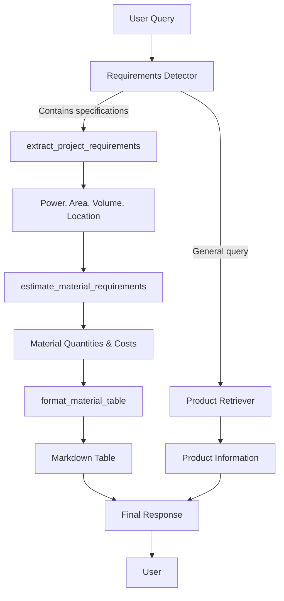
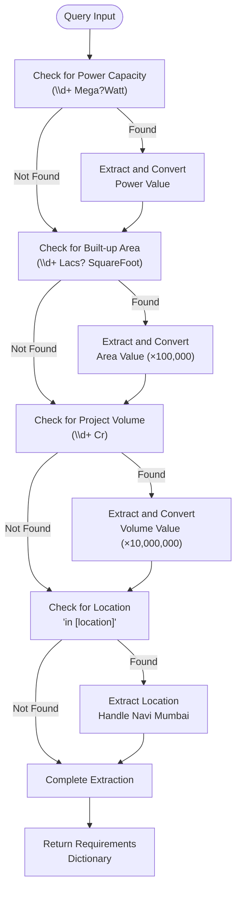
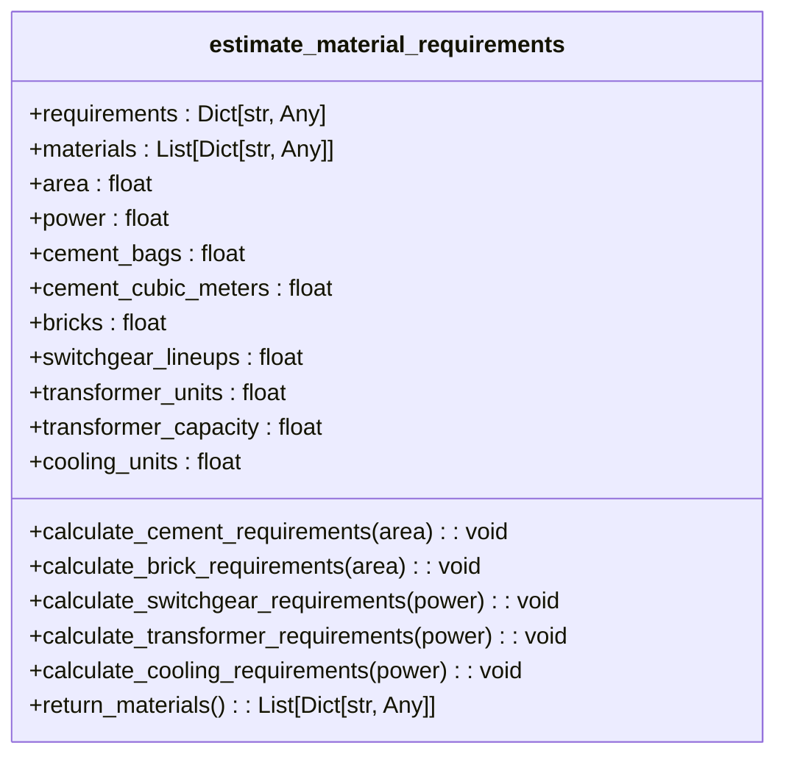
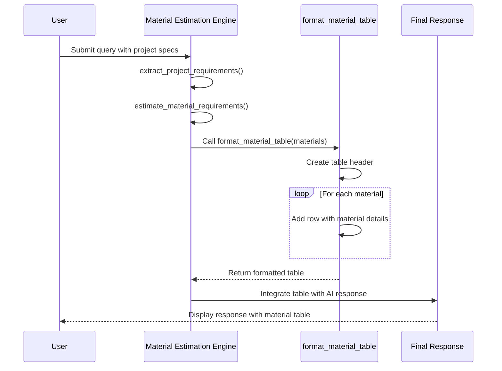
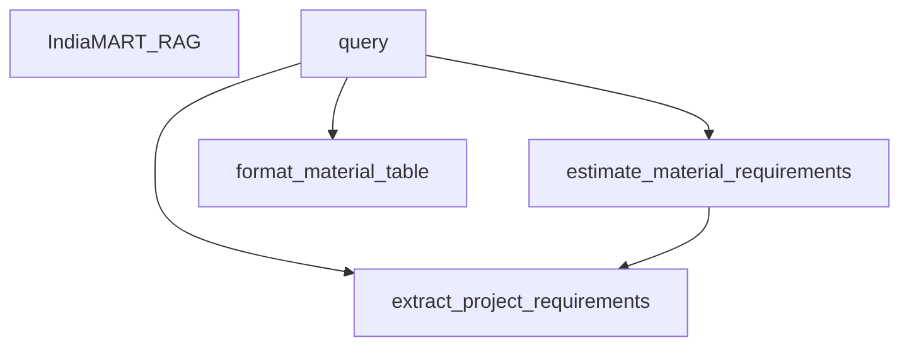

# Material Estimation Engine

<cite>
**Referenced Files in This Document**   
- [seek/rag.py](file://seek/rag.py)
</cite>

## Table of Contents
1. [Introduction](#introduction)
2. [Project Structure](#project-structure)
3. [Core Components](#core-components)
4. [Architecture Overview](#architecture-overview)
5. [Detailed Component Analysis](#detailed-component-analysis)
6. [Dependency Analysis](#dependency-analysis)
7. [Performance Considerations](#performance-considerations)
8. [Troubleshooting Guide](#troubleshooting-guide)
9. [Conclusion](#conclusion)

## Introduction

The Material Estimation Engine is a core component of the RAG (Retrieval-Augmented Generation) system designed for construction procurement. This engine analyzes user queries containing project specifications and generates detailed material requirement estimates based on industry-standard construction norms. The system extracts key parameters such as power capacity, built-up area, project volume, and location from natural language queries, then calculates the necessary quantities of construction materials and electrical equipment. Results are presented in a structured Markdown table format for easy interpretation. This document provides a comprehensive analysis of the engine's implementation, calculation methodologies, and potential areas for improvement.

## Project Structure

The Material Estimation Engine is implemented within the `seek` subdirectory of the vendor-rag-model project. The core functionality resides in the `rag.py` file, which contains the `IndiaMART_RAG` class responsible for material estimation. The project follows a modular structure with JSON files in the `json` directory storing product data that can be referenced during the estimation process. The engine integrates with a retrieval system that can provide vendor and product information to complement the material estimates.

**Section sources**
- [seek/rag.py](file://seek/rag.py#L1-L50)

## Core Components

The Material Estimation Engine consists of three primary methods that work together to process user queries and generate material estimates: `extract_project_requirements`, `estimate_material_requirements`, and `format_material_table`. These methods form a pipeline that transforms natural language specifications into structured material requirements. The engine is designed to detect project-related parameters in user queries and trigger the estimation process only when such specifications are present, ensuring that general product queries are handled appropriately without unnecessary calculations.

**Section sources**
- [seek/rag.py](file://seek/rag.py#L207-L434)

## Architecture Overview

The Material Estimation Engine operates as part of a larger RAG system that combines information retrieval with generative AI capabilities. When a user submits a query, the system first determines whether it contains project specifications that require material estimation. If such specifications are detected, the engine extracts the relevant parameters and calculates material requirements based on predefined construction norms. The results are then formatted into a Markdown table and integrated with the AI-generated response. This architecture allows the system to provide both general product information and detailed project estimates within a unified interface.

**Diagram sources**
- [seek/rag.py](file://seek/rag.py#L207-L434)

## Detailed Component Analysis

### Requirement Extraction Analysis

The `extract_project_requirements` method parses user queries to identify key project parameters using regular expressions. This method searches for specific patterns that indicate power capacity (in MegaWatts), built-up area (in Lacs SquareFoot), project volume (in Crores Rupees), and location. The extracted values are converted to standard units for use in subsequent calculations. For example, area values specified in "Lacs" are multiplied by 100,000 to convert to actual square footage, while project volumes in "Cr" are converted to rupees by multiplying by 10,000,000. The method also handles specific location cases like "Navi Mumbai" to ensure accurate geographical identification.

**Diagram sources**
- [seek/rag.py](file://seek/rag.py#L207-L241)

**Section sources**
- [seek/rag.py](file://seek/rag.py#L207-L241)

### Material Estimation Analysis

The `estimate_material_requirements` method implements the core calculation logic for determining material quantities based on project specifications. The method applies industry-standard construction norms to convert area and power values into material requirements. For construction materials, it uses norms of 0.4 cement bags per square foot and 8 bricks per square foot. For electrical equipment, it applies ratios such as one switchgear lineup per 2.5 MW of power capacity, one transformer per 5 MW, and two cooling units per MW. The method also calculates cost estimates by applying standard unit prices to the calculated quantities, providing both material requirements and budgetary information.

**Diagram sources**
- [seek/rag.py](file://seek/rag.py#L243-L301)

**Section sources**
- [seek/rag.py](file://seek/rag.py#L243-L301)

### Table Formatting Analysis

The `format_material_table` method renders the material estimates in a Markdown table format for display in the final response. This method creates a properly formatted table with headers for Material/Equipment, Quantity, and Unit Cost (Rupees). It iterates through the list of material estimates and formats each entry as a table row, ensuring consistent presentation of the data. The method handles empty input by returning an empty string, preventing errors when no material estimates are available. This formatting function enables the integration of structured data into the AI-generated text response, providing users with a clear and organized presentation of the material requirements.

**Diagram sources**
- [seek/rag.py](file://seek/rag.py#L357-L370)

**Section sources**
- [seek/rag.py](file://seek/rag.py#L357-L370)

## Dependency Analysis

The Material Estimation Engine has minimal external dependencies, relying primarily on standard Python libraries and the project's internal data structures. The engine imports `json`, `os`, `re`, and `typing` for basic functionality, and uses `pandas`, `sentence-transformers`, `faiss`, `numpy`, and `ollama` for the broader RAG system functionality. The material estimation methods themselves are self-contained and do not depend on external services for their calculations, making them reliable and predictable. The engine is integrated into the `query` method of the `IndiaMART_RAG` class, which coordinates the overall response generation process.

**Diagram sources**
- [seek/rag.py](file://seek/rag.py#L207-L434)

**Section sources**
- [seek/rag.py](file://seek/rag.py#L207-L434)

## Performance Considerations

The Material Estimation Engine is designed for efficiency and low computational overhead. The regular expression-based requirement extraction is fast and scales well with query length. The calculation methods use simple arithmetic operations that execute quickly, making the estimation process nearly instantaneous. Since the calculations are deterministic and do not require external API calls, the engine provides consistent response times. The integration with the larger RAG system is optimized to only perform material estimation when project specifications are detected in the query, avoiding unnecessary computations for general product inquiries. The engine's performance is primarily limited by the speed of the underlying text processing and the response time of the Ollama AI model for generating the final response.

## Troubleshooting Guide

When the Material Estimation Engine fails to extract requirements or generate estimates, several common issues should be checked. First, verify that the query contains specifications in the expected format (e.g., "25 MegaWatt" rather than "25 MW"). The regular expressions are case-insensitive but require specific keywords. Second, ensure that numerical values are properly separated from units. Third, check that the query contains at least one of the recognized specification types (power capacity, built-up area, or project volume) to trigger the estimation process. If estimates appear inaccurate, review the underlying construction norms in the code, as these may need adjustment based on regional or project-specific requirements. Finally, verify that the `format_material_table` method receives a non-empty list of materials, as empty input will result in no table being displayed.

**Section sources**
- [seek/rag.py](file://seek/rag.py#L207-L434)

## Conclusion

The Material Estimation Engine provides a robust solution for automatically generating construction material requirements from natural language project specifications. By combining pattern matching, standardized calculation methods, and structured output formatting, the engine bridges the gap between user queries and actionable procurement information. While the current implementation uses fixed construction norms, it provides a solid foundation that could be extended with configurable norms, regional pricing adjustments, and integration with external cost databases. The engine's modular design and clear separation of concerns make it maintainable and adaptable to evolving requirements. Future enhancements could include support for additional material types, more sophisticated location-based adjustments, and integration with real-time pricing data to improve estimate accuracy.