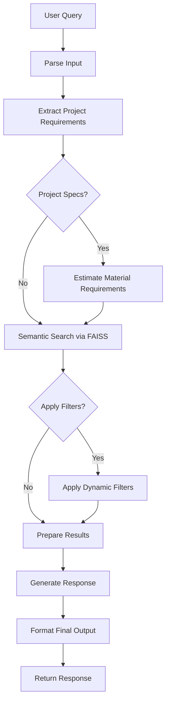
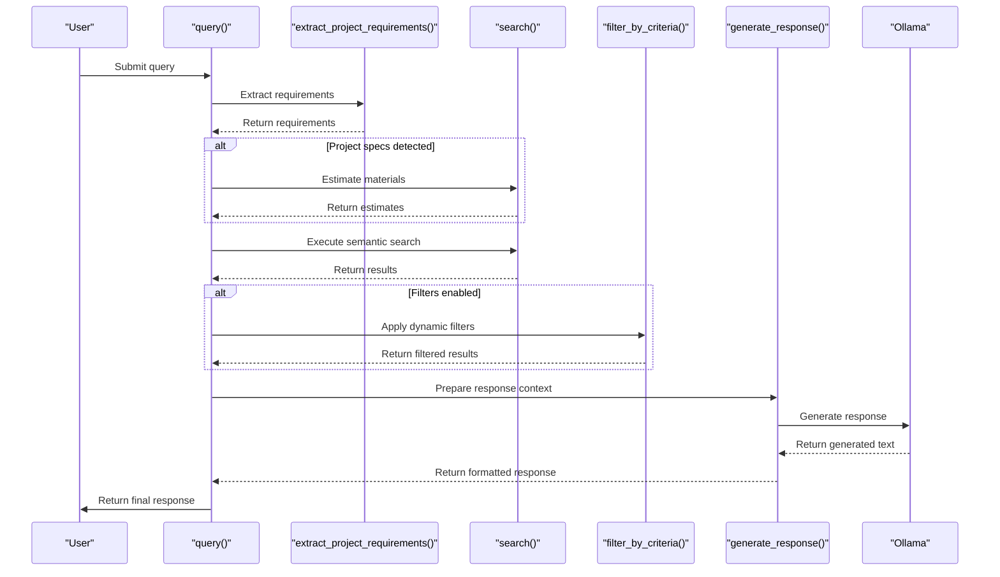
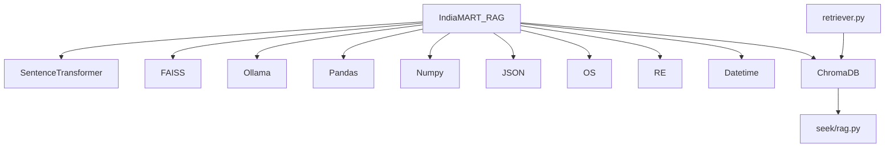

# Query Processing

<cite>
**Referenced Files in This Document**   
- [seek/rag.py](file://seek/rag.py)
- [retriever.py](file://retriever.py)
</cite>

## Table of Contents
1. [Introduction](#introduction)
2. [Core Components](#core-components)
3. [Architecture Overview](#architecture-overview)
4. [Detailed Component Analysis](#detailed-component-analysis)
5. [Dependency Analysis](#dependency-analysis)
6. [Performance Considerations](#performance-considerations)
7. [Troubleshooting Guide](#troubleshooting-guide)
8. [Conclusion](#conclusion)

## Introduction
The query processing component of the RAG Core Engine serves as the central orchestrator for handling user queries in the IndiaMART procurement system. This document details how the `query` method in the `IndiaMART_RAG` class coordinates various sub-components to deliver comprehensive, context-aware responses. The system processes natural language queries, extracts project specifications, performs semantic search using FAISS, applies dynamic filters, and generates structured responses with material estimates when applicable. The workflow is designed to support complex construction procurement scenarios involving product search, vendor lookup, and specification-based filtering.

## Core Components

The query processing pipeline consists of several key components that work together to transform user queries into actionable information. The main orchestrator is the `query` method in the `IndiaMART_RAG` class, which coordinates the extraction, search, filtering, and response generation processes. Supporting components include `extract_project_requirements` for parsing project specifications, `search` for semantic retrieval, `filter_by_criteria` for contextual filtering, and `generate_response` for creating the final output. The system leverages FAISS for efficient vector search and Ollama for response generation, creating a robust pipeline for construction procurement queries.

**Section sources**
- [seek/rag.py](file://seek/rag.py#L372-L409)
- [seek/rag.py](file://seek/rag.py#L116-L140)
- [seek/rag.py](file://seek/rag.py#L142-L205)
- [seek/rag.py](file://seek/rag.py#L207-L241)

## Architecture Overview

The query processing architecture follows a sequential orchestration pattern where each component builds upon the output of the previous one. The process begins with input parsing and requirement extraction, proceeds through semantic search and filtering, and concludes with response generation. The system maintains state through structured data objects that pass between components, ensuring consistency and traceability throughout the pipeline.

**Diagram sources**
- [seek/rag.py](file://seek/rag.py#L372-L409)

## Detailed Component Analysis

### Query Orchestration Analysis
The `query` method serves as the central orchestrator in the RAG system, coordinating multiple components to deliver comprehensive responses to user queries. It follows a structured workflow that begins with input parsing and ends with response formatting. The method accepts three parameters: the query string, the number of results to retrieve (k), and a flag to control filter application. This design allows for flexibility in balancing precision and performance based on query requirements.

#### For API/Service Components:

**Diagram sources**
- [seek/rag.py](file://seek/rag.py#L372-L409)

**Section sources**
- [seek/rag.py](file://seek/rag.py#L372-L409)

### Requirement Extraction Analysis
The `extract_project_requirements` method analyzes user queries to identify and extract key project specifications such as power capacity, built-up area, project volume, and location. Using regular expressions, it detects numerical values associated with specific units (MegaWatt, SquareFoot, Cr) and converts them to standardized units for internal processing. The method returns a structured dictionary containing the extracted requirements, which subsequent components use to enhance the response with material estimates and contextual filtering.

**Section sources**
- [seek/rag.py](file://seek/rag.py#L207-L241)

### Semantic Search Analysis
The `search` method implements the core retrieval functionality using FAISS for efficient similarity search. It converts the user query into an embedding vector using the SentenceTransformer model and performs a nearest-neighbor search against the pre-built index. The method handles edge cases such as empty indexes and limits the number of results to the available documents. Results include the matched document, metadata, and distance score, providing a comprehensive context for downstream processing.

**Section sources**
- [seek/rag.py](file://seek/rag.py#L116-L140)

### Dynamic Filtering Analysis
The `filter_by_criteria` method applies contextual filters based on keywords detected in the user query. It supports various filter types including location (e.g., "in Navi Mumbai"), GST registration date, product ratings, availability status, and material properties (e.g., "fire retardant"). The filtering logic examines metadata from search results and excludes items that don't match the specified criteria. This dynamic approach allows the system to handle complex, multi-faceted queries without requiring explicit filter parameters.

**Section sources**
- [seek/rag.py](file://seek/rag.py#L142-L205)

### Response Generation Analysis
The `generate_response` method prepares the final output by formatting the search results and any material estimates into a prompt for the Ollama language model. It structures the context information in a consistent format that includes document titles, URLs, details, seller information, and company information. When project specifications are present, it incorporates material estimates into the context, enabling the language model to generate comprehensive responses that include procurement recommendations.

**Section sources**
- [seek/rag.py](file://seek/rag.py#L303-L355)

## Dependency Analysis

The query processing component depends on several external libraries and internal modules to function correctly. The system relies on SentenceTransformer for text embeddings, FAISS for efficient similarity search, and Ollama for response generation. It also depends on standard Python libraries such as json, os, re, and datetime for data processing and manipulation. The component interacts with JSON files containing product information and uses pandas for potential data analysis tasks.

**Diagram sources**
- [seek/rag.py](file://seek/rag.py#L0-L35)
- [retriever.py](file://retriever.py#L0-L18)

**Section sources**
- [seek/rag.py](file://seek/rag.py#L0-L35)
- [retriever.py](file://retriever.py#L0-L18)

## Performance Considerations

The query processing pipeline presents several performance considerations that impact response latency and system efficiency. The FAISS index building process occurs once during initialization and significantly speeds up subsequent searches. However, the semantic search and filtering operations introduce latency that scales with the number of results and complexity of filters. The Ollama response generation represents another potential bottleneck, as it involves network communication and language model inference. To optimize performance, the system allows tuning of the `k` parameter to balance result quality against retrieval speed. For high-traffic scenarios, caching frequently accessed results and pre-filtering the search space could further improve response times.

## Troubleshooting Guide

The query processing system includes several mechanisms for handling common issues. Empty results typically occur when no documents match the search criteria, which can happen with overly specific queries or when the FAISS index is not properly built. Malformed queries that don't match expected patterns may result in incomplete requirement extraction or ineffective filtering. The system handles these cases gracefully by proceeding with available information rather than failing. Performance bottlenecks can be addressed by adjusting the `k` value, optimizing the FAISS index configuration, or implementing result caching. When debugging issues, it's important to verify that the JSON data is properly loaded and the FAISS index is successfully built before query processing begins.

**Section sources**
- [seek/rag.py](file://seek/rag.py#L20-L43)
- [seek/rag.py](file://seek/rag.py#L98-L114)

## Conclusion

The query processing component of the RAG Core Engine provides a sophisticated framework for handling complex construction procurement queries. By orchestrating multiple specialized components, it delivers comprehensive responses that combine product information, vendor details, and material estimates. The system's modular design allows for easy extension and customization, while its use of semantic search and dynamic filtering enables it to handle a wide range of query types. For optimal performance, users should carefully tune the `k` parameter based on their specific use case and consider implementing additional optimizations such as result caching for frequently accessed queries.