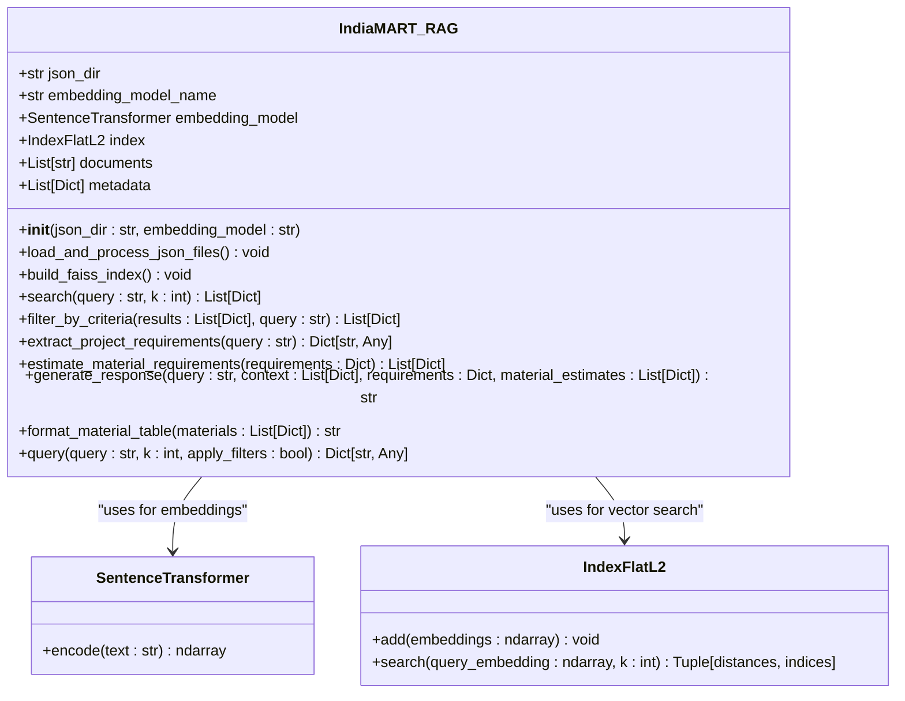
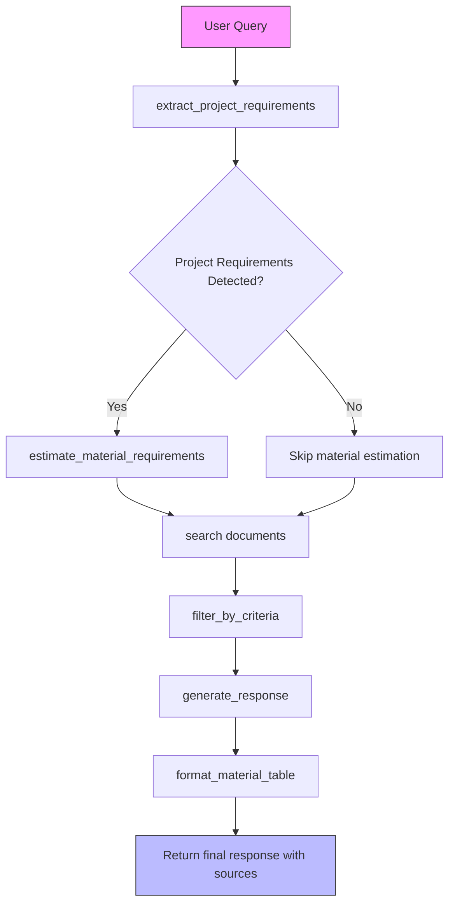
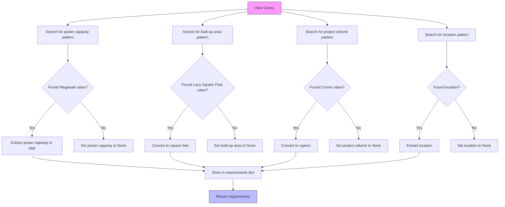
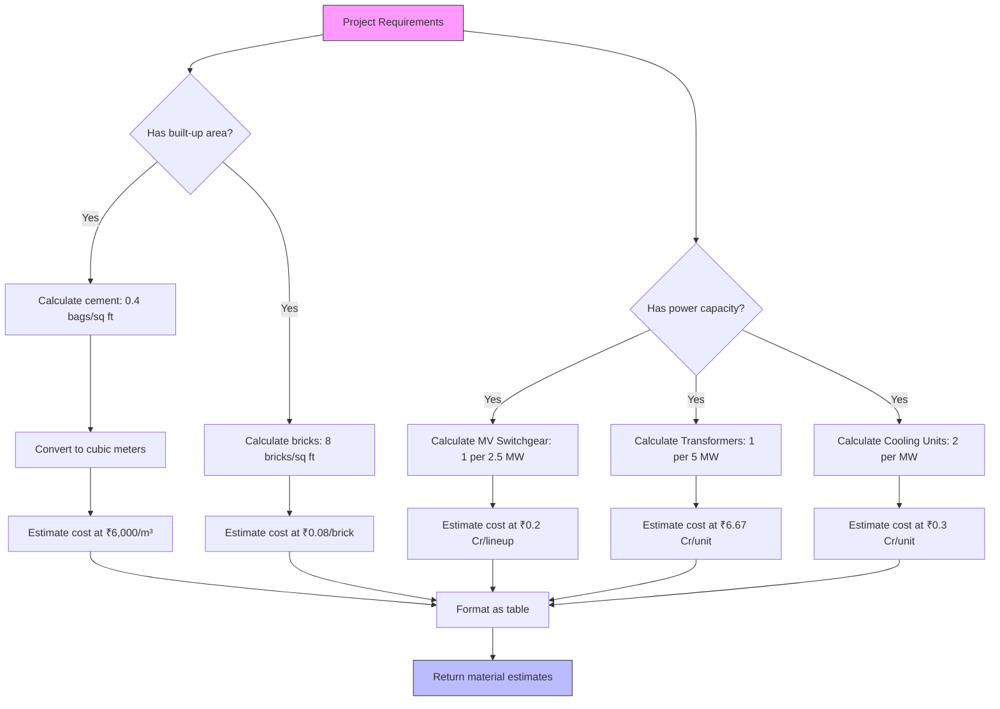
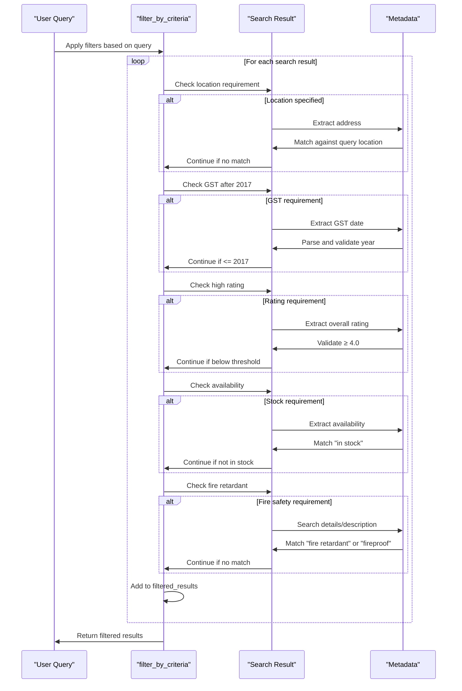
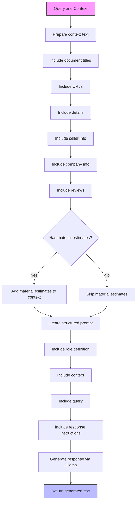

# RAG Core Engine

<cite>
**Referenced Files in This Document**   
- [rag.py](file://rag.py)
- [retriever.py](file://retriever.py)
- [details.py](file://details.py)
</cite>

## Table of Contents
1. [Introduction](#introduction)
2. [Core Architecture](#core-architecture)
3. [Query Processing Pipeline](#query-processing-pipeline)
4. [Project Requirements Extraction](#project-requirements-extraction)
5. [Material Estimation Integration](#material-estimation-integration)
6. [Context Filtering and Relevance](#context-filtering-and-relevance)
7. [Response Generation and Prompt Engineering](#response-generation-and-prompt-engineering)
8. [Source Attribution and Output Formatting](#source-attribution-and-output-formatting)
9. [Conclusion](#conclusion)

## Introduction

The IndiaMART_RAG class implements a sophisticated Retrieval-Augmented Generation (RAG) engine specifically designed for construction procurement queries. This system orchestrates a complete pipeline from input parsing to final response generation, combining semantic search, context-aware filtering, project specification analysis, and LLM-powered response synthesis. The engine processes natural language queries about construction materials and vendors, extracting key requirements, retrieving relevant product information from a knowledge base, applying intelligent filters, and generating comprehensive, context-aware responses with proper source attribution.

**Section sources**
- [rag.py](file://rag.py#L11-L409)

## Core Architecture

The RAG engine follows a modular architecture with distinct components for data loading, indexing, retrieval, filtering, and response generation. The system is initialized with a JSON directory containing product data and uses the SentenceTransformer model for embedding generation. The FAISS vector index enables efficient similarity search across the product catalog.

**Diagram sources**
- [rag.py](file://rag.py#L11-L409)

**Section sources**
- [rag.py](file://rag.py#L11-L409)

## Query Processing Pipeline

The query method serves as the central orchestrator of the RAG pipeline, coordinating multiple stages of processing to transform a natural language query into a comprehensive response. The workflow begins with project requirements extraction, followed by document retrieval, context filtering, response generation, and final output formatting.

**Diagram sources**
- [rag.py](file://rag.py#L372-L409)

**Section sources**
- [rag.py](file://rag.py#L372-L409)

## Project Requirements Extraction

The system employs pattern-based extraction to identify key project specifications from user queries. The extract_project_requirements method scans for numerical values associated with power capacity (in Megawatts), built-up area (in Lacs Square Feet), and project volume (in Crores Rupees). It also extracts location information, with special handling for "Navi Mumbai" as a common query parameter. This structured extraction enables the system to understand the scale and context of construction projects, which informs subsequent material estimation and vendor recommendations.

**Diagram sources**
- [rag.py](file://rag.py#L207-L241)

**Section sources**
- [rag.py](file://rag.py#L207-L241)

## Material Estimation Integration

When project requirements are detected, the system generates material estimates using industry-standard construction norms. The estimate_material_requirements method calculates quantities and costs for key construction materials based on the extracted project specifications. For building projects, it estimates cement and brick requirements based on built-up area. For power projects, it estimates switchgear, transformers, and cooling systems based on power capacity. The estimates include both quantities and cost projections, providing valuable guidance for procurement planning.

**Diagram sources**
- [rag.py](file://rag.py#L243-L301)

**Section sources**
- [rag.py](file://rag.py#L243-L301)

## Context Filtering and Relevance

The filter_by_criteria method applies intelligent post-retrieval filtering to ensure response relevance. It examines search results against query-specific criteria such as location, GST registration date, vendor ratings, product availability, and material properties like fire retardancy. The filtering logic combines text pattern matching with structured data analysis, allowing the system to honor complex user requirements. For example, when a user requests "vendors with GST after 2017 in Navi Mumbai with high ratings," the system validates each candidate vendor's GST registration date, location, and rating before including them in the response.

**Diagram sources**
- [rag.py](file://rag.py#L142-L205)

**Section sources**
- [rag.py](file://rag.py#L142-L205)

## Response Generation and Prompt Engineering

The generate_response method orchestrates context-aware response generation using the Ollama LLM. It constructs a comprehensive prompt that includes retrieved product information, vendor details, and material estimates when applicable. The prompt engineering strategy emphasizes factual accuracy, source attribution, and structured output. The system instructs the LLM to only use information from the provided context, include URLs for all mentioned products, and format material estimates as tables. This careful prompt design ensures consistent, reliable, and actionable responses that meet the needs of construction procurement professionals.

**Diagram sources**
- [rag.py](file://rag.py#L303-L355)

**Section sources**
- [rag.py](file://rag.py#L303-L355)

## Source Attribution and Output Formatting

The system maintains transparency through comprehensive source attribution. All retrieved documents contribute their URLs to the sources list, which is included in the final response. When material estimates are generated, they are formatted as Markdown tables with clear headers for Material/Equipment, Quantity, and Unit Cost. The final output combines the LLM-generated response with the material estimation table (when applicable) and the list of source URLs, providing a complete and verifiable answer. This approach ensures users can validate information and explore original product listings for further details.

**Section sources**
- [rag.py](file://rag.py#L372-L409)

## Conclusion

The IndiaMART_RAG engine demonstrates a sophisticated implementation of RAG principles for construction procurement. By integrating semantic search, structured data extraction, intelligent filtering, and LLM-powered response generation, the system provides comprehensive, context-aware answers to complex procurement queries. Its ability to extract project specifications, generate material estimates, and apply multi-criteria filtering makes it particularly valuable for construction professionals who need accurate, actionable information. The transparent source attribution and structured output formatting further enhance the system's reliability and usability in professional settings.