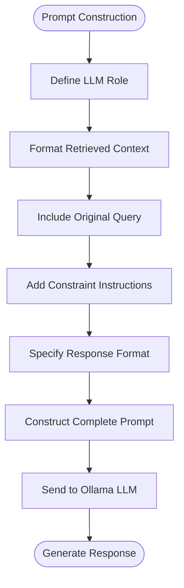
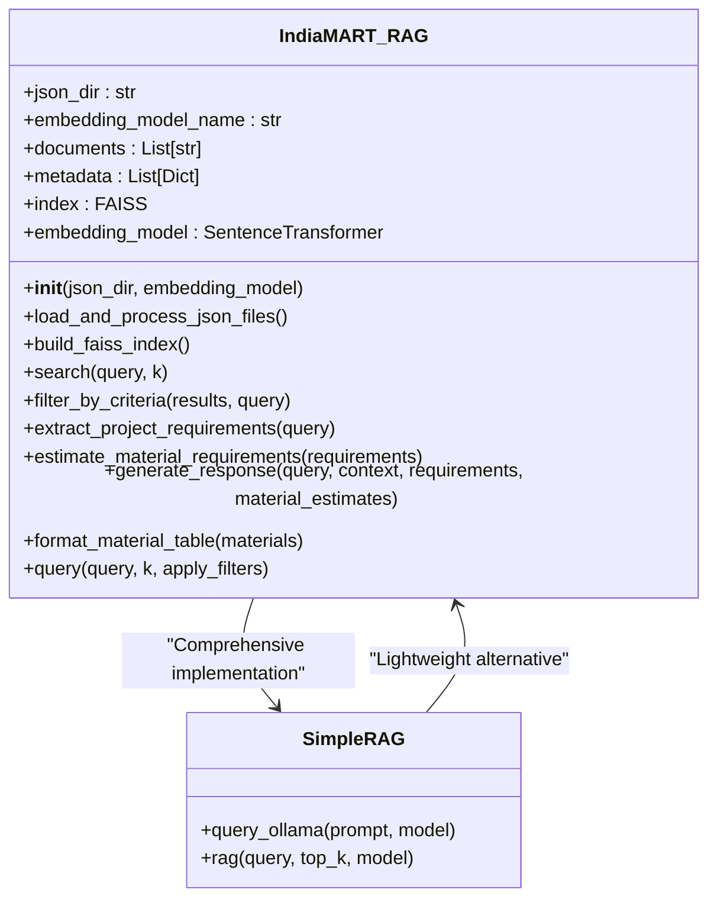
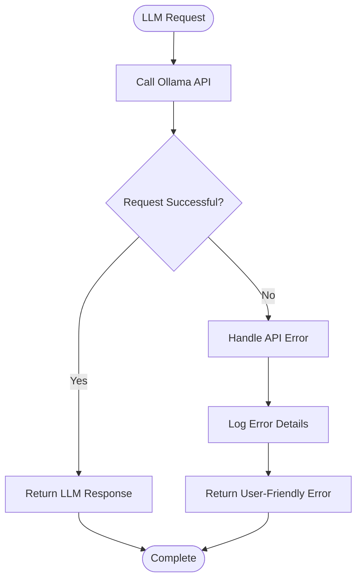

# Response Generation

<cite>
**Referenced Files in This Document**  
- [seek/rag.py](file://seek/rag.py)
- [rag.py](file://rag.py)
- [retriever.py](file://retriever.py)
</cite>

## Table of Contents
1. [Introduction](#introduction)
2. [Core Response Generation Mechanism](#core-response-generation-mechanism)
3. [Prompt Engineering Strategy](#prompt-engineering-strategy)
4. [Comparison of RAG Implementations](#comparison-of-rag-implementations)
5. [Source Attribution and Output Formatting](#source-attribution-and-output-formatting)
6. [Error Handling and API Communication](#error-handling-and-api-communication)
7. [Model Configuration and Customization](#model-configuration-and-customization)
8. [Conclusion](#conclusion)

## Introduction

The Response Generation subsystem is a critical component of the RAG (Retrieval-Augmented Generation) Core Engine, responsible for synthesizing retrieved information into coherent, contextually relevant responses. This document details the implementation of response generation across two distinct modules: the comprehensive `seek/rag.py` implementation and the lightweight standalone `rag.py` module. The system leverages the Ollama LLM to generate responses based on search results, metadata, and material estimates, with careful attention to prompt engineering, source attribution, and error handling.

**Section sources**
- [seek/rag.py](file://seek/rag.py#L303-L355)
- [rag.py](file://rag.py#L26-L71)

## Core Response Generation Mechanism

The response generation process begins with the `generate_response` method in the `IndiaMART_RAG` class, which orchestrates the construction of a structured prompt for the LLM. The method takes as input a user query, search context (retrieved documents), optional project requirements, and material estimates. It first formats the context by iterating through each search result, extracting and organizing metadata such as title, URL, product details, seller information, and company information into a human-readable format.

When material estimates are available (typically when project specifications are detected in the query), these are appended to the context, providing the LLM with quantitative data about required materials, quantities, and costs. This contextual enrichment enables the generation of responses that not only answer the query but also provide actionable procurement guidance.

The core logic flows through a well-defined sequence: context preparation → prompt construction → LLM invocation → response formatting. This pipeline ensures that all relevant information is properly structured before being presented to the language model, maximizing the quality and relevance of generated responses.

**Section sources**
- [seek/rag.py](file://seek/rag.py#L303-L355)
- [seek/rag.py](file://seek/rag.py#L400-L434)

## Prompt Engineering Strategy

The prompt engineering strategy employed in both RAG implementations follows a consistent pattern designed to guide the LLM toward producing accurate, helpful, and constrained responses. The prompt template is carefully structured with several key components:

1. **Role Definition**: The prompt begins by establishing the LLM's role as a "product and vendor assistant for construction procurement," setting clear expectations for the type of responses to generate.

2. **Context Presentation**: Retrieved documents are presented in a structured format with clear labels (Title, URL, Details, Seller Info, Company Info), making it easy for the LLM to parse and utilize the information.

3. **Query Repetition**: The original user query is included verbatim, ensuring the LLM understands exactly what information is being requested.

4. **Instruction Set**: A comprehensive set of instructions guides the LLM's behavior, emphasizing critical constraints such as "Only use information from the context. Do not invent details."

5. **Response Format Guidance**: The instructions specify exactly how different types of information should be presented (product listings, vendor information, filtered results, material estimates).

This structured approach to prompt engineering ensures consistency in response quality and format while preventing hallucination and maintaining factual accuracy based on the provided context.

**Diagram sources**
- [seek/rag.py](file://seek/rag.py#L320-L350)
- [rag.py](file://rag.py#L50-L65)

## Comparison of RAG Implementations

The repository contains two distinct RAG implementations that serve different purposes within the system architecture. The `seek/rag.py` module represents a comprehensive, feature-rich implementation designed for complex procurement scenarios, while the standalone `rag.py` provides a lightweight, modular approach suitable for simpler queries.

The `seek/rag.py` implementation is object-oriented and includes advanced functionality such as:
- Project requirement extraction from natural language queries
- Material estimation based on project specifications (power capacity, built-up area, budget)
- Sophisticated filtering capabilities (location, GST registration date, ratings, availability, fire retardancy)
- Integrated FAISS vector database for similarity search
- Complete end-to-end processing from query to formatted response

In contrast, the standalone `rag.py` module follows a functional programming paradigm and focuses on the core RAG pipeline:
- Simple retrieval using ChromaDB
- Basic prompt construction and LLM interaction
- Minimal post-processing of results
- Direct return of sources with the answer

The choice between these implementations depends on the use case: `seek/rag.py` is appropriate for complex procurement scenarios requiring material estimation and advanced filtering, while `rag.py` serves as a lightweight option for straightforward product and vendor queries.

**Diagram sources**
- [seek/rag.py](file://seek/rag.py#L30-L434)
- [rag.py](file://rag.py#L1-L71)

**Section sources**
- [seek/rag.py](file://seek/rag.py#L303-L355)
- [rag.py](file://rag.py#L26-L71)

## Source Attribution and Output Formatting

Source attribution is a critical aspect of the response generation system, ensuring transparency and enabling users to verify information. Both implementations maintain source attribution through metadata tracking, but they differ in their approach to presenting this information.

In `seek/rag.py`, sources are extracted from the metadata of filtered search results and returned as part of the structured response dictionary. The final response includes both the generated answer and a list of source URLs, allowing for clear separation of content and provenance. When material estimates are included, they are presented in a formatted table that enhances readability.

The standalone `rag.py` module takes a simpler approach, appending the sources directly to the answer text with a "Sources:" header. This inline attribution makes it immediately clear which URLs support the response, though it provides less structured separation between the answer and its sources.

Both implementations ensure that every product or vendor mentioned in the response is accompanied by its corresponding URL, maintaining traceability and enabling users to explore the original information. This commitment to source transparency is reinforced by the prompt instructions that explicitly require URLs for all mentioned products and vendors.

**Section sources**
- [seek/rag.py](file://seek/rag.py#L420-L430)
- [rag.py](file://rag.py#L68-L71)

## Error Handling and API Communication

The response generation subsystem includes robust error handling mechanisms to ensure reliability during LLM communication. Both implementations wrap their API calls in try-except blocks to gracefully handle potential failures.

In `seek/rag.py`, the `generate_response` method uses a try-except block around the `ollama.chat` call, catching any exceptions that may occur during communication with the Ollama API. If an error occurs, the method returns a user-friendly error message rather than failing silently or propagating a technical exception.

The standalone `rag.py` module implements similar error handling in the `query_ollama` function, which catches `requests.RequestException` and related errors. This function provides more detailed error reporting by printing the specific error to the console while returning a generic error message to the user, balancing transparency with usability.

Both implementations follow a fail-safe approach: when the LLM cannot generate a response due to API issues, the system returns an appropriate error message rather than attempting to generate content independently. This prevents the presentation of potentially incorrect or hallucinated information when the primary generation mechanism is unavailable.

**Diagram sources**
- [seek/rag.py](file://seek/rag.py#L345-L355)
- [rag.py](file://rag.py#L15-L24)

**Section sources**
- [seek/rag.py](file://seek/rag.py#L345-L355)
- [rag.py](file://rag.py#L15-L24)

## Model Configuration and Customization

The response generation system provides flexibility in model configuration and prompt customization, allowing adaptation to different requirements and preferences. Both implementations default to using the `llama3:latest` model, but this can be easily modified through parameterization.

The `seek/rag.py` implementation offers extensive customization opportunities through its structured prompt template. The instructions section can be modified to change the response style, add new constraints, or emphasize different aspects of the response. For example, the prompt could be adjusted to produce more verbose explanations, focus on cost comparisons, or prioritize certain vendor attributes.

The standalone `rag.py` module provides model selection through the `model` parameter in both the `query_ollama` and `rag` functions, making it easy to switch between different LLMs supported by Ollama. This parameterization facilitates experimentation with different models to find the optimal balance of performance, cost, and response quality.

For extending support to additional LLMs beyond Ollama, the architecture would require minimal changes—primarily updating the API endpoint and payload format in the `query_ollama` function or its equivalent in the `seek` implementation. This modular design makes the system adaptable to different LLM providers while maintaining the core RAG functionality.

**Section sources**
- [seek/rag.py](file://seek/rag.py#L345-L355)
- [rag.py](file://rag.py#L4-L24)

## Conclusion

The Response Generation subsystem of the RAG Core Engine demonstrates a thoughtful approach to leveraging LLMs for construction procurement assistance. Through careful prompt engineering, robust error handling, and transparent source attribution, the system generates reliable, contextually relevant responses that help users make informed procurement decisions.

The dual implementation strategy—featuring both a comprehensive `seek/rag.py` module and a lightweight standalone `rag.py`—provides flexibility for different use cases, from complex project planning with material estimation to simple product and vendor queries. The consistent prompt structure across both implementations ensures a uniform response style while allowing for feature differentiation based on application requirements.

Key strengths of the system include its constraint enforcement (preventing hallucination), structured context presentation, and transparent source attribution. These features make the system particularly well-suited for procurement applications where accuracy and traceability are paramount. The modular design also facilitates future enhancements, such as support for additional LLMs, expanded filtering capabilities, or integration with other data sources.