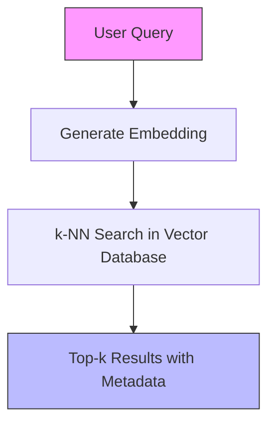
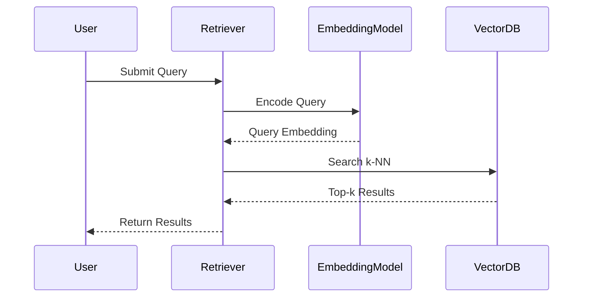
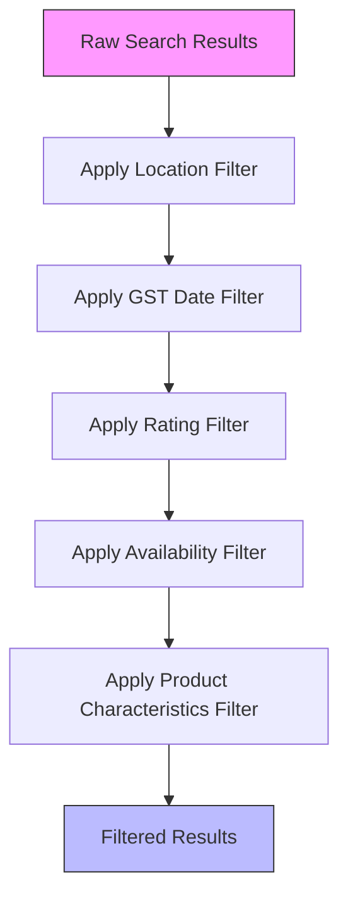
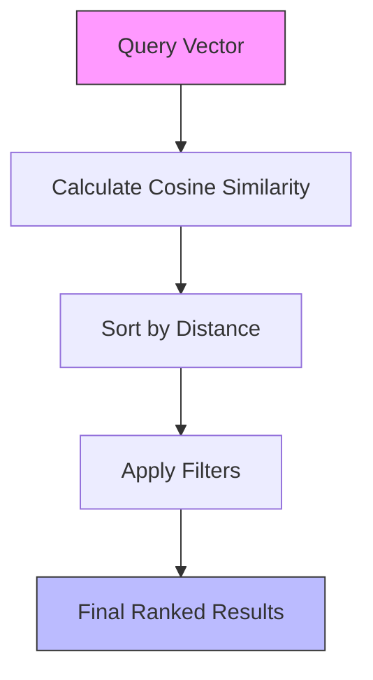
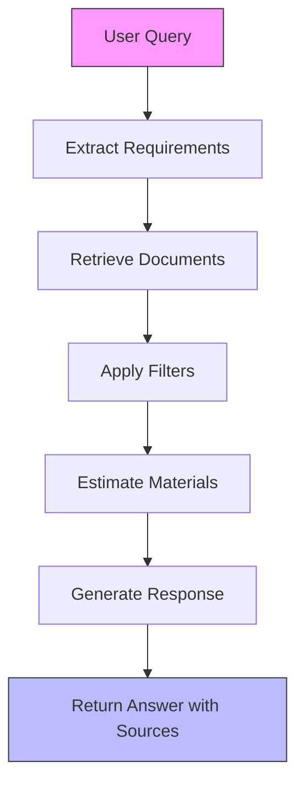
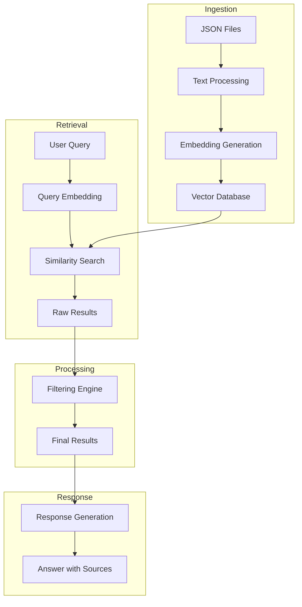

# Retrieval System

<cite>
**Referenced Files in This Document**   
- [retriever.py](file://retriever.py)
- [rag.py](file://rag.py)
- [ingest.py](file://ingest.py)
- [seek/rag.py](file://seek/rag.py)
</cite>

## Table of Contents
1. [Introduction](#introduction)
2. [Core Retrieval Mechanism](#core-retrieval-mechanism)
3. [Semantic Search Implementation](#semantic-search-implementation)
4. [Filtering Mechanisms](#filtering-mechanisms)
5. [Relevance Scoring and Ranking](#relevance-scoring-and-ranking)
6. [Query Processing Pipeline](#query-processing-pipeline)
7. [Performance Considerations](#performance-considerations)
8. [Architecture Overview](#architecture-overview)

## Introduction

The retrieval system in this RAG (Retrieval-Augmented Generation) pipeline implements a sophisticated document retrieval mechanism that combines semantic search with metadata filtering to deliver relevant construction product and vendor information. The system is designed to handle complex queries involving product specifications, vendor qualifications, and project requirements. It leverages vector similarity for semantic understanding of queries while applying post-retrieval filters to refine results based on specific criteria such as location, ratings, availability, and regulatory compliance.

**Section sources**
- [retriever.py](file://retriever.py#L0-L18)
- [seek/rag.py](file://seek/rag.py#L11-L434)

## Core Retrieval Mechanism

The retrieval system operates through two distinct implementations: a ChromaDB-based vector store and a FAISS-based index. The primary retrieval function in `retriever.py` uses ChromaDB to perform k-NN (k-Nearest Neighbors) search on pre-computed embeddings. When a query is received, it is transformed into a vector using the SentenceTransformer model and compared against the vector database using cosine similarity. The system returns the top-k most similar document chunks along with their metadata and distance scores.

An alternative implementation in the `seek` module uses FAISS for indexing, which provides efficient similarity search and clustering of dense vectors. This implementation demonstrates a different approach to vector storage and retrieval, offering potential performance benefits for large-scale operations.

**Diagram sources**
- [retriever.py](file://retriever.py#L8-L18)
- [seek/rag.py](file://seek/rag.py#L116-L140)

**Section sources**
- [retriever.py](file://retriever.py#L8-L18)
- [seek/rag.py](file://seek/rag.py#L116-L140)

## Semantic Search Implementation

The semantic search functionality is implemented using the SentenceTransformer model 'all-MiniLM-L6-v2', which converts both queries and documents into 384-dimensional embedding vectors. The retrieval process begins with the encoding of the user query into a vector representation that captures its semantic meaning rather than relying on keyword matching.

The system supports two vector database backends: ChromaDB and FAISS. ChromaDB provides a persistent client for storing and querying embeddings, while FAISS offers optimized data structures for efficient similarity search. The choice of database affects the retrieval algorithm and performance characteristics, with FAISS typically providing faster search times for large datasets.

When processing queries, the system applies the same embedding model used during ingestion to ensure consistency between query and document representations. This approach enables the system to find relevant results even when the query uses different terminology than the indexed documents, as long as the semantic meaning is similar.

**Diagram sources**
- [retriever.py](file://retriever.py#L8-L18)
- [ingest.py](file://ingest.py#L0-L94)

**Section sources**
- [retriever.py](file://retriever.py#L8-L18)
- [ingest.py](file://ingest.py#L0-L94)

## Filtering Mechanisms

The retrieval system implements comprehensive post-retrieval filtering to refine results based on specific criteria mentioned in user queries. These filters are applied after the initial semantic search to ensure that only documents meeting all specified conditions are returned.

The filtering system supports several criteria:
- **Location**: Filters results based on geographic location mentioned in the query (e.g., "in Navi Mumbai")
- **Regulatory Compliance**: Filters vendors based on GST registration date (e.g., "GST after 2017")
- **Quality Ratings**: Filters products and vendors by customer ratings (e.g., "high rating" or "rating > 4")
- **Availability**: Filters products based on stock status (e.g., "available in stock")
- **Product Characteristics**: Filters based on specific product attributes (e.g., "fire retardant" or "fireproof")

The filtering logic is implemented in the `filter_by_criteria` method, which examines metadata from the initial search results and applies regular expression patterns to extract filtering conditions from the query text. This approach allows for flexible and natural language-based filtering without requiring structured query syntax.

**Diagram sources**
- [seek/rag.py](file://seek/rag.py#L142-L205)

**Section sources**
- [seek/rag.py](file://seek/rag.py#L142-L205)

## Relevance Scoring and Ranking

The retrieval system employs a multi-stage relevance scoring and ranking strategy that combines vector similarity with metadata-based filtering. The initial ranking is determined by cosine similarity scores from the vector database, with closer vectors considered more relevant to the query.

The relevance scoring process follows these steps:
1. Generate embedding for the user query
2. Perform k-NN search to find the most similar document vectors
3. Rank results by distance (lower distance = higher relevance)
4. Apply post-retrieval filters to remove non-compliant results
5. Return the final ranked list of relevant documents

The system uses cosine similarity as the distance metric, which measures the cosine of the angle between the query vector and document vectors. This metric is particularly effective for text data as it focuses on the orientation rather than the magnitude of the vectors, making it robust to differences in document length.

After filtering, the results maintain their original similarity-based ranking, ensuring that the most semantically relevant documents appear first in the results list, provided they meet all filtering criteria.

**Diagram sources**
- [retriever.py](file://retriever.py#L8-L18)
- [seek/rag.py](file://seek/rag.py#L116-L140)

**Section sources**
- [retriever.py](file://retriever.py#L8-L18)
- [seek/rag.py](file://seek/rag.py#L116-L140)

## Query Processing Pipeline

The complete query processing pipeline integrates retrieval, filtering, and response generation into a cohesive workflow. The pipeline begins with query analysis to extract project requirements and filtering criteria, followed by document retrieval and filtering, and concludes with response generation.

The pipeline handles several types of information:
- **Project Requirements**: Extracts specifications like power capacity, built-up area, and project volume
- **Material Estimation**: Calculates required materials based on project specifications
- **Document Retrieval**: Finds relevant products and vendors
- **Response Generation**: Creates a comprehensive answer with sources

This end-to-end pipeline enables the system to answer complex queries that require both information retrieval and computational reasoning, such as estimating material requirements for construction projects.

**Diagram sources**
- [seek/rag.py](file://seek/rag.py#L207-L409)

**Section sources**
- [seek/rag.py](file://seek/rag.py#L207-L409)

## Performance Considerations

The retrieval system balances accuracy and performance through several design choices. The use of pre-computed embeddings allows for fast similarity search at query time, as the computationally expensive embedding generation is performed during the ingestion phase rather than at retrieval.

The system implements k-NN search with a configurable k parameter, allowing trade-offs between result comprehensiveness and response time. Smaller k values return results faster but may miss relevant documents, while larger k values increase search time but improve recall.

The two-vector database implementations (ChromaDB and FAISS) offer different performance characteristics. ChromaDB provides persistence and ease of use, while FAISS offers optimized search algorithms for high-performance scenarios. The choice between these depends on the specific deployment requirements and scale.

Post-retrieval filtering adds computational overhead but significantly improves result precision. The system applies filters sequentially and can short-circuit when a document fails an early filter, minimizing unnecessary processing.

**Section sources**
- [retriever.py](file://retriever.py#L0-L18)
- [seek/rag.py](file://seek/rag.py#L98-L114)
- [ingest.py](file://ingest.py#L0-L94)

## Architecture Overview

The retrieval system architecture consists of multiple interconnected components that work together to deliver relevant information to users. The system follows a modular design with clear separation of concerns between data ingestion, indexing, retrieval, filtering, and response generation.

The architecture supports multiple retrieval backends, allowing flexibility in deployment scenarios. The core functionality remains consistent across implementations, ensuring that the system can adapt to different performance and scalability requirements.

**Diagram sources**
- [ingest.py](file://ingest.py#L0-L94)
- [retriever.py](file://retriever.py#L0-L18)
- [seek/rag.py](file://seek/rag.py#L11-L434)

**Section sources**
- [ingest.py](file://ingest.py#L0-L94)
- [retriever.py](file://retriever.py#L0-L18)
- [seek/rag.py](file://seek/rag.py#L11-L434)