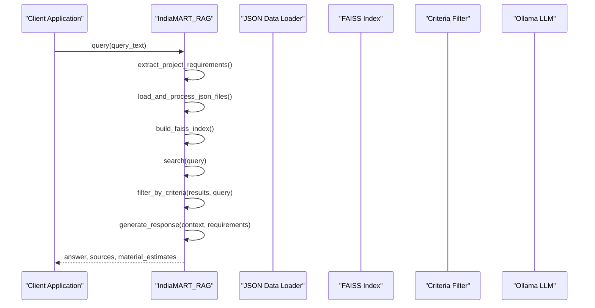
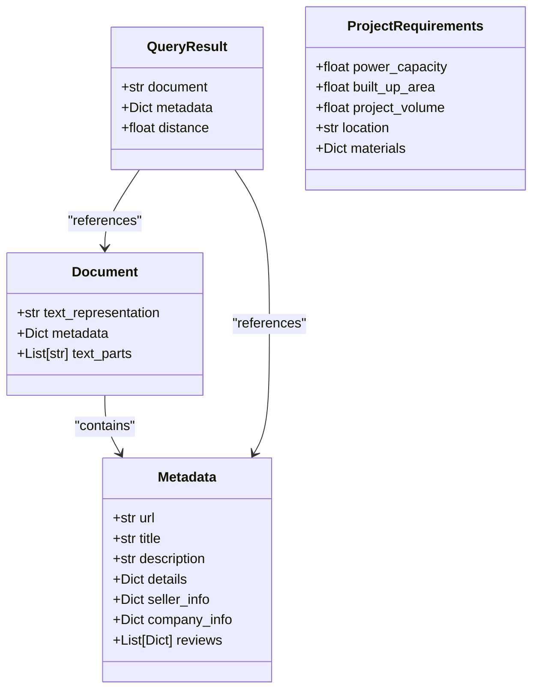
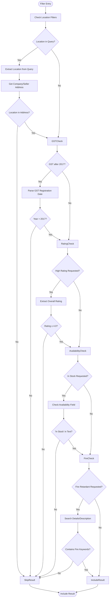
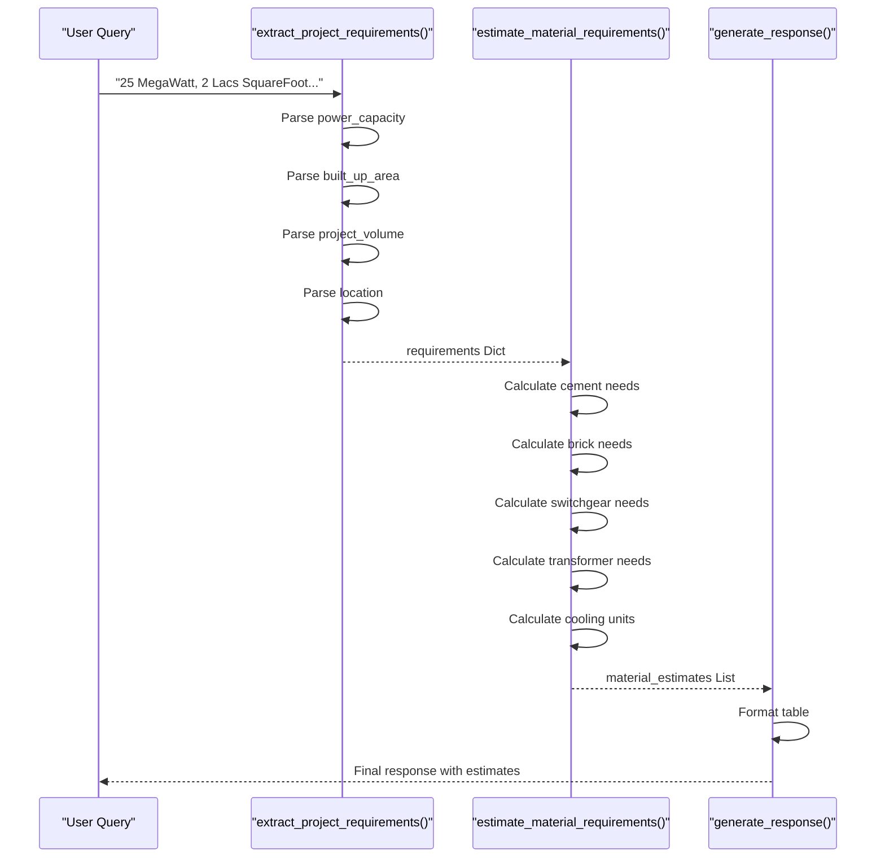
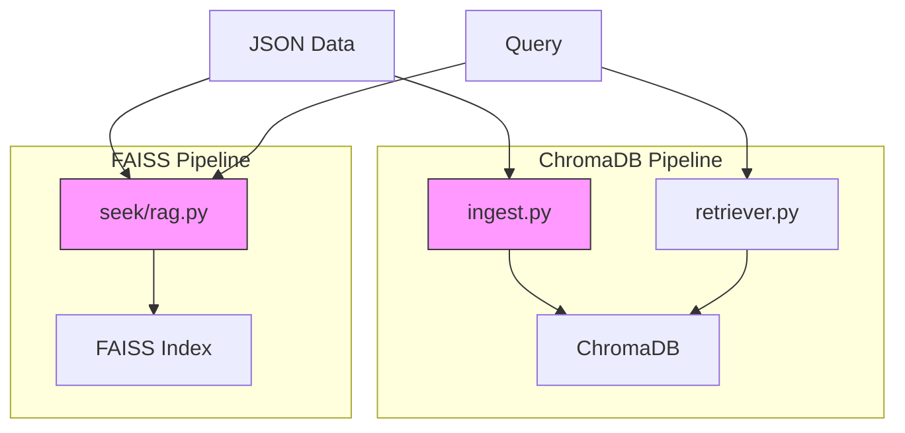

# Component Interactions

<cite>
**Referenced Files in This Document**  
- [seek/rag.py](file://seek/rag.py)
- [details.py](file://details.py)
- [ingest.py](file://ingest.py)
- [retriever.py](file://retriever.py)
</cite>

## Table of Contents
1. [IndiaMART_RAG Class Overview](#indiamart_rag-class-overview)
2. [Core Method Invocation Flow](#core-method-invocation-flow)
3. [Domain Models and Data Structures](#domain-models-and-data-structures)
4. [Filtering Logic Implementation](#filtering-logic-implementation)
5. [Project Requirements Parsing and Material Estimation](#project-requirements-parsing-and-material-estimation)
6. [Integration Challenges and Solutions](#integration-challenges-and-solutions)

## IndiaMART_RAG Class Overview

The `IndiaMART_RAG` class serves as the central orchestrator in the vendor-rag-model system, coordinating data loading, indexing, retrieval, filtering, and response generation components. It encapsulates the complete RAG pipeline for construction procurement vendor search, transforming raw JSON product data into actionable insights through a series of method invocations.

The class manages several key state variables including `documents` (text representations for embedding), `metadata` (structured product and vendor information), and `index` (FAISS vector index for similarity search). These components work together to enable efficient retrieval and filtering of vendor information based on complex query criteria.

**Section sources**
- [seek/rag.py](file://seek/rag.py#L11-L409)

## Core Method Invocation Flow

The component interaction begins with the initialization of the `IndiaMART_RAG` class, which sets up the embedding model and initializes data structures. The primary workflow follows a sequential invocation pattern that orchestrates the entire retrieval process:

**Diagram sources**
- [seek/rag.py](file://seek/rag.py#L303-L355)
- [seek/rag.py](file://seek/rag.py#L20-L43)
- [seek/rag.py](file://seek/rag.py#L98-L114)
- [seek/rag.py](file://seek/rag.py#L116-L140)
- [seek/rag.py](file://seek/rag.py#L142-L205)

The `query` method serves as the entry point, orchestrating the entire pipeline. It first extracts project requirements from natural language queries, then loads and processes JSON files containing vendor data. After building the FAISS index for efficient similarity search, it retrieves relevant documents and applies additional filtering based on query criteria before generating a natural language response.

## Domain Models and Data Structures

The system employs several key domain models that structure the vendor and product information:

**Diagram sources**
- [seek/rag.py](file://seek/rag.py#L60-L95)
- [details.py](file://details.py#L100-L150)

The `Document` class represents the text-embedded version of vendor data, created by combining title, details, description, seller information, and company information into a single text representation. The `Metadata` structure preserves the original structured data from IndiaMART listings, including URLs, product details, seller information, company information, and customer reviews. Query results combine both the document text and its associated metadata with a distance score from the vector search.

## Filtering Logic Implementation

The system implements sophisticated filtering logic through the `filter_by_criteria` method, which applies business rules based on natural language query patterns. The filtering process examines multiple dimensions of vendor data to ensure precise results:

**Diagram sources**
- [seek/rag.py](file://seek/rag.py#L142-L205)

The filtering logic handles several key criteria:
- **Location filtering**: Matches queries containing "in [location]" or "Navi Mumbai" by checking company and seller addresses
- **GST date filtering**: Parses GST registration dates and filters for registrations after 2017
- **Rating filtering**: Extracts overall ratings from reviews and filters for ratings above 4.0
- **Availability filtering**: Checks product availability status for "in stock" items
- **Fire retardant filtering**: Searches product details and descriptions for fireproof or fire retardant characteristics

## Project Requirements Parsing and Material Estimation

The system includes specialized functionality for parsing project specifications from natural language queries and generating material estimates. This capability bridges the gap between high-level project requirements and specific vendor recommendations.

**Diagram sources**
- [seek/rag.py](file://seek/rag.py#L207-L301)
- [seek/rag.py](file://seek/rag.py#L303-L355)

The `extract_project_requirements` method uses regular expressions to identify key project parameters in natural language queries, including power capacity (in Megawatts), built-up area (in Lacs Square Feet), project volume (in Crores Rupees), and location. When these requirements are detected, the `estimate_material_requirements` method calculates material needs based on construction industry norms:

- Cement: 0.4 bags per square foot
- Bricks: 8 bricks per square foot  
- Medium Voltage Switchgear: 1 lineup per 2.5 MW
- Transformers: 1 unit per 5 MW
- Cooling units: 2 units per MW

These estimates are formatted into a markdown table and included in the final response to provide comprehensive project planning support.

## Integration Challenges and Solutions

The vendor-rag-model system addresses several integration challenges that commonly arise in RAG implementations:

### Embedding Mismatches
The system ensures embedding consistency by using the same `sentence-transformers/all-MiniLM-L6-v2` model for both document indexing and query encoding. This prevents embedding space mismatches that could degrade retrieval quality.

### Index Persistence
While the current implementation builds the FAISS index in memory during each session, the system could be enhanced with index persistence by saving and loading the index using FAISS's built-in serialization methods (`faiss.write_index` and `faiss.read_index`).

### Metadata Consistency Across ChromaDB and FAISS
The codebase reveals a dual-vector store architecture where ChromaDB is used in `ingest.py` and `retriever.py` while FAISS is used in `seek/rag.py`. This creates potential metadata consistency challenges:

**Diagram sources**
- [ingest.py](file://ingest.py#L70-L94)
- [retriever.py](file://retriever.py#L10-L18)
- [seek/rag.py](file://seek/rag.py#L98-L114)

The system currently maintains separate ingestion and retrieval paths, with `ingest.py` populating ChromaDB and `seek/rag.py` independently loading JSON files and building a FAISS index. This duplication could lead to metadata inconsistencies if the data sources diverge. A unified approach would improve data consistency and reduce maintenance overhead.

**Section sources**
- [ingest.py](file://ingest.py#L70-L94)
- [retriever.py](file://retriever.py#L10-L18)
- [seek/rag.py](file://seek/rag.py#L98-L114)