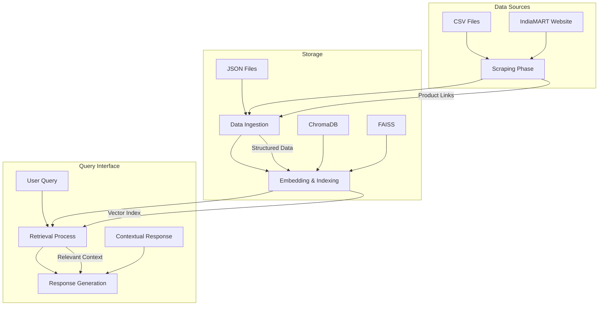
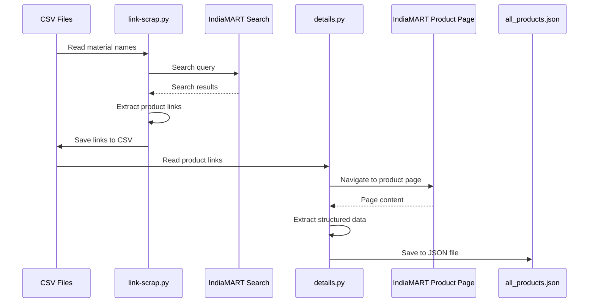
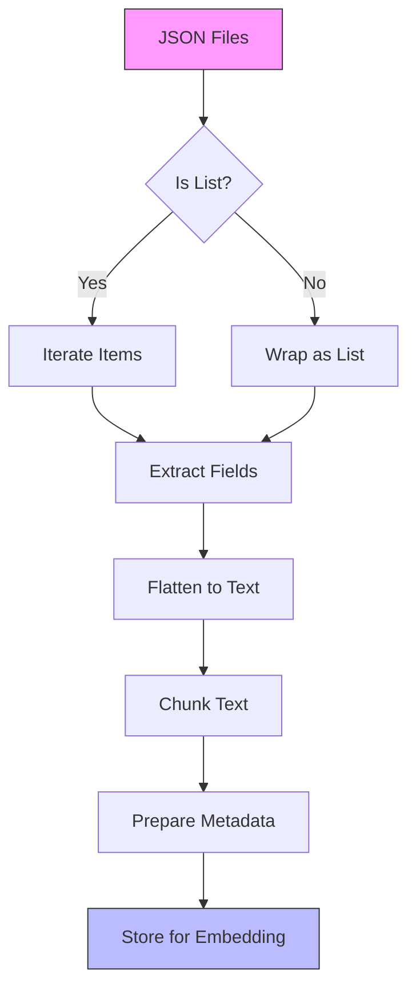
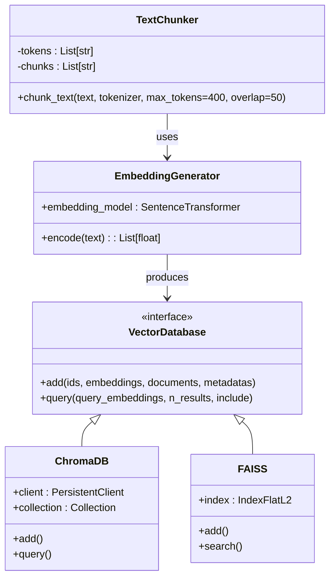
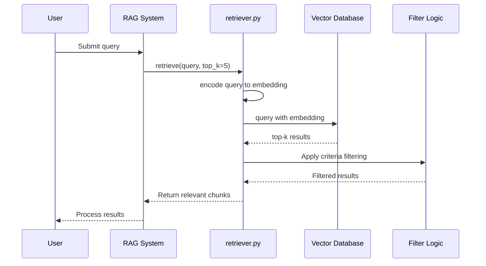
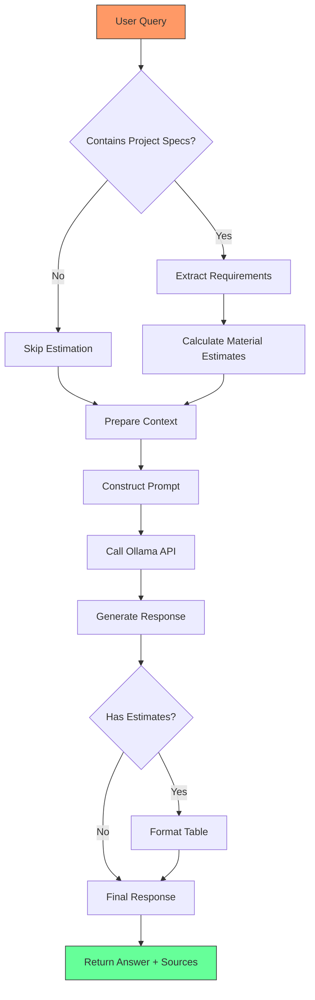

# Data Flow

<cite>
**Referenced Files in This Document**  
- [link-scrap.py](file://link-scrap.py)
- [details.py](file://details.py)
- [ingest.py](file://ingest.py)
- [retriever.py](file://retriever.py)
- [rag.py](file://rag.py)
- [seek/rag.py](file://seek/rag.py)
</cite>

## Table of Contents
1. [Data Flow Overview](#data-flow-overview)
2. [Scraping Phase](#scraping-phase)
3. [Data Ingestion and Processing](#data-ingestion-and-processing)
4. [Embedding and Indexing](#embedding-and-indexing)
5. [Retrieval Process](#retrieval-process)
6. [Response Generation](#response-generation)
7. [Error Handling](#error-handling)
8. [Performance Considerations](#performance-considerations)

## Data Flow Overview

The vendor-rag-model system implements a comprehensive Retrieval-Augmented Generation (RAG) pipeline for construction procurement, transforming raw product data from IndiaMART into contextual responses. The end-to-end data flow consists of five sequential phases: scraping, ingestion, embedding/indexing, retrieval, and response generation. This architecture enables users to query for construction materials and vendors with natural language, receiving accurate, contextually relevant responses based on real product data.

**Diagram sources**
- [link-scrap.py](file://link-scrap.py)
- [details.py](file://details.py)
- [ingest.py](file://ingest.py)
- [retriever.py](file://retriever.py)
- [rag.py](file://rag.py)

**Section sources**
- [link-scrap.py](file://link-scrap.py)
- [details.py](file://details.py)
- [ingest.py](file://ingest.py)
- [retriever.py](file://retriever.py)
- [rag.py](file://rag.py)

## Scraping Phase

The data flow begins with the scraping phase, where product information is extracted from IndiaMART through two coordinated scripts: `link-scrap.py` and `details.py`. This phase follows a two-step approach to efficiently gather comprehensive product data while minimizing the risk of being blocked by the website.

The process starts with `link-scrap.py`, which reads material names from CSV files (`facility_construction_summary.csv` and `construction_materials_by_facility.csv`) to generate search queries. For each material, the script performs a search on IndiaMART and extracts all product links from the search results across multiple pages. The extracted links, along with their corresponding search queries and titles, are saved to `indiamart_anchor_links.csv`.

**Diagram sources**
- [link-scrap.py](file://link-scrap.py#L1-L162)
- [details.py](file://details.py#L1-L344)

**Section sources**
- [link-scrap.py](file://link-scrap.py#L1-L162)
- [details.py](file://details.py#L1-L344)

## Data Ingestion and Processing

After scraping, the raw product data undergoes ingestion and processing through the `ingest.py` script. This phase transforms the JSON-formatted product data into a structured format suitable for embedding and retrieval. The ingestion process handles multiple JSON files from the `json/` directory, processing each file to extract relevant information from various fields.

The script flattens product information from multiple nested structures including title, description, details, company information, seller information, and reviews into a single text representation. This consolidation ensures that all relevant product attributes are available for semantic search. The processing also includes error handling for invalid JSON files, allowing the system to continue ingestion even when some files are corrupted or improperly formatted.

**Diagram sources**
- [ingest.py](file://ingest.py#L1-L94)

**Section sources**
- [ingest.py](file://ingest.py#L1-L94)

## Embedding and Indexing

The processed text data is then transformed into numerical representations through embedding and stored in vector databases for efficient retrieval. The system uses the Sentence Transformers library with the `all-MiniLM-L6-v2` model to generate 384-dimensional embeddings for each text chunk. This model was selected for its balance of performance and computational efficiency in semantic similarity tasks.

Two indexing strategies are implemented in parallel: ChromaDB and FAISS. ChromaDB provides a persistent, easy-to-use vector database with metadata filtering capabilities, while FAISS offers highly optimized similarity search for large-scale vector operations. The chunking strategy divides text into segments of 400 tokens with a 50-token overlap to maintain context continuity across chunks, addressing the model's token limit constraints.

**Diagram sources**
- [ingest.py](file://ingest.py#L7-L18)
- [seek/rag.py](file://seek/rag.py#L98-L114)

**Section sources**
- [ingest.py](file://ingest.py#L1-L94)
- [seek/rag.py](file://seek/rag.py#L1-L434)

## Retrieval Process

The retrieval process enables semantic search of the indexed product data through the `retriever.py` module. When a user query is received, it is transformed into an embedding using the same Sentence Transformers model employed during ingestion. This query embedding is then used to perform a nearest-neighbor search against the vector index, retrieving the most semantically similar product chunks.

The retrieval system implements cosine similarity-based ranking to identify the top-k most relevant results. Beyond basic semantic matching, the system incorporates additional filtering logic to refine results based on specific criteria mentioned in the query, such as location, GST registration date, product availability, and fire resistance properties. This multi-stage retrieval approach ensures that results are both contextually relevant and compliant with explicit filtering requirements.

**Diagram sources**
- [retriever.py](file://retriever.py#L8-L18)
- [seek/rag.py](file://seek/rag.py#L116-L140)

**Section sources**
- [retriever.py](file://retriever.py#L1-L18)
- [seek/rag.py](file://seek/rag.py#L142-L205)

## Response Generation

The final phase of the data flow is response generation, where retrieved context is used to create natural language responses through the RAG pipeline implemented in `rag.py`. The system constructs a comprehensive prompt that includes the user query, retrieved product context, and specific instructions for response formatting. This prompt is sent to the Ollama API running a Llama3 model, which generates contextual responses based on the provided information.

The response generation process includes sophisticated handling of different query types, from simple product searches to complex project specifications that require material estimation. When project requirements are detected in the query (such as power capacity, built-up area, or budget), the system automatically calculates estimated material requirements and presents them in a formatted table. All responses include source URLs to maintain transparency and enable users to verify information.

**Diagram sources**
- [rag.py](file://rag.py#L4-L24)
- [seek/rag.py](file://seek/rag.py#L303-L355)

**Section sources**
- [rag.py](file://rag.py#L1-L71)
- [seek/rag.py](file://seek/rag.py#L1-L434)

## Error Handling

The system implements comprehensive error handling throughout the data flow to ensure robustness and reliability. During data loading, the ingestion process includes try-catch blocks to handle JSON decoding errors, allowing the system to skip invalid files while continuing processing of valid ones. The scraping phase incorporates timeout handling and exception management for network-related issues, element location failures, and page loading problems.

In the retrieval and response generation phases, the system includes error handling for API connectivity issues with Ollama. When the Ollama service is unavailable or returns an error, the system provides a graceful fallback response rather than failing completely. The filtering logic also includes defensive programming with try-catch blocks around date parsing and type conversion operations to prevent query processing from being disrupted by malformed data in the product records.

**Section sources**
- [details.py](file://details.py#L1-L344)
- [ingest.py](file://ingest.py#L1-L94)
- [rag.py](file://rag.py#L4-L24)

## Performance Considerations

The vendor-rag-model system incorporates several performance optimizations to ensure efficient operation across all phases of the data flow. The chunking strategy with 400-token segments and 50-token overlap balances context preservation with computational efficiency, preventing information fragmentation while respecting model token limits. The use of FAISS for vector search provides highly optimized similarity calculations with sub-linear query time complexity.

Query latency is minimized through the use of pre-computed embeddings and efficient vector indexing, allowing for rapid retrieval of relevant products even from large datasets. The system also implements caching through the persistent vector databases (ChromaDB and FAISS), eliminating the need to reprocess data on each query. For project specification queries, the material estimation algorithms use simplified construction norms to provide quick, approximate calculations without requiring complex simulations or external data sources.

**Section sources**
- [ingest.py](file://ingest.py#L7-L18)
- [seek/rag.py](file://seek/rag.py#L98-L114)
- [seek/rag.py](file://seek/rag.py#L243-L301)