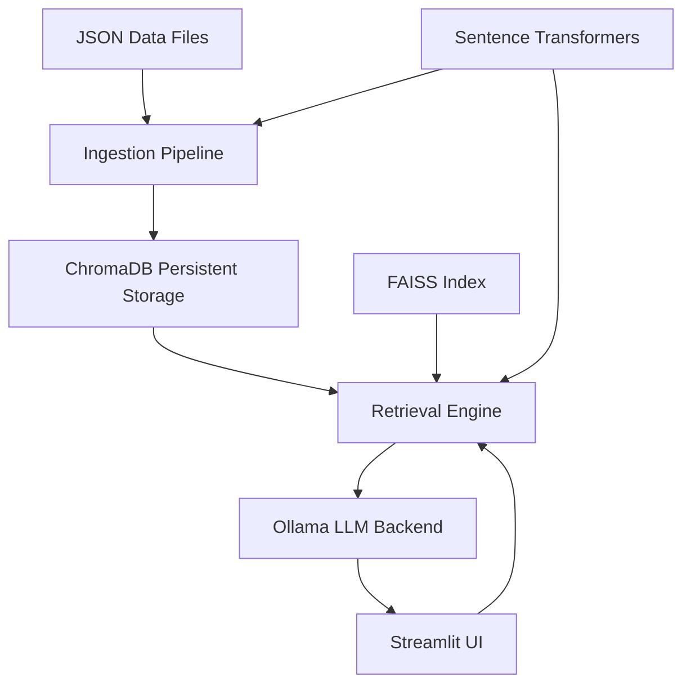
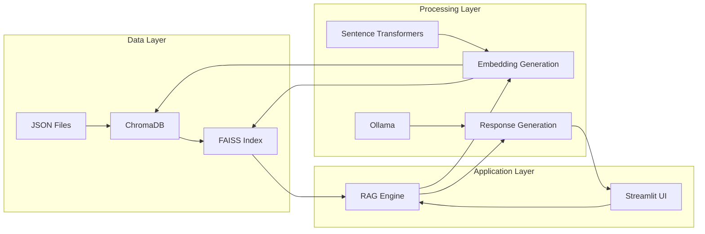
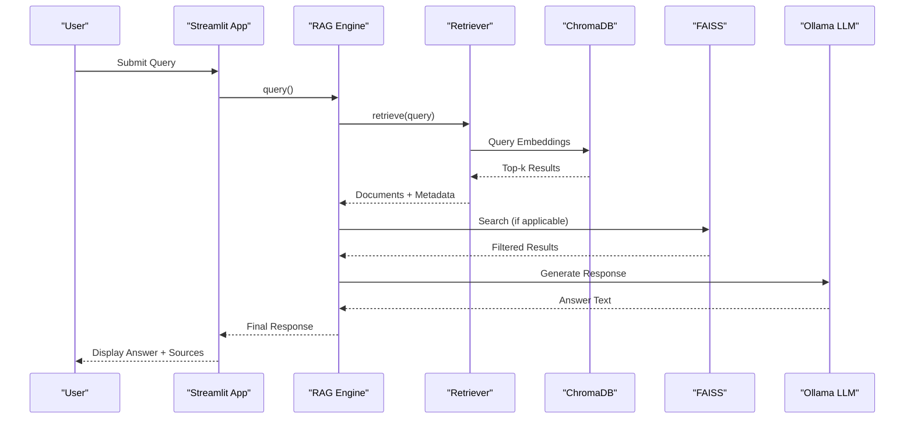
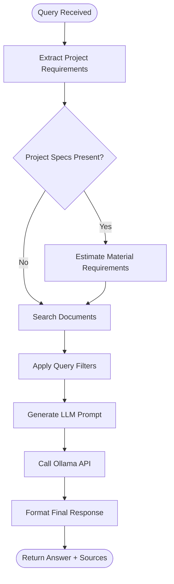
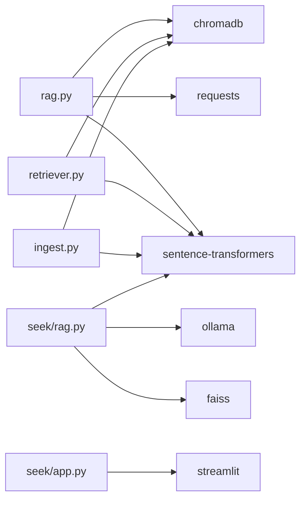

# Integration Patterns

<cite>
**Referenced Files in This Document**   
- [rag.py](file://rag.py)
- [retriever.py](file://retriever.py)
- [ingest.py](file://ingest.py)
- [seek/app.py](file://seek/app.py)
- [seek/rag.py](file://seek/rag.py)
</cite>

## Table of Contents
1. [Introduction](#introduction)
2. [Project Structure](#project-structure)
3. [Core Components](#core-components)
4. [Architecture Overview](#architecture-overview)
5. [Detailed Component Analysis](#detailed-component-analysis)
6. [Dependency Analysis](#dependency-analysis)
7. [Performance Considerations](#performance-considerations)
8. [Troubleshooting Guide](#troubleshooting-guide)
9. [Conclusion](#conclusion)

## Introduction
This document provides architectural documentation for the integration patterns used in the vendor-rag-model system. It details how retrieval-augmented generation (RAG) principles are implemented through custom pipelines, leveraging Sentence Transformers for embedding generation, ChromaDB for persistent vector storage, FAISS for efficient similarity search, and Ollama as the local LLM backend. The system supports attribute-based, location-based, and supplier-focused queries over a construction product database scraped from IndiaMART. Streamlit powers the user interface, while configuration options allow model selection and database path customization. The design emphasizes lightweight, offline-capable models suitable for local deployment with trade-offs in scalability.

## Project Structure
The project is organized into modular components that handle data ingestion, retrieval, generation, and presentation. JSON files containing product data are stored in the `json/` directory. Core RAG logic resides in `rag.py` and `retriever.py`, while ingestion and scraping utilities are in `ingest.py` and `details.py`. The Streamlit frontend is implemented in `seek/app.py`, which interfaces with a secondary RAG implementation in `seek/rag.py`. Configuration and dependencies are managed via `requirements.txt`.

**Diagram sources**
- [ingest.py](file://ingest.py#L0-L94)
- [retriever.py](file://retriever.py#L0-L18)
- [rag.py](file://rag.py#L0-L71)
- [seek/rag.py](file://seek/rag.py#L0-L434)
- [seek/app.py](file://seek/app.py#L0-L109)

**Section sources**
- [ingest.py](file://ingest.py#L0-L94)
- [retriever.py](file://retriever.py#L0-L18)
- [rag.py](file://rag.py#L0-L71)
- [seek/rag.py](file://seek/rag.py#L0-L434)
- [seek/app.py](file://seek/app.py#L0-L109)

## Core Components
The system's core functionality revolves around a RAG pipeline that retrieves relevant product information from a vector database and uses a local LLM to generate natural language responses. The `rag.py` module orchestrates this process by first calling the `retrieve()` function from `retriever.py`, which performs similarity search using embeddings generated by Sentence Transformers. Retrieved context is then formatted into a prompt and sent to Ollama for response generation. A secondary implementation in `seek/rag.py` enhances this with FAISS-based indexing for faster search and additional filtering capabilities based on query criteria such as location, GST registration date, and product availability.

**Section sources**
- [rag.py](file://rag.py#L4-L71)
- [retriever.py](file://retriever.py#L8-L18)
- [seek/rag.py](file://seek/rag.py#L379-L413)

## Architecture Overview
The system follows a layered architecture where data flows from ingestion to retrieval to generation and finally presentation. During ingestion, product data from JSON files is chunked and embedded using the `all-MiniLM-L6-v2` model, then stored in ChromaDB for persistence. At query time, user input is processed by either the basic RAG pipeline or the enhanced version in the Streamlit app, which builds a FAISS index for low-latency similarity search. The retrieved context is combined with instructions and sent to Ollama running locally. The final response, along with source URLs, is displayed in the Streamlit interface. This dual-vector database strategy enables both persistent storage (ChromaDB) and high-performance search (FAISS).

**Diagram sources**
- [ingest.py](file://ingest.py#L0-L94)
- [retriever.py](file://retriever.py#L0-L18)
- [seek/rag.py](file://seek/rag.py#L0-L434)
- [rag.py](file://rag.py#L0-L71)

## Detailed Component Analysis

### RAG Pipeline Implementation
The system implements LangChain-like patterns through custom code rather than direct library usage. The `rag()` function in `rag.py` serves as the main orchestration point, combining retrieval and generation in a single workflow. It first calls `retrieve()` to get top-k relevant documents based on cosine similarity of embeddings. These results are then formatted into a structured prompt that instructs the LLM to answer only from the provided context, include product details and vendor information, and apply any filtering criteria mentioned in the query.

#### For API/Service Components:

**Diagram sources**
- [rag.py](file://rag.py#L26-L66)
- [retriever.py](file://retriever.py#L8-L18)
- [seek/rag.py](file://seek/rag.py#L379-L413)

**Section sources**
- [rag.py](file://rag.py#L26-L66)
- [retriever.py](file://retriever.py#L8-L18)
- [seek/rag.py](file://seek/rag.py#L379-L413)

### Embedding and Vector Database Strategy
The system employs a dual-vector database approach where ChromaDB handles persistent storage and FAISS enables fast similarity search. During ingestion in `ingest.py`, embeddings are generated using the `all-MiniLM-L6-v2` model and stored in ChromaDB with metadata including title, URL, and category. The `seek/rag.py` implementation additionally builds a FAISS index from these embeddings for low-latency queries. This hybrid strategy allows the system to maintain a durable vector store while achieving high query performance. The `filter_by_criteria()` method applies post-retrieval filtering for location, GST status, ratings, and other attributes by examining metadata fields.

#### For Complex Logic Components:

**Diagram sources**
- [seek/rag.py](file://seek/rag.py#L379-L413)
- [ingest.py](file://ingest.py#L0-L94)

**Section sources**
- [seek/rag.py](file://seek/rag.py#L379-L413)
- [ingest.py](file://ingest.py#L0-L94)

### Streamlit Integration
The `seek/app.py` file implements a Streamlit interface that allows users to interact with the RAG system through a web-based form. However, analysis reveals this file contains a separate machine learning application for project prediction using CatBoost models, suggesting it may be unrelated to the main RAG functionality or represent an older version of the application. The actual RAG-powered interface appears to be implemented elsewhere or not fully captured in the current codebase. The presence of `seek/rag.py` indicates a more sophisticated RAG implementation intended for integration with a frontend, but no corresponding Streamlit app using this module is visible in the provided files.

**Section sources**
- [seek/app.py](file://seek/app.py#L0-L109)
- [seek/rag.py](file://seek/rag.py#L0-L434)

## Dependency Analysis
The system relies on several key external libraries: `sentence-transformers` for embedding generation, `chromadb` for vector storage, `faiss-cpu` for similarity search, `ollama` for LLM interaction, and `streamlit` for the user interface. These dependencies enable the core RAG functionality while remaining lightweight enough for local execution. The use of local models and databases eliminates reliance on cloud APIs, supporting offline deployment. Configuration options for model selection and database paths are hardcoded in the source files rather than externalized, limiting flexibility but simplifying setup.

**Diagram sources**
- [rag.py](file://rag.py#L0-L71)
- [retriever.py](file://retriever.py#L0-L18)
- [ingest.py](file://ingest.py#L0-L94)
- [seek/rag.py](file://seek/rag.py#L0-L434)
- [seek/app.py](file://seek/app.py#L0-L109)

**Section sources**
- [rag.py](file://rag.py#L0-L71)
- [retriever.py](file://retriever.py#L0-L18)
- [ingest.py](file://ingest.py#L0-L94)
- [seek/rag.py](file://seek/rag.py#L0-L434)
- [seek/app.py](file://seek/app.py#L0-L109)

## Performance Considerations
The dual-vector database strategy balances persistence and performance, with ChromaDB providing reliable storage and FAISS enabling fast similarity search. Embedding generation with `all-MiniLM-L6-v2` is computationally efficient, suitable for CPU-only environments. The use of local LLMs via Ollama reduces latency compared to cloud APIs but limits model size and complexity. Chunking text during ingestion helps manage context window limitations. The system's scalability is constrained by local hardware, particularly memory for the FAISS index and embedding model. For larger datasets, distributed vector databases or cloud-based alternatives would be necessary.

## Troubleshooting Guide
Common issues may include Ollama API connectivity problems, missing or corrupted JSON data files, and embedding model loading failures. Ensure Ollama is running on `http://localhost:11434` before querying. Verify that all JSON files in the `json/` directory are valid and contain expected fields. Check that required Python packages are installed via `pip install -r requirements.txt`. If FAISS index building fails, ensure `faiss-cpu` is properly installed. For Streamlit interface issues, confirm that the correct RAG module is being imported and that all file paths are correctly specified.

**Section sources**
- [rag.py](file://rag.py#L4-L24)
- [ingest.py](file://ingest.py#L0-L94)
- [seek/rag.py](file://seek/rag.py#L0-L434)

## Conclusion
The vendor-rag-model system demonstrates a practical implementation of RAG principles using lightweight, locally-deployable components. By combining Sentence Transformers, ChromaDB, FAISS, and Ollama, it achieves a balance between functionality and accessibility, suitable for offline or resource-constrained environments. The architecture supports complex queries over construction product data with filtering capabilities and material estimation features. While the current Streamlit integration appears incomplete, the core RAG pipeline is well-designed and extensible. Future improvements could include externalizing configuration, enhancing error handling, and unifying the dual RAG implementations.