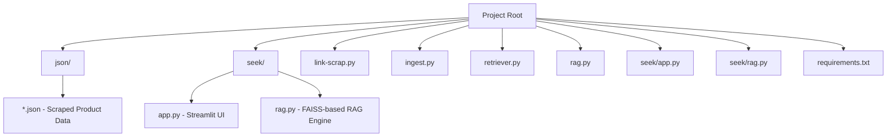
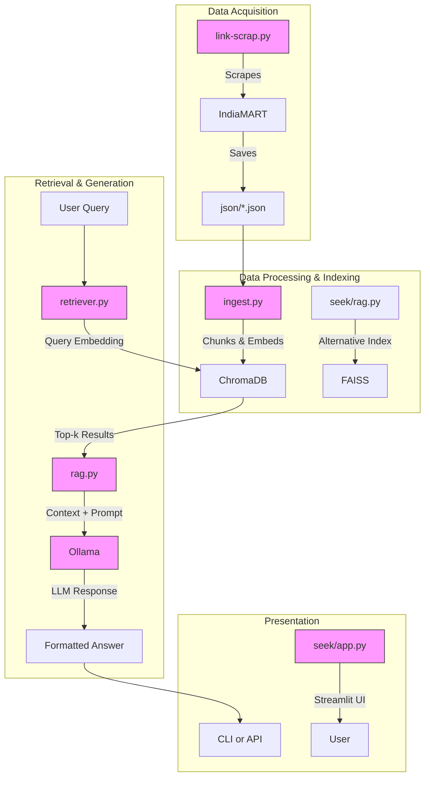
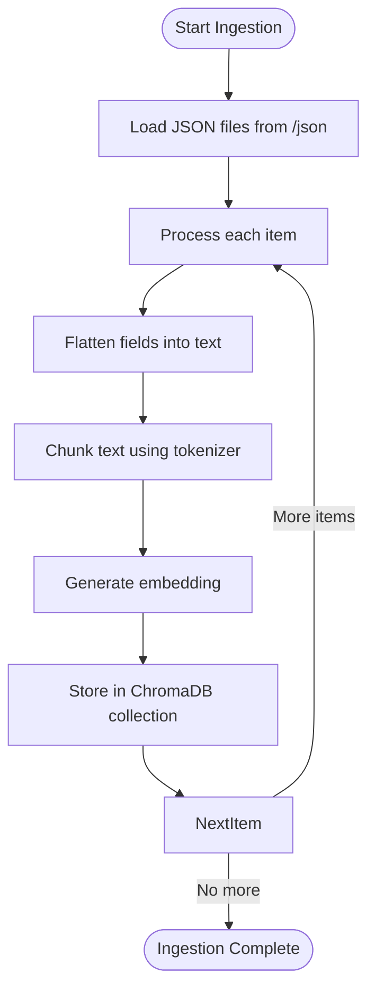
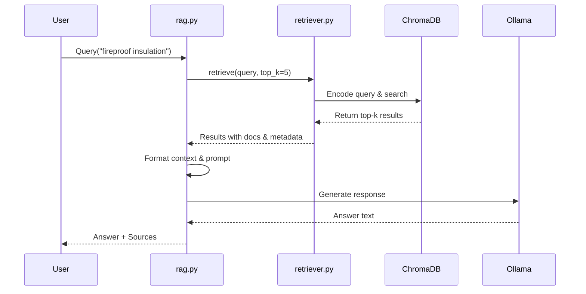
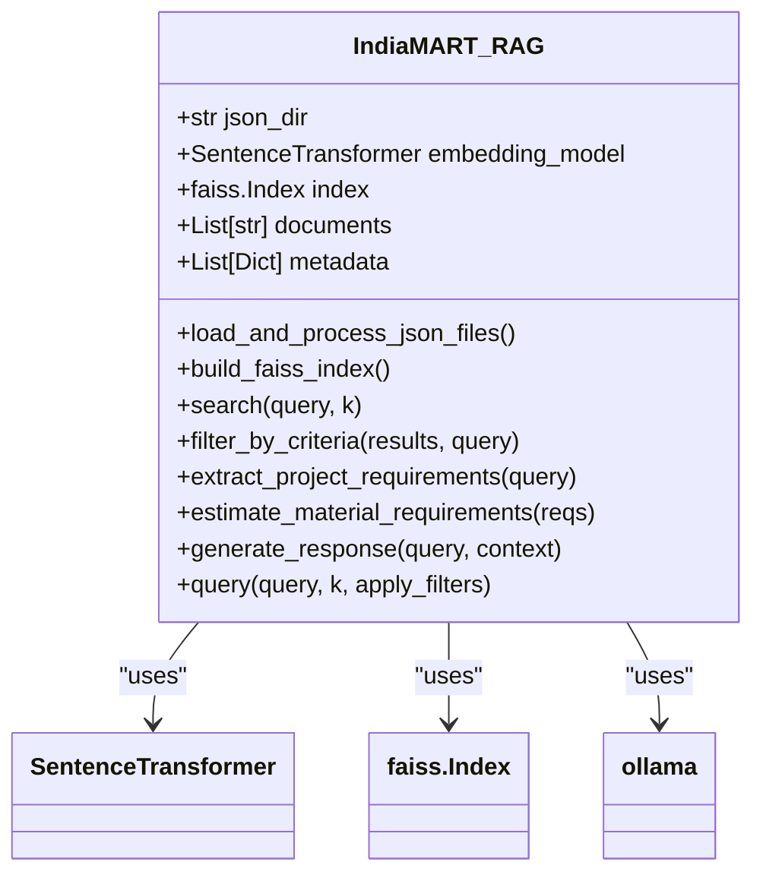
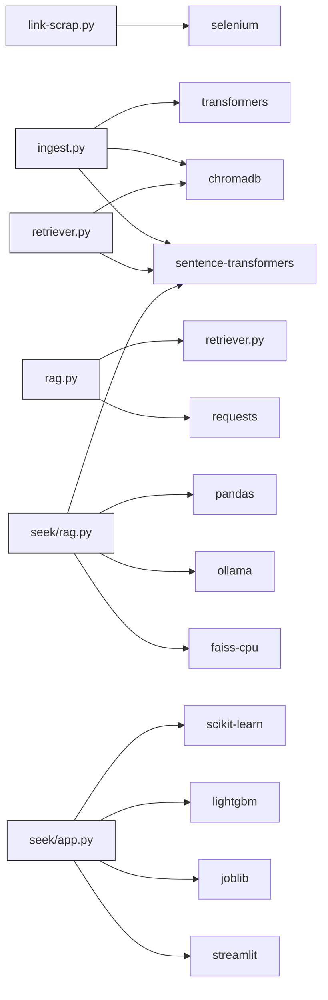

# System Architecture

<cite>
**Referenced Files in This Document**   
- [ingest.py](file://ingest.py)
- [retriever.py](file://retriever.py)
- [rag.py](file://rag.py)
- [seek/rag.py](file://seek/rag.py)
- [seek/app.py](file://seek/app.py)
- [link-scrap.py](file://link-scrap.py)
- [requirements.txt](file://requirements.txt)
</cite>

## Table of Contents
1. [Introduction](#introduction)
2. [Project Structure](#project-structure)
3. [Core Components](#core-components)
4. [Architecture Overview](#architecture-overview)
5. [Detailed Component Analysis](#detailed-component-analysis)
6. [Dependency Analysis](#dependency-analysis)
7. [Performance Considerations](#performance-considerations)
8. [Troubleshooting Guide](#troubleshooting-guide)
9. [Conclusion](#conclusion)

## Introduction
The vendor-rag-model system is a full-stack Retrieval-Augmented Generation (RAG) pipeline designed for construction procurement intelligence. It enables users to query vendor and product information from IndiaMART with natural language, leveraging scraped data to provide accurate, context-rich responses. The architecture follows a layered design encompassing data acquisition, processing, indexing, retrieval, and presentation. It integrates ChromaDB and FAISS for vector storage and similarity search, LangChain-inspired patterns for data handling, Ollama for local LLM inference, and Streamlit for interactive UI presentation. The system supports advanced filtering based on attributes, location, ratings, and GST status, and can estimate material requirements for construction projects.

## Project Structure

**Diagram sources**
- [json](file://json)
- [seek](file://seek)
- [link-scrap.py](file://link-scrap.py)
- [ingest.py](file://ingest.py)
- [retriever.py](file://retriever.py)
- [rag.py](file://rag.py)

**Section sources**
- [link-scrap.py](file://link-scrap.py)
- [ingest.py](file://ingest.py)
- [retriever.py](file://retriever.py)
- [rag.py](file://rag.py)
- [seek/rag.py](file://seek/rag.py)

## Core Components

The system comprises five core components forming a complete RAG pipeline: data scraping, ingestion, retrieval, generation, and presentation. The `link-scrap.py` script acquires vendor data from IndiaMART and stores it in JSON files within the `json/` directory. The `ingest.py` script processes these JSON files, chunks the text, generates embeddings using Sentence Transformers, and stores them in ChromaDB. The `retriever.py` module provides a simple interface to query the vector database. The main `rag.py` orchestrates retrieval and response generation via Ollama. A parallel implementation in `seek/rag.py` uses FAISS for indexing and includes advanced features like project-based material estimation and strategy-based filtering. The `seek/app.py` Streamlit application provides a user interface for project prediction.

**Section sources**
- [link-scrap.py](file://link-scrap.py)
- [ingest.py](file://ingest.py)
- [retriever.py](file://retriever.py)
- [rag.py](file://rag.py)
- [seek/rag.py](file://seek/rag.py)
- [seek/app.py](file://seek/app.py)

## Architecture Overview

**Diagram sources**
- [link-scrap.py](file://link-scrap.py)
- [ingest.py](file://ingest.py)
- [retriever.py](file://retriever.py)
- [rag.py](file://rag.py)
- [seek/rag.py](file://seek/rag.py)
- [seek/app.py](file://seek/app.py)

## Detailed Component Analysis

### Data Acquisition Layer
The data acquisition process begins with `link-scrap.py`, which uses Selenium to scrape product listings from IndiaMART based on material names from CSV files. It navigates search results, extracts product links, titles, and URLs, and saves them in a CSV file. This script handles pagination and includes anti-bot evasion techniques like headless browsing and WebDriver property manipulation.

**Section sources**
- [link-scrap.py](file://link-scrap.py)

### Data Processing and Indexing Layer
The `ingest.py` script implements the data processing pipeline. It loads all JSON files from the `json/` directory, flattens product data (title, description, details, company/seller info, reviews) into text chunks, and uses the `all-MiniLM-L6-v2` model to generate embeddings. Text is chunked using a sliding window approach with token overlap to preserve context. The embeddings, along with documents and metadata (title, URL, category), are stored in a persistent ChromaDB collection. This component follows a pipeline processing pattern with clear separation between data loading, transformation, and storage.

**Diagram sources**
- [ingest.py](file://ingest.py)

**Section sources**
- [ingest.py](file://ingest.py)

### Retrieval Layer
The `retriever.py` module provides a singleton pattern for database connection to ChromaDB. It initializes a persistent client and retrieves the "products" collection. The `retrieve()` function encodes the query using the same embedding model, performs a similarity search, and returns top-k results with documents, metadata, and distances. This layer abstracts the vector database interaction, enabling clean separation between retrieval and generation logic.

**Diagram sources**
- [retriever.py](file://retriever.py)
- [rag.py](file://rag.py)

**Section sources**
- [retriever.py](file://retriever.py)

### Generation Layer
The `rag.py` module orchestrates the RAG pipeline. It uses the `retrieve()` function to get relevant context, formats a prompt with strict instructions for the LLM, and sends it to Ollama's API. The prompt includes context from retrieved documents and instructs the model to answer factually, include product/vendor details, and provide source URLs. The response is post-processed to append sources. This component demonstrates the integration between LangChain-like patterns (context augmentation) and Ollama for local LLM execution.

**Section sources**
- [rag.py](file://rag.py)

### Advanced RAG Engine (seek/rag.py)
The `seek/rag.py` module implements an enhanced RAG system with additional capabilities:
- **FAISS Indexing**: Uses FAISS for efficient similarity search with L2 distance.
- **Strategy-Based Filtering**: Implements dynamic filtering for location, GST registration date, ratings, availability, and fire retardant properties.
- **Project Intelligence**: Extracts project specifications (power, area, budget) from queries and estimates material requirements (cement, bricks, transformers).
- **Material Estimation**: Calculates material quantities and costs based on construction norms.

**Diagram sources**
- [seek/rag.py](file://seek/rag.py)

**Section sources**
- [seek/rag.py](file://seek/rag.py)

### Presentation Layer
The `seek/app.py` file implements a Streamlit web application for project prediction. It loads pre-trained LightGBM models and preprocessing pipelines to predict MasterItemNo and regression values based on project details (city, state, market, size). The UI allows users to input project parameters and displays predictions with source information. This component demonstrates the integration of traditional ML models with the RAG system for comprehensive decision support.

**Section sources**
- [seek/app.py](file://seek/app.py)

## Dependency Analysis

**Diagram sources**
- [requirements.txt](file://requirements.txt)

**Section sources**
- [requirements.txt](file://requirements.txt)

## Performance Considerations
The system employs several performance optimization strategies:
- **Singleton Database Connections**: Both ChromaDB and FAISS implementations use persistent, singleton connections to avoid reinitialization overhead.
- **Efficient Chunking**: Text is chunked at 400 tokens with 50-token overlap to balance context preservation and retrieval efficiency.
- **Batch Processing**: The ingestion pipeline processes files and items in batches, minimizing I/O and computation overhead.
- **Caching**: The Streamlit application uses `@st.cache_resource` to cache ML models and preprocessors, reducing load time on subsequent requests.
- **Index Selection**: The system offers both ChromaDB (for ease of use) and FAISS (for high-performance similarity search) as vector stores, allowing deployment flexibility.

For scalability, the ChromaDB instance is stored persistently on disk (`./chroma_db`), enabling incremental updates. The FAISS index can be rebuilt as needed from the JSON corpus. Deployment considerations include running Ollama as a local service (port 11434) and ensuring sufficient GPU resources for embedding generation and LLM inference when available.

## Troubleshooting Guide
Common issues and solutions:
- **Empty Results**: Verify that `ingest.py` has been run successfully and that `chroma_db` directory contains data. Check JSON files for valid content.
- **Ollama Connection Errors**: Ensure Ollama server is running (`ollama serve`). Verify the URL in `rag.py` matches the Ollama API endpoint.
- **Embedding Model Issues**: Confirm `sentence-transformers/all-MiniLM-L6-v2` is available. Internet access may be required for initial download.
- **Selenium Scraping Failures**: Update ChromeDriver if browser compatibility issues occur. Consider rate limiting to avoid IP blocking.
- **Streamlit App Errors**: Ensure all required models (`lgb_classifier.pkl`, etc.) are present in the working directory.

**Section sources**
- [ingest.py](file://ingest.py)
- [rag.py](file://rag.py)
- [link-scrap.py](file://link-scrap.py)
- [seek/app.py](file://seek/app.py)

## Conclusion
The vendor-rag-model system presents a robust, full-stack RAG architecture for construction procurement intelligence. It effectively integrates web scraping, vector databases (ChromaDB/FAISS), local LLMs (Ollama), and interactive UIs (Streamlit) into a cohesive pipeline. The architecture demonstrates key patterns like pipeline processing, singleton connections, and strategy-based filtering. The dual implementation with both ChromaDB and FAISS provides flexibility in deployment scenarios. Future enhancements could include real-time ingestion, hybrid search (vector + keyword), and enhanced project estimation capabilities.