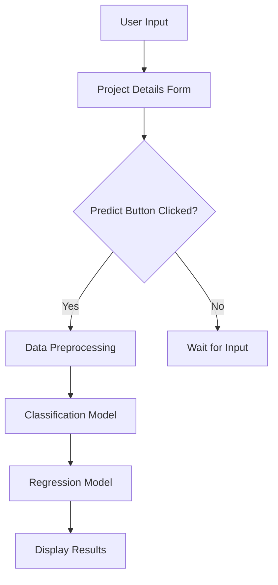
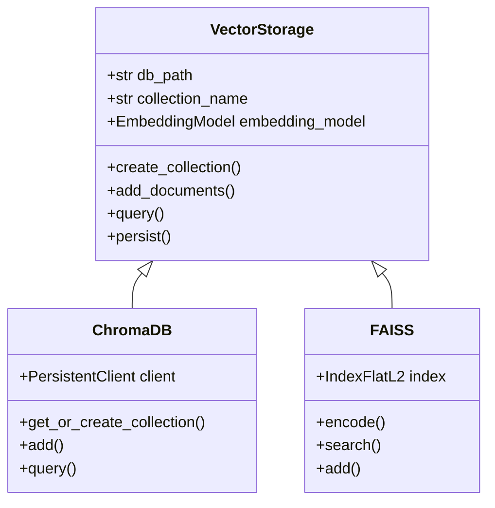
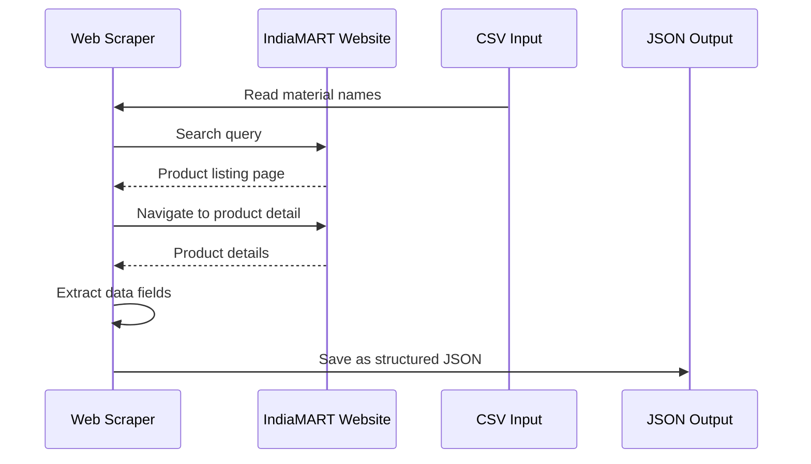

# Technology Stack & Dependencies

<cite>
**Referenced Files in This Document**   
- [requirements.txt](file://requirements.txt)
- [seek/app.py](file://seek/app.py)
- [seek/rag.py](file://seek/rag.py)
- [rag.py](file://rag.py)
- [ingest.py](file://ingest.py)
- [retriever.py](file://retriever.py)
- [link-scrap.py](file://link-scrap.py)
- [details.py](file://details.py)
</cite>

## Table of Contents
1. [Introduction](#introduction)
2. [Core Frameworks](#core-frameworks)
3. [Supporting Libraries](#supporting-libraries)
4. [Version Compatibility and Installation](#version-compatibility-and-installation)
5. [Python Environment Setup](#python-environment-setup)
6. [Dependency Management](#dependency-management)

## Introduction
The vendor-rag-model leverages a modern technology stack designed for efficient retrieval-augmented generation (RAG) in the construction procurement domain. This document details the core frameworks, supporting libraries, and development practices that enable the system to extract vendor information from IndiaMART, store product data in vector databases, and provide intelligent responses to user queries about construction materials and suppliers. The architecture combines web scraping, natural language processing, and interactive web interfaces to create a comprehensive vendor intelligence platform.

## Core Frameworks

### LangChain for RAG Orchestration
LangChain serves as the orchestration framework for the RAG pipeline, coordinating the retrieval and generation components. The system uses LangChain components to manage the flow from query input through context retrieval to response generation. The framework enables the integration of various components including document loaders, text splitters, embedding models, and language models, creating a cohesive pipeline for processing user queries about construction vendors and materials.

**Section sources**
- [rag.py](file://rag.py#L1-L71)
- [seek/rag.py](file://seek/rag.py#L1-L434)

### Streamlit for Web Interface
Streamlit provides the web interface for user interaction with the vendor intelligence system. The framework enables rapid development of interactive web applications with minimal frontend code, allowing users to input project specifications and receive intelligent recommendations for construction materials and suppliers. The interface supports both simple product queries and complex project-based requirements analysis.



**Diagram sources**
- [seek/app.py](file://seek/app.py#L1-L109)

**Section sources**
- [seek/app.py](file://seek/app.py#L1-L109)

### ChromaDB and FAISS for Vector Storage
The system implements dual vector storage solutions using both ChromaDB and FAISS for optimal performance and flexibility. ChromaDB serves as the primary persistent vector database for long-term storage of product embeddings, while FAISS provides high-performance similarity search capabilities for rapid retrieval operations. This hybrid approach allows the system to balance persistence requirements with low-latency query performance.



**Diagram sources**
- [ingest.py](file://ingest.py#L1-L94)
- [retriever.py](file://retriever.py#L1-L18)
- [seek/rag.py](file://seek/rag.py#L1-L434)

**Section sources**
- [ingest.py](file://ingest.py#L1-L94)
- [retriever.py](file://retriever.py#L1-L18)
- [seek/rag.py](file://seek/rag.py#L1-L434)

### Ollama for Local LLM Inference
Ollama enables local large language model inference, providing the generative component of the RAG system. The framework allows the deployment of various open-source language models, with the current implementation using the Llama3 model for response generation. By running inference locally, the system maintains data privacy and reduces dependency on external API services while providing robust natural language understanding and generation capabilities.

**Section sources**
- [rag.py](file://rag.py#L1-L71)
- [seek/rag.py](file://seek/rag.py#L1-L434)

### Selenium and BeautifulSoup for Web Scraping
The data acquisition pipeline utilizes Selenium for dynamic web scraping of vendor information from IndiaMART. Selenium handles JavaScript-heavy pages and interactive elements, while BeautifulSoup could be integrated for parsing static HTML content. The scraping system navigates through product listings, extracts detailed product specifications, pricing information, seller details, and customer reviews, transforming unstructured web data into structured JSON format for downstream processing.



**Diagram sources**
- [link-scrap.py](file://link-scrap.py#L1-L162)
- [details.py](file://details.py#L1-L344)

**Section sources**
- [link-scrap.py](file://link-scrap.py#L1-L162)
- [details.py](file://details.py#L1-L344)

## Supporting Libraries

### Pandas for Data Manipulation
Pandas provides essential data manipulation capabilities throughout the system, from preprocessing scraped data to preparing input features for machine learning models. The library enables efficient handling of structured data in DataFrame format, supporting operations such as data cleaning, transformation, and aggregation. In the prediction interface, Pandas combines categorical and numerical features into a unified input format for the machine learning models.

**Section sources**
- [seek/app.py](file://seek/app.py#L1-L109)
- [link-scrap.py](file://link-scrap.py#L1-L162)

### Sentence Transformers for Embeddings
Sentence Transformers implements the embedding model that converts text into high-dimensional vectors for semantic search. The system uses the all-MiniLM-L6-v2 model to generate 384-dimensional embeddings of product descriptions, specifications, and vendor information. These embeddings enable semantic similarity search, allowing the system to find relevant products based on the meaning of user queries rather than exact keyword matching.

**Section sources**
- [ingest.py](file://ingest.py#L1-L94)
- [retriever.py](file://retriever.py#L1-L18)
- [seek/rag.py](file://seek/rag.py#L1-L434)

### Python-dotenv for Configuration
Python-dotenv manages configuration settings by loading environment variables from .env files. This library provides a secure way to handle sensitive information and configuration parameters without hardcoding them into the source code. The system uses environment variables to configure database paths, API endpoints, and other runtime parameters, enhancing security and deployment flexibility.

**Section sources**
- [requirements.txt](file://requirements.txt#L117-L118)

## Version Compatibility and Installation

The system has been tested with the following version combinations to ensure compatibility:

- Python 3.9+ (required for all dependencies)
- LangChain 0.3.27 with langchain-core 0.3.74
- Streamlit 1.49.1 with compatible Altair and Tornado versions
- ChromaDB 1.0.20 with persistent client support
- FAISS-CPU 1.12.0 for CPU-based similarity search
- Ollama 0.5.3 with Llama3 model support
- Selenium 4.27.0 with ChromeDriver compatibility
- Sentence Transformers 5.1.0 with Transformers 4.55.2

To install the required dependencies, use the provided requirements.txt file:

```bash
pip install -r requirements.txt
```

Additional system requirements include:
- Chrome browser for Selenium web scraping
- Ollama server running locally for LLM inference
- Sufficient RAM for vector database operations (8GB+ recommended)
- Disk space for vector database storage (varies by dataset size)

## Python Environment Setup

Create an isolated Python environment using virtualenv or conda:

```bash
# Using virtualenv
python -m venv vendor-rag-env
source vendor-rag-env/bin/activate  # Linux/Mac
# vendor-rag-env\Scripts\activate  # Windows

# Using conda
conda create -n vendor-rag-env python=3.9
conda activate vendor-rag-env
```

After activating the environment, install the dependencies and set up the required directories:

```bash
# Install dependencies
pip install -r requirements.txt

# Create necessary directories
mkdir -p json chroma_db

# Download required models
# (Handled automatically by Sentence Transformers on first run)
```

Configure environment variables in a .env file:

```env
CHROMA_DB_PATH=./chroma_db
OLLAMA_HOST=http://localhost:11434
SELENIUM_HEADLESS=true
```

## Dependency Management

The project uses pip for dependency management with a comprehensive requirements.txt file that specifies exact versions for all packages. This approach ensures reproducible builds and prevents version conflicts. The dependency tree is structured with clear separation between core frameworks, supporting libraries, and development tools.

For development, consider using Poetry or Pipenv to manage dependencies with lock files and better dependency resolution. The current setup prioritizes simplicity and ease of deployment over advanced dependency management features.

When updating dependencies, follow this procedure:
1. Test updates in an isolated environment
2. Verify compatibility with existing functionality
3. Update requirements.txt with new versions
4. Document any breaking changes in the README
5. Test the complete pipeline from data ingestion to response generation

The system's modular architecture allows for relatively straightforward dependency updates, with clear separation between the scraping, ingestion, retrieval, and interface components.