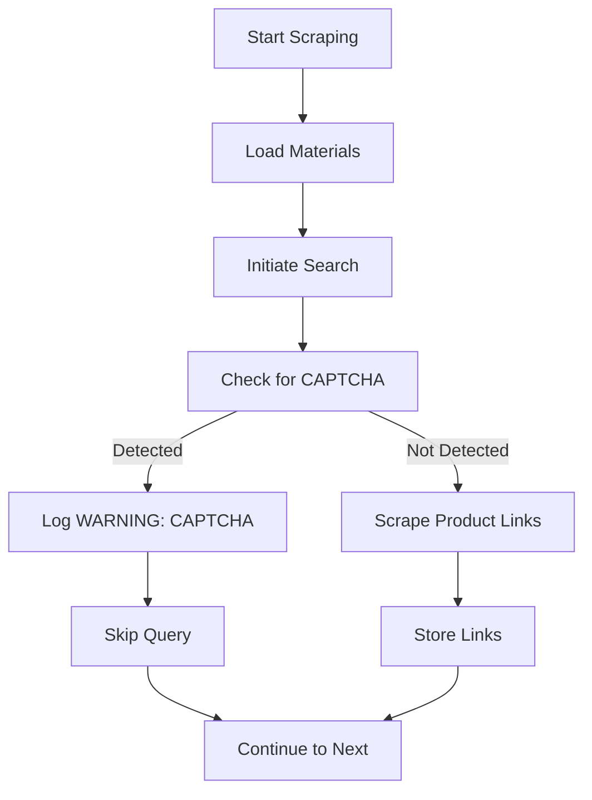
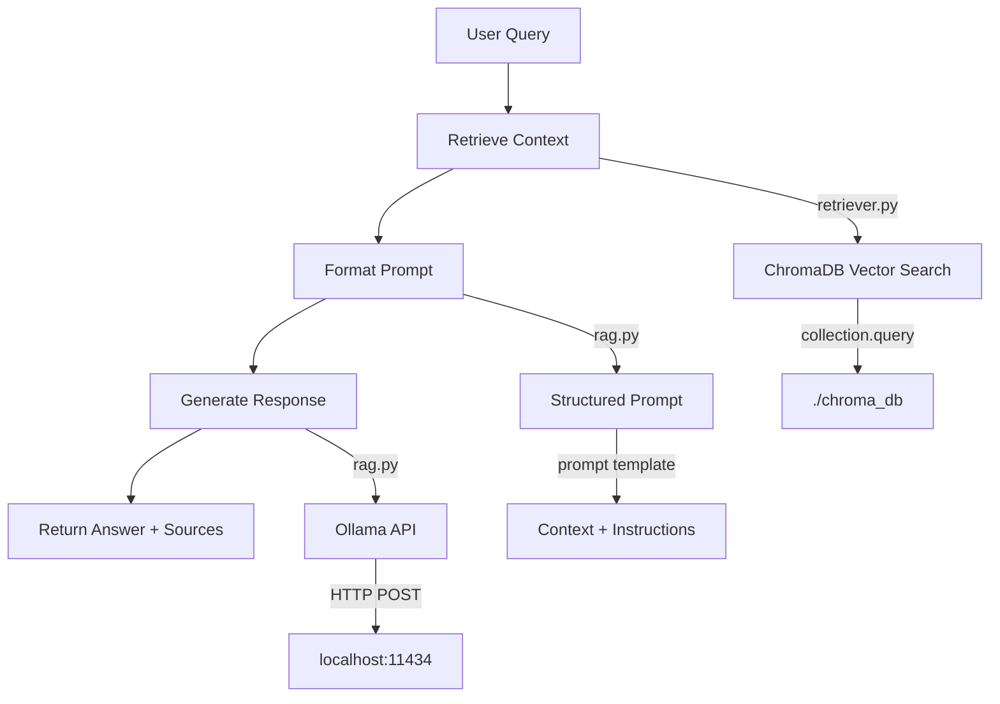

# Troubleshooting Guide

<cite>
**Referenced Files in This Document**   
- [link-scrap.py](file://link-scrap.py)
- [details.py](file://details.py)
- [ingest.py](file://ingest.py)
- [retriever.py](file://retriever.py)
- [rag.py](file://rag.py)
- [scraper_log.txt](file://scraper_log.txt)
- [scraping_progress.json](file://scraping_progress.json)
</cite>

## Common Issues and Error Handling

### Scraping Failures

The scraping pipeline consists of two main stages: link discovery (`link-scrap.py`) and detailed product extraction (`details.py`). Each stage implements specific error handling strategies.

When the scraper encounters CAPTCHA challenges, it logs a warning and skips the current query. This is evident in the `scraper_log.txt` where multiple entries show "CAPTCHA detected" for search terms like "Acoustic Barriers". The system does not attempt to bypass CAPTCHA, prioritizing stability over aggressive scraping.

The `details.py` script implements comprehensive exception handling for element location failures. It uses `NoSuchElementException` to handle missing page elements such as price information, description sections, seller details, company information, and reviews. When critical sections like the product table or seller box are not found, the script logs the issue and continues with available data, ensuring partial information is still captured.

**Section sources**
- [link-scrap.py](file://link-scrap.py#L48-L105)
- [details.py](file://details.py#L63-L255)
- [scraper_log.txt](file://scraper_log.txt#L2-L6)

### Database Connection Problems

The data pipeline uses ChromaDB as the vector database for storing embedded product information. Connection issues are handled through the persistent client initialization in both `ingest.py` and `retriever.py`. The `PersistentClient` is configured with a local path (`./chroma_db`), which eliminates network dependency but requires proper file system permissions.

If the database directory is inaccessible or corrupted, the system will fail during the `get_or_create_collection` call. No explicit error handling is implemented for database connection failures, so permission issues or disk errors will cause the ingestion and retrieval processes to terminate.

**Section sources**
- [ingest.py](file://ingest.py#L19-L21)
- [retriever.py](file://retriever.py#L4-L6)

### LLM Response Errors

The RAG system communicates with Ollama through HTTP requests. The `query_ollama` function in `rag.py` implements error handling for API connectivity issues using `requests.RequestException`. If the Ollama server is unreachable or returns an error, the function returns a descriptive error message instead of failing silently.

The system assumes Ollama is running on `localhost:11434`. Connection failures typically indicate that the Ollama service is not running or is configured on a different port. The error handling does not include retry logic or fallback models.

**Section sources**
- [rag.py](file://rag.py#L4-L24)

## Data Pipeline Diagnostics

### Log Analysis

The `scraper_log.txt` file provides real-time feedback on scraping operations. Key diagnostic patterns include:

- **INFO level messages**: Indicate successful operations such as loading materials or initiating searches
- **WARNING level messages**: Highlight blocking issues like CAPTCHA detection
- **Error messages**: Printed directly by Python exception handlers in `details.py`

Analyzing the log sequence reveals the scraping workflow: material loading → search initiation → page scraping → CAPTCHA detection → search retry. The duplicate entries for "Acoustic Barriers" show the system's retry behavior when encountering CAPTCHA.

**Diagram sources**
- [scraper_log.txt](file://scraper_log.txt#L1-L7)

### Progress Monitoring

The `scraping_progress.json` file serves as a checkpoint mechanism for long-running scraping operations. It tracks:

- **current_index**: The current position in the processing queue
- **total_processed**: Number of items successfully processed
- **successful_scrapes**: Count of completed scrapes
- **failed_scrapes**: Count of failed attempts
- **start_time** and **last_update**: Temporal tracking
- **completed_urls** and **failed_urls**: Specific URL tracking

The current progress file shows 90 successful scrapes with no failures, indicating a stable scraping session. The `completed_urls` array contains the actual product pages that have been processed, allowing verification of coverage.

**Section sources**
- [scraping_progress.json](file://scraping_progress.json#L1-L100)

## Resolving Common Problems

### Rate Limiting and CAPTCHA

When the system detects CAPTCHA, it skips the current search query. To mitigate this:

1. Increase delays between requests by modifying the `time.sleep(2)` in `link-scrap.py`
2. Implement proxy rotation (not currently supported)
3. Reduce search concurrency (the system is currently single-threaded)

The headless browser configuration in `setup_driver()` includes anti-detection measures like disabling automation flags and modifying navigator properties, but these may not be sufficient against sophisticated anti-bot systems.

### Memory Exhaustion During Indexing

Large JSON files can cause memory issues during the ingestion process. The `ingest.py` script processes files sequentially but loads entire JSON files into memory. For very large product datasets:

1. Process files in smaller batches
2. Implement streaming JSON parsing
3. Monitor system memory usage during ingestion

The chunking process in `chunk_text()` helps manage memory by breaking large texts into 400-token segments, but the initial JSON loading remains a potential bottleneck.

### Malformed JSON Data

The ingestion pipeline includes basic JSON error handling. When `json.load()` fails due to malformed data, the script logs the error and skips the file. To prevent this:

1. Validate JSON files before ingestion
2. Implement more robust parsing with error recovery
3. Use `json.loads()` with custom error handlers for partial data extraction

The system currently skips invalid files entirely, which could result in data loss.

**Section sources**
- [ingest.py](file://ingest.py#L25-L30)
- [link-scrap.py](file://link-scrap.py#L27-L38)

## Performance Optimization

### Slow Query Resolution

Slow retrieval performance is typically caused by inefficient vector searches or LLM processing delays. The system uses cosine similarity with ChromaDB's default configuration. To improve speed:

1. Ensure proper indexing by verifying ChromaDB's persistence
2. Adjust the `top_k` parameter in the `retrieve()` function to balance relevance and speed
3. Optimize the embedding model (currently using 'all-MiniLM-L6-v2')

The RAG pipeline can be optimized by:
- Caching frequent queries
- Pre-computing common retrieval patterns
- Using more efficient LLM models

### Retrieval Accuracy Issues

Accuracy depends on both the embedding quality and prompt engineering. The current system uses a well-structured prompt in the `rag()` function that includes clear instructions for context usage, output format, and filtering requirements.

To improve accuracy:
1. Fine-tune the embedding model on domain-specific construction materials data
2. Expand the context window by adjusting `max_tokens` in `chunk_text()`
3. Implement query expansion to handle synonym variations
4. Add relevance scoring to filter low-confidence results

The metadata filtering capability (category, URL, title) provides additional precision for targeted queries.

**Section sources**
- [retriever.py](file://retriever.py#L8-L18)
- [rag.py](file://rag.py#L26-L71)
- [ingest.py](file://ingest.py#L7-L18)

## RAG Pipeline Debugging

Debugging the complete RAG pipeline requires tracing data flow from ingestion to response generation. The key components are:

1. **Ingestion**: `ingest.py` processes JSON files into vector database entries
2. **Retrieval**: `retriever.py` finds relevant chunks based on query similarity
3. **Generation**: `rag.py` combines context with LLM to produce answers

When debugging, verify each stage:
- Check that products are properly ingested by examining `all_products.json`
- Validate that retrieval returns relevant documents using direct calls to `retrieve()`
- Test prompt effectiveness by examining the full context passed to Ollama

The example usage in `rag.py` provides a template for testing the complete pipeline with a sample query about fireproof insulation products.

**Diagram sources**
- [retriever.py](file://retriever.py#L8-L18)
- [rag.py](file://rag.py#L4-L71)