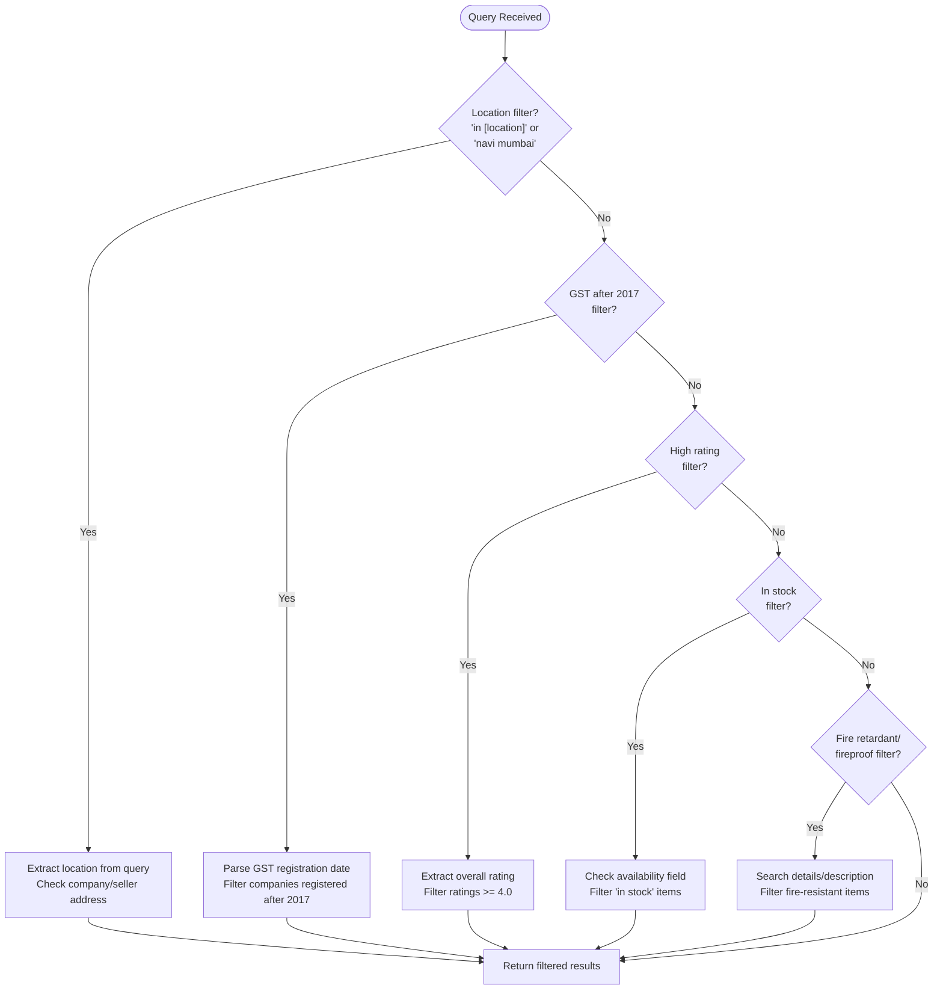
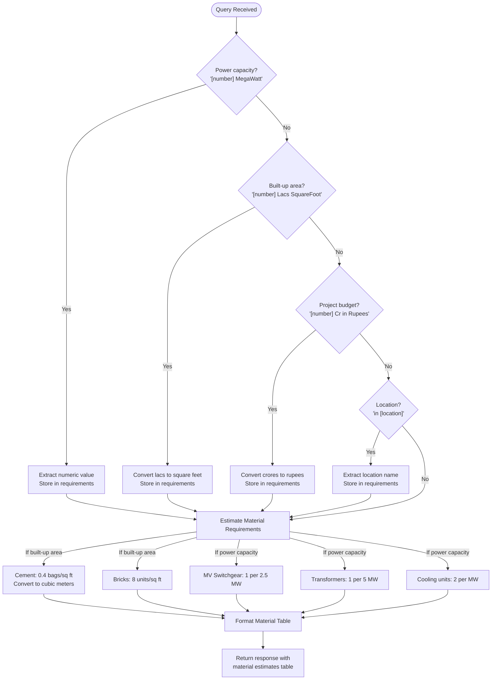

# Usage Examples

<cite>
**Referenced Files in This Document**   
- [seek/rag.py](file://seek/rag.py)
- [details.py](file://details.py)
- [ingest.py](file://ingest.py)
- [retriever.py](file://retriever.py)
</cite>

## Table of Contents
1. [Basic Queries](#basic-queries)
2. [Filtered Searches](#filtered-searches)
3. [Project-Based Material Estimations](#project-based-material-estimations)
4. [Vendor and Product Analysis Workflows](#vendor-and-product-analysis-workflows)
5. [Query Interpretation and Refinement](#query-interpretation-and-refinement)

## Basic Queries

The system supports straightforward queries for retrieving product and vendor information from the IndiaMART database. Users can search for specific products, materials, or equipment by name, and the system will return relevant results with detailed information.

For example, a basic query for "cement suppliers" would retrieve information about cement vendors including their company details, product specifications, pricing, and contact information. The system processes these queries by searching through the indexed product database and returning the most relevant matches based on semantic similarity.

**Section sources**
- [seek/rag.py](file://seek/rag.py#L372-L409)

## Filtered Searches

The system enables sophisticated filtering capabilities that allow users to refine search results based on specific criteria. These filters are automatically applied when certain keywords or phrases are detected in the query.

**Diagram sources**
- [seek/rag.py](file://seek/rag.py#L142-L205)

**Section sources**
- [seek/rag.py](file://seek/rag.py#L142-L205)

## Project-Based Material Estimations

The system can extract project specifications from natural language queries and generate material requirement estimates based on standard construction norms. This functionality is particularly useful for project planning and budgeting.

**Diagram sources**
- [seek/rag.py](file://seek/rag.py#L207-L301)
- [seek/rag.py](file://seek/rag.py#L303-L370)

**Section sources**
- [seek/rag.py](file://seek/rag.py#L207-L301)
- [seek/rag.py](file://seek/rag.py#L303-L370)

## Vendor and Product Analysis Workflows

The system supports comprehensive workflows for finding vendors, comparing product specifications, and generating procurement reports. These workflows leverage the structured data extracted from vendor websites during the scraping process.

### Finding Vendors by Location

To find vendors in a specific location, users can include location-based filters in their queries. The system extracts the location from the query and compares it against both company and seller addresses in the database.

### Comparing Product Specifications

When comparing products, the system retrieves detailed specifications from the 'details' field of each product listing. This includes technical parameters, availability, pricing, and other relevant information that enables meaningful comparisons.

### Generating Procurement Reports

The system can generate comprehensive procurement reports by aggregating information from multiple sources. These reports include product details, vendor information, pricing, and availability status, providing a complete picture for procurement decision-making.

**Section sources**
- [details.py](file://details.py)
- [seek/rag.py](file://seek/rag.py#L372-L409)

## Query Interpretation and Refinement

### Interpreting Results

When interpreting results, users should pay attention to several key factors:
- **Source credibility**: Check vendor ratings, GST registration status, and TrustSEAL verification
- **Product availability**: Verify current stock status and delivery timelines
- **Pricing details**: Examine price units and any additional costs
- **Technical specifications**: Review detailed product parameters to ensure compatibility

### Evaluating Source Credibility

The system provides several indicators of source credibility:
- **Ratings and reviews**: Vendors with ratings of 4.0 or higher are generally more reliable
- **GST registration**: Companies registered after 2017 demonstrate recent business activity
- **TrustSEAL verification**: Indicates IndiaMART's verification of the business
- **Years of experience**: Longer-established businesses may offer more stability

### Refining Queries for Better Accuracy

To improve query accuracy, users should:
- Be specific with technical requirements (e.g., "fire retardant insulation" rather than "good insulation")
- Include location constraints when relevant
- Specify quality requirements (e.g., "high rating" or "GST after 2017")
- Use standardized units and terminology
- Break complex queries into simpler components when necessary

### Common Usage Patterns and Anti-Patterns

**Effective Patterns:**
- Using precise technical terminology
- Including quantitative specifications
- Applying relevant filters
- Structuring queries with clear requirements

**Anti-Patterns to Avoid:**
- Overly broad queries without specific criteria
- Using ambiguous terms without clarification
- Combining too many unrelated requirements in a single query
- Expecting exact matches for loosely defined requirements

**Section sources**
- [seek/rag.py](file://seek/rag.py#L142-L205)
- [seek/rag.py](file://seek/rag.py#L207-L301)