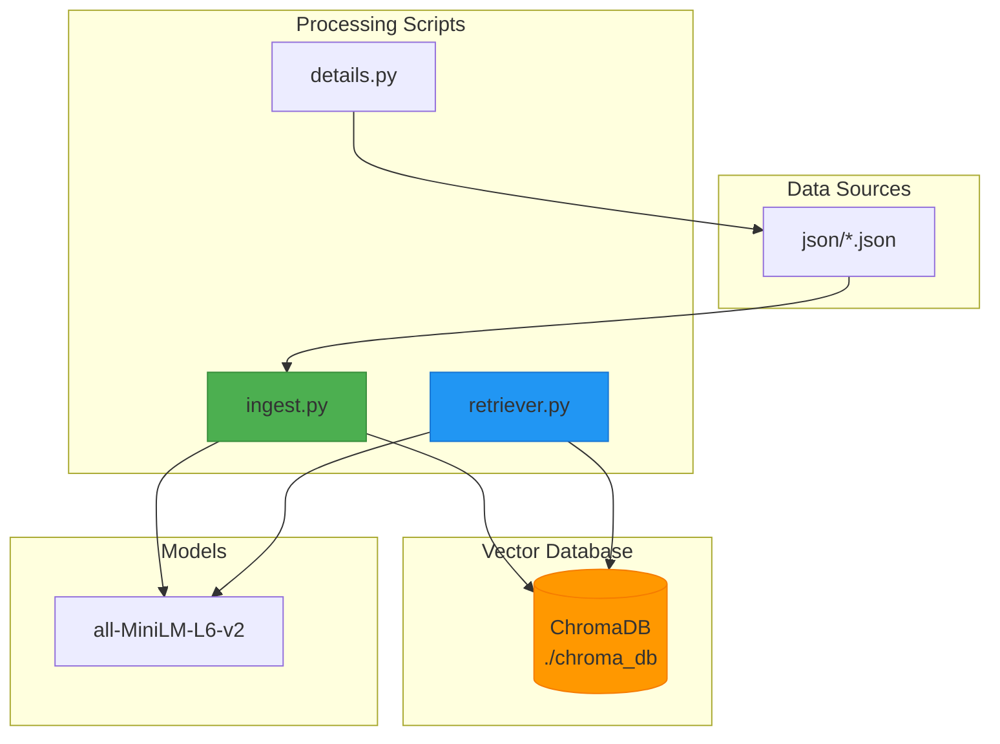
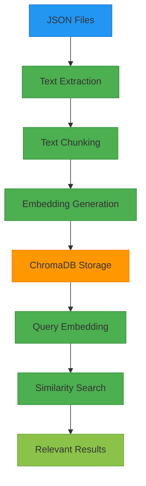
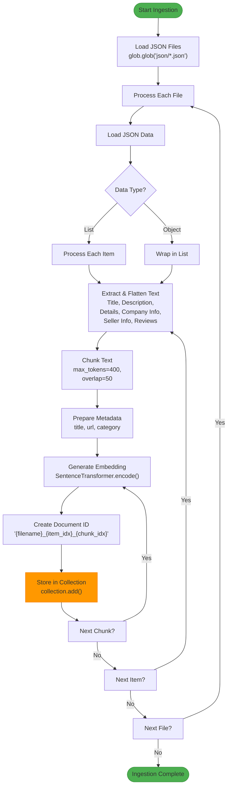
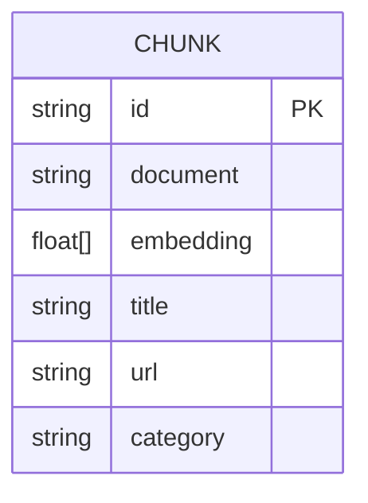
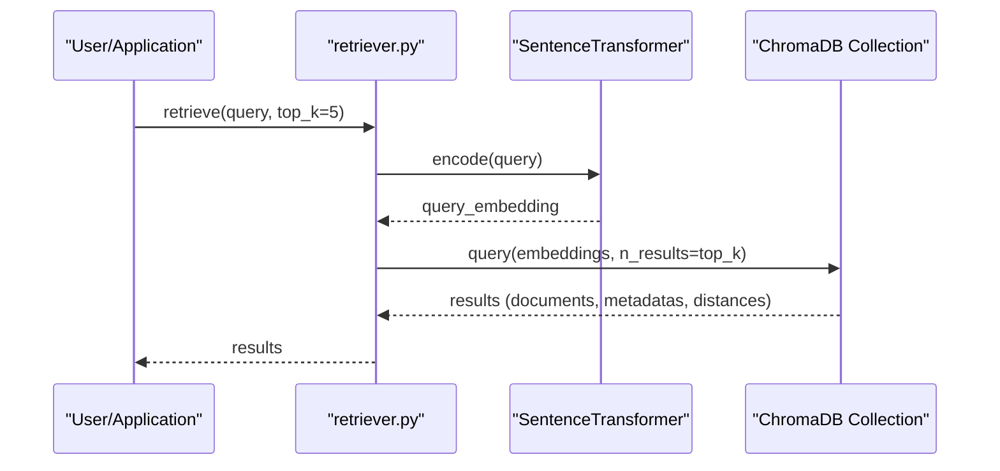
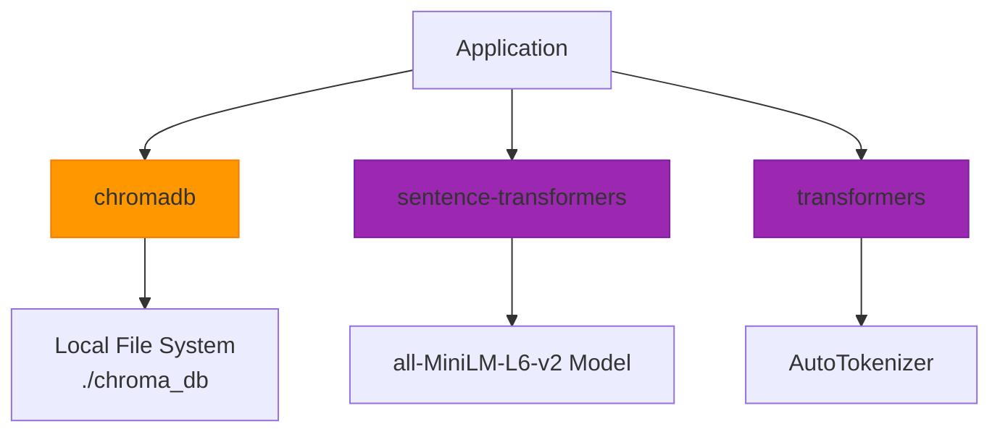

# ChromaDB Integration

<cite>
**Referenced Files in This Document**   
- [ingest.py](file://ingest.py)
- [retriever.py](file://retriever.py)
- [details.py](file://details.py)
- [requirements.txt](file://requirements.txt)
</cite>

## Table of Contents
1. [Introduction](#introduction)
2. [Project Structure](#project-structure)
3. [Core Components](#core-components)
4. [Architecture Overview](#architecture-overview)
5. [Detailed Component Analysis](#detailed-component-analysis)
6. [Dependency Analysis](#dependency-analysis)
7. [Performance Considerations](#performance-considerations)
8. [Troubleshooting Guide](#troubleshooting-guide)
9. [Conclusion](#conclusion)

## Introduction

This document provides comprehensive documentation for the integration of ChromaDB as the persistent vector database within the Retrieval-Augmented Generation (RAG) system. The system is designed to ingest product data from JSON files, process and chunk textual content, generate embeddings using the SentenceTransformer model, and store the resulting vectors in a persistent ChromaDB collection. The documentation covers the complete data model, ingestion workflow, retrieval mechanism, configuration options, and best practices for maintaining database integrity.

## Project Structure

The project structure is organized to separate data sources, processing scripts, and application components. The `json/` directory contains numerous JSON files with product information, each following a consistent schema with fields for title, description, details, company information, seller information, and reviews. The root directory contains the core processing scripts: `ingest.py` for data ingestion into ChromaDB, `retriever.py` for querying the database, and `details.py` for web scraping product details. The system uses ChromaDB with persistent storage in the `./chroma_db` directory and leverages the `all-MiniLM-L6-v2` SentenceTransformer model for embedding generation.

**Diagram sources**
- [ingest.py](file://ingest.py#L23-L24)
- [retriever.py](file://retriever.py#L4-L5)

**Section sources**
- [ingest.py](file://ingest.py#L1-L94)
- [retriever.py](file://retriever.py#L1-L18)
- [details.py](file://details.py#L1-L344)

## Core Components

The system's core functionality revolves around three main components: data ingestion, vector storage, and information retrieval. The ingestion process in `ingest.py` reads JSON files, extracts and flattens textual content, chunks long texts, generates embeddings, and stores them in ChromaDB with associated metadata. The retrieval mechanism in `retriever.py` enables querying the database using cosine similarity to find the most relevant document chunks. The system uses ChromaDB's PersistentClient to ensure data persistence across sessions, storing the vector database in the local `./chroma_db` directory.

**Section sources**
- [ingest.py](file://ingest.py#L23-L24)
- [retriever.py](file://retriever.py#L4-L5)

## Architecture Overview

The architecture follows a pipeline pattern where raw product data is transformed into searchable vector representations. The system begins with JSON files containing structured product information, which are processed by the ingestion script to create text chunks. Each chunk is converted into a vector embedding using the SentenceTransformer model and stored in ChromaDB along with its original text, metadata, and a unique identifier. During retrieval, user queries are similarly embedded and compared against the stored vectors using cosine similarity to identify the most relevant content.

**Diagram sources**
- [ingest.py](file://ingest.py#L1-L94)
- [retriever.py](file://retriever.py#L1-L18)

## Detailed Component Analysis

### Ingestion Workflow Analysis

The ingestion workflow in `ingest.py` systematically processes all JSON files in the `json/` directory, extracting relevant information and transforming it into a format suitable for vector storage. The process begins by initializing the SentenceTransformer model and tokenizer, followed by establishing a persistent connection to ChromaDB. Each JSON file is loaded and processed item by item, with text content extracted from various fields and flattened into a single string for embedding.

#### Text Processing Flowchart

**Diagram sources**
- [ingest.py](file://ingest.py#L30-L94)

**Section sources**
- [ingest.py](file://ingest.py#L30-L94)

### Data Model and Schema Design

The ChromaDB collection named 'products' follows a structured schema that stores four key components for each document chunk: the original text content, the vector embedding, metadata, and a unique identifier. This design enables efficient similarity search while preserving the context needed for downstream applications.

#### Data Model Structure

The metadata structure is designed to support filtering and contextual retrieval, containing essential fields:
- **title**: Product title from the source JSON
- **url**: Source URL for the product
- **category**: Product category extracted from details

The document ID follows a systematic pattern: `{filename}_{item_idx}_{chunk_idx}`, ensuring uniqueness across the entire dataset and enabling traceability back to the source file and position.

**Section sources**
- [ingest.py](file://ingest.py#L70-L85)

### Retrieval Mechanism Analysis

The retrieval system in `retriever.py` provides a simple yet powerful interface for querying the vector database using natural language. The system converts the query into an embedding vector and performs a similarity search against the stored vectors, returning the most relevant results based on cosine similarity.

#### Retrieval Sequence Diagram

The retrieval function supports configurable result limits through the `top_k` parameter and includes multiple result components: the original documents, associated metadata, and similarity distances. This comprehensive return structure enables applications to present results with full context and confidence scores.

**Diagram sources**
- [retriever.py](file://retriever.py#L7-L18)

**Section sources**
- [retriever.py](file://retriever.py#L7-L18)

## Dependency Analysis

The system relies on several key external dependencies that enable its core functionality. ChromaDB serves as the persistent vector database, providing efficient similarity search capabilities. The SentenceTransformer library, specifically the 'all-MiniLM-L6-v2' model, handles the conversion of text to vector embeddings. These dependencies are managed through the requirements.txt file, ensuring consistent environment setup.

**Diagram sources**
- [requirements.txt](file://requirements.txt#L28-L29)
- [ingest.py](file://ingest.py#L3-L4)
- [retriever.py](file://retriever.py#L2-L3)

**Section sources**
- [requirements.txt](file://requirements.txt#L28-L29)
- [ingest.py](file://ingest.py#L1-L94)
- [retriever.py](file://retriever.py#L1-L18)

## Performance Considerations

The system incorporates several performance optimizations to handle potentially large datasets efficiently. Text chunking with overlap ensures that long product descriptions are processed in manageable segments while preserving context across boundaries. The use of batch operations in ChromaDB (though not explicitly shown in the current implementation) could further improve ingestion performance for large datasets.

For optimal performance, consider the following recommendations:
- Process JSON files in parallel to reduce overall ingestion time
- Implement batch operations when adding multiple documents to ChromaDB
- Monitor the size of the `./chroma_db` directory and implement archival strategies for older data
- Consider indexing strategies for metadata fields used in filtering
- Cache frequently accessed embeddings to reduce redundant computation

The current implementation processes documents sequentially, which ensures data integrity but may become a bottleneck with large datasets. Future optimizations could include parallel processing of JSON files and asynchronous embedding generation.

## Troubleshooting Guide

When working with the ChromaDB integration, several common issues may arise. The system includes basic error handling for invalid JSON files in the ingestion process, but additional considerations are important for maintaining system reliability.

**Common Issues and Solutions:**
- **Database Locking**: Ensure only one process accesses the `./chroma_db` directory at a time
- **Memory Constraints**: Large JSON files or numerous chunks may exceed memory limits; consider processing files individually
- **Model Loading**: The SentenceTransformer model requires significant memory; ensure adequate system resources
- **File Path Issues**: Verify that the `json/` directory exists and contains valid JSON files
- **ChromaDB Version Compatibility**: Ensure the chromadb package version is compatible with the PersistentClient interface

The ingestion script includes error handling for JSON decoding errors, skipping invalid files and continuing with the remaining data. For production use, additional logging and monitoring would be recommended to track ingestion progress and identify problematic files.

**Section sources**
- [ingest.py](file://ingest.py#L45-L48)
- [ingest.py](file://ingest.py#L86-L88)

## Conclusion

The ChromaDB integration provides a robust foundation for the RAG system, enabling efficient storage and retrieval of product information through vector embeddings. The system's design follows best practices for data ingestion, with careful attention to text processing, metadata management, and persistent storage. The separation of concerns between ingestion and retrieval components allows for flexible deployment and scaling. By leveraging the PersistentClient, the system ensures data durability across application restarts, making it suitable for production environments. Future enhancements could include support for incremental updates, improved error handling, and performance optimizations for large-scale datasets.