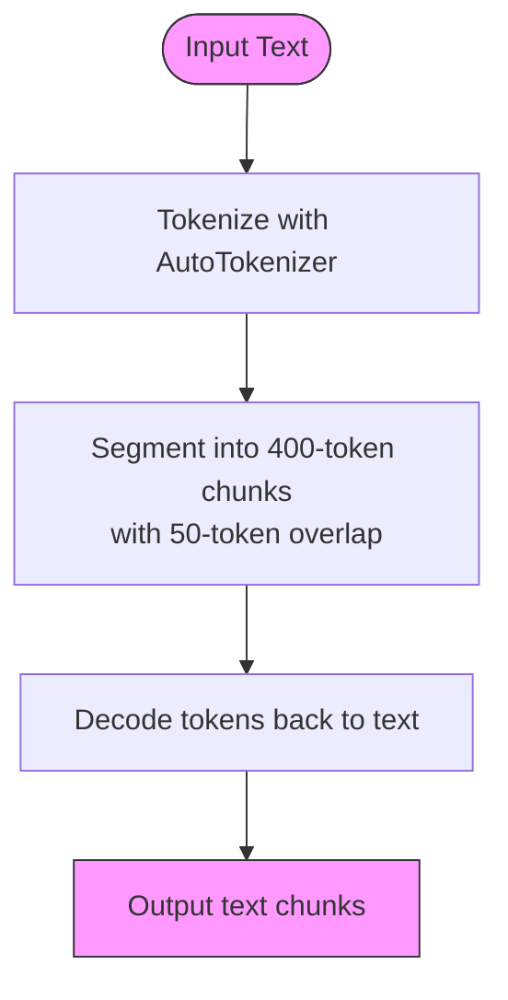
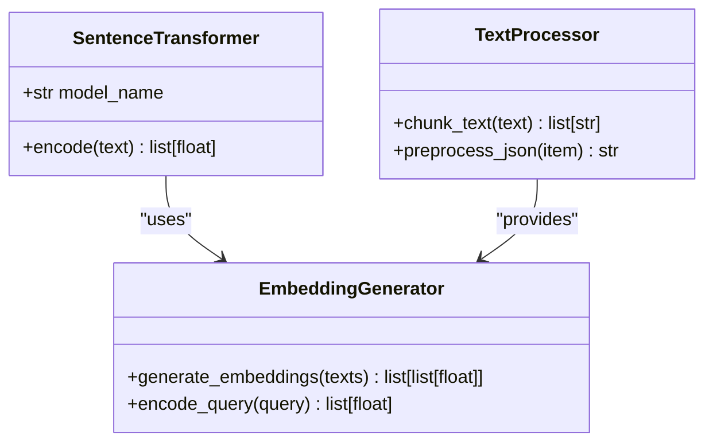
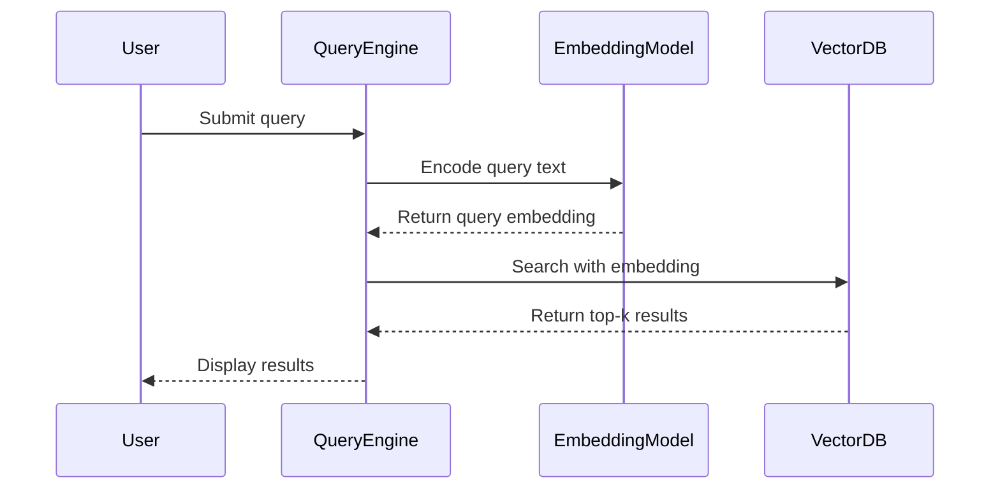

# Embedding Generation

<cite>
**Referenced Files in This Document**   
- [ingest.py](file://ingest.py)
- [seek/rag.py](file://seek/rag.py)
- [retriever.py](file://retriever.py)
- [requirements.txt](file://requirements.txt)
</cite>

## Table of Contents
1. [Introduction](#introduction)
2. [Core Components](#core-components)
3. [Text Preprocessing and Field Concatenation](#text-preprocessing-and-field-concatenation)
4. [Text Chunking with AutoTokenizer](#text-chunking-with-autotokenizer)
5. [Embedding Generation Process](#embedding-generation-process)
6. [Vector Database Integration](#vector-database-integration)
7. [Query-Time Embedding Generation](#query-time-embedding-generation)
8. [Performance Considerations](#performance-considerations)
9. [Consistency Between Indexing and Querying](#consistency-between-indexing-and-querying)
10. [Conclusion](#conclusion)

## Introduction

This document details the embedding generation process within the Retrieval-Augmented Generation (RAG) system for vendor and product data. The system leverages the Sentence Transformers model `all-MiniLM-L6-v2` to convert unstructured text data from JSON files into dense vector representations suitable for semantic search. The process involves multiple stages including text preprocessing, chunking, embedding generation, and storage in vector databases. Two distinct pipelines are implemented: one using ChromaDB for ingestion and another using FAISS for retrieval, both relying on consistent preprocessing to ensure accurate results.

**Section sources**
- [ingest.py](file://ingest.py#L1-L94)
- [seek/rag.py](file://seek/rag.py#L0-L435)

## Core Components

The embedding generation system is composed of three primary components: the ingestion pipeline (`ingest.py`), the retrieval pipeline (`seek/rag.py`), and the query interface (`retriever.py`). The ingestion pipeline processes raw JSON data, extracts relevant fields, performs text cleaning and concatenation, chunks long texts, generates embeddings, and stores them in ChromaDB. The retrieval pipeline loads the same JSON data, applies similar preprocessing, generates embeddings using FAISS for efficient similarity search, and provides a query interface. The `retriever.py` script offers a direct interface to the ChromaDB collection for retrieval operations.

**Section sources**
- [ingest.py](file://ingest.py#L1-L94)
- [seek/rag.py](file://seek/rag.py#L0-L435)
- [retriever.py](file://retriever.py#L1-L18)

## Text Preprocessing and Field Concatenation

The text preprocessing phase involves extracting and concatenating relevant fields from structured JSON data into a single text representation for embedding. Both pipelines follow a similar approach, though with slight variations in implementation. The `ingest.py` script concatenates the `title`, `description`, and key-value pairs from `details`, `company_info`, and `seller_info` fields, with special handling for `reviews` by including the top five reviews. The `seek/rag.py` implementation follows a comparable pattern, constructing text parts from title, details, description, seller info, and company info, ensuring only non-empty values are included. This field concatenation strategy ensures that all relevant product and vendor information is captured in the final text representation before embedding.

**Section sources**
- [ingest.py](file://ingest.py#L45-L70)
- [seek/rag.py](file://seek/rag.py#L132-L185)

## Text Chunking with AutoTokenizer

To handle long text documents that exceed the model's token limit, both pipelines implement a text chunking strategy using the `AutoTokenizer` from the Transformers library. The `chunk_text` function in `ingest.py` tokenizes the input text, segments it into chunks of up to 400 tokens with a 50-token overlap, and decodes the token sequences back into text. This overlap preserves context across chunk boundaries, preventing the loss of semantic information at segment edges. The tokenizer is initialized from the same `sentence-transformers/all-MiniLM-L6-v2` model used for embeddings, ensuring consistency in tokenization behavior. While `seek/rag.py` does not explicitly show a chunking function, its embedding process operates on the full document text, suggesting a different approach to handling long texts or an assumption of manageable input sizes.

**Diagram sources**
- [ingest.py](file://ingest.py#L7-L18)

**Section sources**
- [ingest.py](file://ingest.py#L7-L18)
- [requirements.txt](file://requirements.txt#L117-L167)

## Embedding Generation Process

The core of the embedding generation process utilizes the `SentenceTransformer` model `all-MiniLM-L6-v2` to convert text chunks into 384-dimensional dense vectors. In the ingestion pipeline (`ingest.py`), each text chunk is encoded individually using the `embedding_model.encode()` method, and the resulting embedding is stored in ChromaDB along with the original text and metadata. The retrieval pipeline (`seek/rag.py`) generates embeddings in batch mode using the same model, encoding all processed documents at once with `show_progress_bar=True` for monitoring. The `retriever.py` script demonstrates query-time embedding generation, encoding a single query string for similarity search against the ChromaDB collection. This dual approach—batch encoding during ingestion and single encoding at query time—optimizes performance for their respective use cases.

**Diagram sources**
- [ingest.py](file://ingest.py#L20-L23)
- [seek/rag.py](file://seek/rag.py#L10-L15)
- [retriever.py](file://retriever.py#L5-L7)

**Section sources**
- [ingest.py](file://ingest.py#L70-L94)
- [seek/rag.py](file://seek/rag.py#L98-L114)
- [retriever.py](file://retriever.py#L12-L18)

## Vector Database Integration

The embedding generation process is tightly integrated with vector database storage for efficient retrieval. The ingestion pipeline uses ChromaDB to store embeddings, documents, and metadata in a persistent collection. Each chunk is assigned a unique ID based on its source file, item index, and chunk index, ensuring traceability. The retrieval pipeline employs FAISS, a library optimized for efficient similarity search, to build an in-memory index from the generated embeddings. The `IndexFlatL2` index type is used, which performs exact search using L2 distance. This dual-database approach allows for flexible data management, with ChromaDB providing persistence and FAISS enabling high-performance querying. The integration ensures that embeddings are not only generated but also immediately available for semantic search operations.

**Section sources**
- [ingest.py](file://ingest.py#L21-L22)
- [seek/rag.py](file://seek/rag.py#L108-L114)

## Query-Time Embedding Generation

At query time, the system generates embeddings for user queries to enable semantic similarity search. The `retriever.py` script demonstrates this process, where a query string is encoded using the same `all-MiniLM-L6-v2` model to produce a query embedding. This embedding is then used to query the ChromaDB collection via cosine similarity. The `seek/rag.py` implementation follows a similar pattern in its `search` method, encoding the query and using FAISS to find the most similar documents. This real-time embedding generation ensures that queries are processed with the same model and preprocessing logic as the indexed documents, maintaining consistency in the vector space. The query embedding process is optimized for low latency, as it typically involves encoding a single, relatively short text string.

**Diagram sources**
- [retriever.py](file://retriever.py#L12-L18)
- [seek/rag.py](file://seek/rag.py#L116-L131)

**Section sources**
- [retriever.py](file://retriever.py#L12-L18)
- [seek/rag.py](file://seek/rag.py#L116-L131)

## Performance Considerations

The embedding generation process incorporates several performance optimizations to handle the dataset efficiently. The ingestion pipeline processes files sequentially, loading and processing one JSON file at a time to manage memory usage. The retrieval pipeline leverages batch encoding with `show_progress_bar=True` to monitor the embedding generation process for large document collections. GPU acceleration is implicitly supported through the underlying PyTorch and sentence-transformers libraries, though explicit device configuration is not shown in the code. The use of FAISS for similarity search provides significant performance benefits over brute-force methods, especially for large-scale datasets. Batching strategies are evident in the retrieval pipeline's use of batch encoding, while the ingestion pipeline processes chunks individually, reflecting the different performance requirements of indexing versus querying.

**Section sources**
- [ingest.py](file://ingest.py#L70-L94)
- [seek/rag.py](file://seek/rag.py#L98-L114)

## Consistency Between Indexing and Querying

Maintaining consistency between the indexing and querying phases is critical for retrieval accuracy. Both pipelines use the same `all-MiniLM-L6-v2` model for embedding generation, ensuring that texts and queries are mapped to the same vector space. The text preprocessing steps, including field concatenation and cleaning, are implemented similarly in both `ingest.py` and `seek/rag.py`, preserving the semantic structure of the data. The use of the same tokenizer for chunking in the ingestion pipeline further ensures that text segmentation is consistent with the model's expectations. This alignment between indexing and querying processes guarantees that the semantic relationships captured during ingestion are accurately reflected during retrieval, forming the foundation of the RAG system's effectiveness.

**Section sources**
- [ingest.py](file://ingest.py#L20-L23)
- [seek/rag.py](file://seek/rag.py#L10-L15)

## Conclusion

The embedding generation process in this RAG system effectively transforms structured product and vendor data into dense vector representations suitable for semantic search. By leveraging the `all-MiniLM-L6-v2` model, implementing careful text preprocessing and chunking, and integrating with efficient vector databases, the system provides a robust foundation for information retrieval. The dual-pipeline architecture, with separate ingestion and retrieval components, allows for optimized performance in both indexing and querying scenarios. The emphasis on consistency between preprocessing and embedding steps ensures accurate and reliable search results, making the system well-suited for complex vendor and product queries in the construction procurement domain.