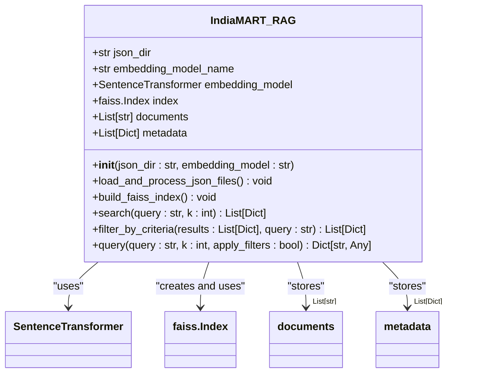
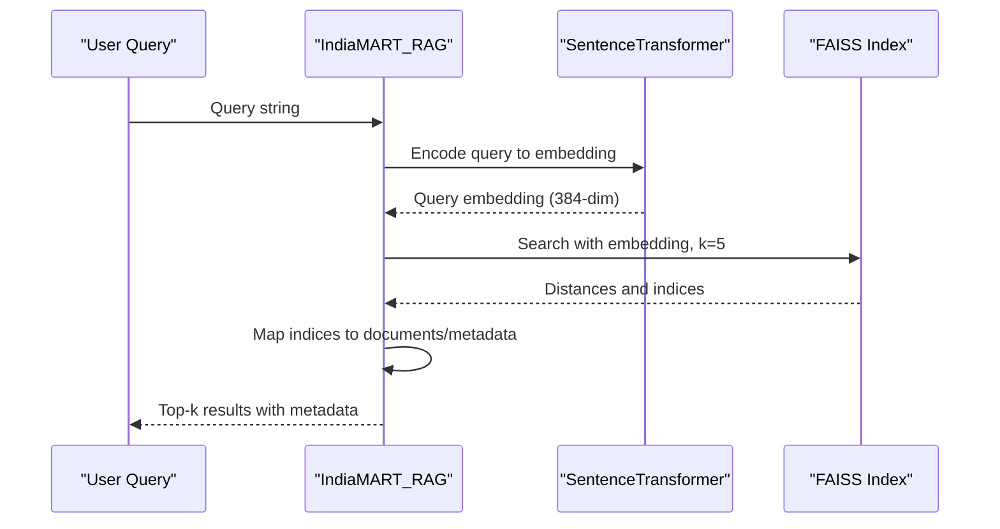
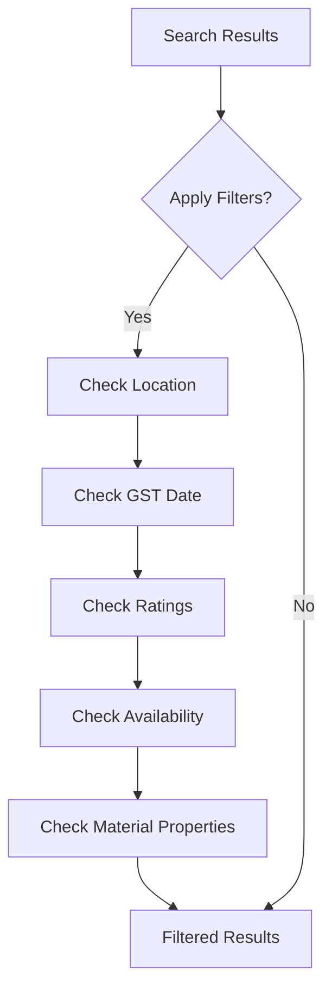

# FAISS Implementation

<cite>
**Referenced Files in This Document**   
- [seek/rag.py](file://seek/rag.py)
</cite>

## Table of Contents
1. [Introduction](#introduction)
2. [FAISS Architecture Overview](#faiss-architecture-overview)
3. [Index Initialization Process](#index-initialization-process)
4. [Search Mechanism](#search-mechanism)
5. [Data Processing Pipeline](#data-processing-pipeline)
6. [Memory Management and Performance](#memory-management-and-performance)
7. [Filtering and Post-Processing](#filtering-and-post-processing)
8. [Comparison with ChromaDB](#comparison-with-chromadb)
9. [Limitations and Considerations](#limitations-and-considerations)

## Introduction

The FAISS implementation within the IndiaMART_RAG class provides an efficient similarity search solution for construction product and vendor retrieval. This document details the architectural design, implementation specifics, and operational characteristics of the FAISS-based retrieval system, which serves as an alternative indexing solution to ChromaDB for low-latency document search in the vendor RAG model.

**Section sources**
- [seek/rag.py](file://seek/rag.py#L12-L18)

## FAISS Architecture Overview

The FAISS implementation follows a vector-based retrieval architecture where product and vendor information from IndiaMART is converted into dense vector embeddings for efficient similarity search. The system leverages the all-MiniLM-L6-v2 sentence transformer model to generate 384-dimensional embeddings for each document, which are then indexed using FAISS's IndexFlatL2 structure that employs L2 (Euclidean) distance for similarity measurement.

The architecture consists of several key components: document loading and processing, embedding generation, index construction, similarity search, and result filtering. This design enables rapid retrieval of relevant products and vendors based on semantic similarity rather than keyword matching, providing more accurate results for construction procurement queries.

**Diagram sources**
- [seek/rag.py](file://seek/rag.py#L12-L18)
- [seek/rag.py](file://seek/rag.py#L98-L114)

**Section sources**
- [seek/rag.py](file://seek/rag.py#L12-L18)
- [seek/rag.py](file://seek/rag.py#L98-L114)

## Index Initialization Process

The index initialization process begins with the `build_faiss_index()` method, which first verifies that documents have been loaded into the system. The method then generates embeddings for all processed documents using the sentence-transformers/all-MiniLM-L6-v2 model, which produces 384-dimensional vectors. These embeddings are converted to float32 data type for compatibility with FAISS and memory efficiency.

The FAISS index is created as an IndexFlatL2 structure, which stores all vectors in memory and performs exact nearest neighbor search using L2 distance. The dimensionality of the index is automatically determined from the embedding shape (384 dimensions), ensuring compatibility with the chosen embedding model. All document embeddings are added to the index in a single batch operation, making the index ready for subsequent search operations.

**Section sources**
- [seek/rag.py](file://seek/rag.py#L98-L114)

## Search Mechanism

The search mechanism is implemented in the `search()` method, which follows a standard vector retrieval pattern. When a query is received, it is first converted into an embedding using the same sentence transformer model employed during index construction. This ensures consistency between query and document representations in the vector space.

The query embedding is then used to search the FAISS index for the k-nearest neighbors, with similarity measured by L2 distance (lower distance indicates higher similarity). The search returns both the distance scores and the indices of the matching documents, which are then mapped to their corresponding metadata. Results are returned as a list of dictionaries containing the original document text, associated metadata, and the distance score, enabling downstream processing and filtering.

**Diagram sources**
- [seek/rag.py](file://seek/rag.py#L116-L140)

**Section sources**
- [seek/rag.py](file://seek/rag.py#L116-L140)

## Data Processing Pipeline

The data processing pipeline begins with loading JSON files from the designated directory, which contain product and vendor information scraped from IndiaMART. Each JSON item is processed to create a comprehensive text representation by concatenating the title, details, description, seller information, and company information fields. This unified text representation ensures that all relevant information contributes to the document's embedding.

During processing, empty or irrelevant fields are filtered out to maintain data quality. The processed text is stored in the `documents` list, while the original structured data is preserved in the `metadata` list for retrieval and presentation. This separation allows the system to perform semantic search on the text content while maintaining access to the structured metadata for result formatting and filtering.

**Section sources**
- [seek/rag.py](file://seek/rag.py#L20-L96)

## Memory Management and Performance

The FAISS implementation is entirely in-memory, storing both the index and all document data in RAM. This design choice enables extremely low-latency search operations, as queries can be processed without disk I/O overhead. The embeddings are stored as float32 arrays, which balances precision with memory efficiency.

The system's memory usage scales linearly with the number of documents and their embedding dimensionality (384 dimensions). For large datasets, this can result in significant memory consumption, as each document requires approximately 1.5KB for its embedding (384 dimensions × 4 bytes per float32). The current implementation does not include persistence mechanisms, meaning the index must be rebuilt on each application restart, trading startup time for query performance.

**Section sources**
- [seek/rag.py](file://seek/rag.py#L12-L18)
- [seek/rag.py](file://seek/rag.py#L98-L114)

## Filtering and Post-Processing

While FAISS provides efficient similarity search, it lacks native support for metadata filtering. To address this limitation, the implementation includes a post-processing step through the `filter_by_criteria()` method, which applies additional filters to the search results based on query requirements.

This method implements several domain-specific filters for construction procurement, including location (e.g., "in Navi Mumbai"), GST registration date (e.g., "GST after 2017"), vendor ratings (e.g., "high rating"), product availability (e.g., "available in stock"), and material properties (e.g., "fire retardant"). These filters are applied by examining the metadata of each search result and retaining only those that match the specified criteria, effectively combining semantic search with structured data filtering.

**Diagram sources**
- [seek/rag.py](file://seek/rag.py#L142-L205)

**Section sources**
- [seek/rag.py](file://seek/rag.py#L142-L205)

## Comparison with ChromaDB

The FAISS implementation differs significantly from a ChromaDB approach in several key aspects. Unlike ChromaDB, which provides built-in persistence, metadata filtering, and a complete database-like interface, this FAISS implementation is standalone and operates entirely in memory without persistence capabilities.

FAISS excels in raw search performance, particularly for exact nearest neighbor search on moderate-sized datasets, while ChromaDB offers more comprehensive features including incremental indexing, metadata-based querying, and persistent storage. The current implementation compensates for FAISS's lack of metadata filtering by implementing custom post-processing logic, whereas ChromaDB would handle such filtering natively within the database layer.

The choice of FAISS reflects a performance-oriented design prioritizing low-latency search over data management features, making it suitable for applications where query speed is paramount and the dataset can fit comfortably in memory.

**Section sources**
- [seek/rag.py](file://seek/rag.py#L98-L114)
- [seek/rag.py](file://seek/rag.py#L142-L205)

## Limitations and Considerations

The current FAISS implementation has several notable limitations. The most significant is the lack of persistence, requiring the entire index to be rebuilt on each application startup, which can be time-consuming for large datasets. Additionally, the in-memory nature limits scalability, as the system's memory requirements grow linearly with the dataset size.

The implementation does not support incremental updates, meaning any changes to the underlying data require complete index reconstruction. Metadata filtering is implemented externally to FAISS, which can impact performance as all potentially relevant documents must be retrieved before filtering. For very large datasets, approximate nearest neighbor methods might be more appropriate than the exact search provided by IndexFlatL2, though this would introduce potential accuracy trade-offs.

Despite these limitations, the implementation effectively serves its purpose for the current use case, providing fast and accurate retrieval of construction products and vendors from the IndiaMART dataset with sophisticated post-processing to meet domain-specific requirements.

**Section sources**
- [seek/rag.py](file://seek/rag.py#L98-L114)
- [seek/rag.py](file://seek/rag.py#L142-L205)