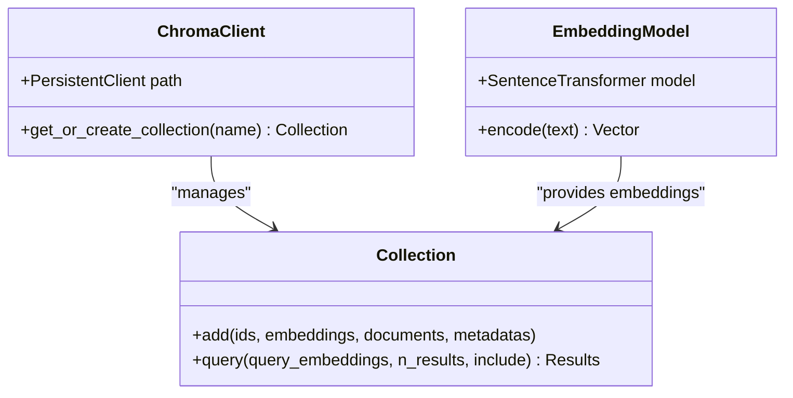
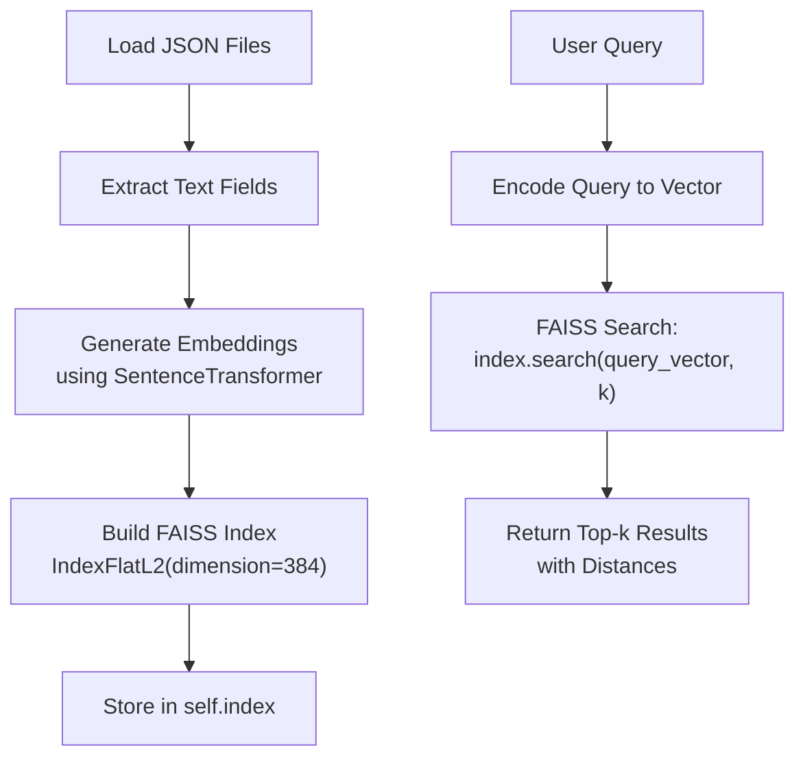
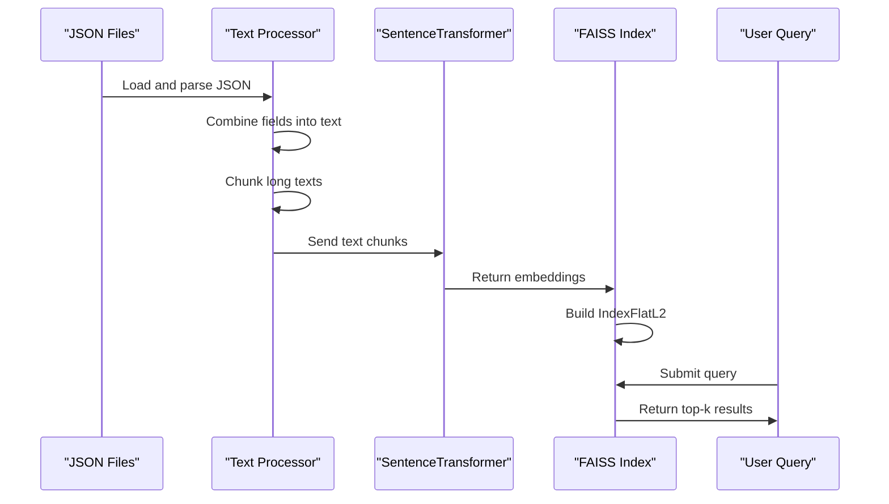

# Vector Database & Indexing

<cite>
**Referenced Files in This Document**   
- [ingest.py](file://ingest.py)
- [retriever.py](file://retriever.py)
- [seek/rag.py](file://seek/rag.py)
</cite>

## Table of Contents
1. [Vector Database & Indexing](#vector-database--indexing)
2. [Embedding Generation with Sentence Transformers](#embedding-generation-with-sentence-transformers)
3. [ChromaDB for Persistent Vector Storage](#chromadb-for-persistent-vector-storage)
4. [FAISS for Efficient Similarity Search](#faiss-for-efficient-similarity-search)
5. [Hybrid Indexing Approach: ChromaDB and FAISS](#hybrid-indexing-approach-chromadb-and-faiss)
6. [Index Creation Workflow](#index-creation-workflow)
7. [Configuration Options and Storage Requirements](#configuration-options-and-storage-requirements)
8. [Best Practices for Index Quality](#best-practices-for-index-quality)

## Embedding Generation with Sentence Transformers

The system uses the `all-MiniLM-L6-v2` Sentence Transformer model to generate dense vector embeddings from product and vendor data. This model converts unstructured text into 384-dimensional vectors that capture semantic meaning, enabling similarity-based retrieval. Text is extracted from JSON files containing product titles, descriptions, details, seller information, company information, and reviews. Before embedding, long texts are chunked using a sliding window approach with overlap to preserve context across segments. Each chunk is independently encoded into a vector representation.

**Section sources**
- [ingest.py](file://ingest.py#L7-L18)
- [seek/rag.py](file://seek/rag.py#L34-L69)

## ChromaDB for Persistent Vector Storage

ChromaDB serves as the primary persistent vector database for storing embedded product data. It is initialized in `ingest.py` using `PersistentClient` with a local storage path (`./chroma_db`). The system creates or retrieves a collection named "products" where each document is stored with its embedding, metadata, and unique identifier. Metadata includes the product title, URL, and category, enabling filtering during retrieval. Documents are added in batches per JSON file, with each text chunk receiving a unique ID derived from the source file, item index, and chunk index. ChromaDB supports cosine similarity search through its query interface, which is used by the `retriever.py` module to fetch top-k relevant documents based on a query embedding.

**Diagram sources**
- [ingest.py](file://ingest.py#L15-L25)
- [retriever.py](file://retriever.py#L3-L10)

**Section sources**
- [ingest.py](file://ingest.py#L15-L94)
- [retriever.py](file://retriever.py#L3-L18)

## FAISS for Efficient Similarity Search

FAISS (Facebook AI Similarity Search) is used within the `seek/rag.py` module to enable fast and efficient similarity search over high-dimensional vectors. Unlike ChromaDB, which provides persistence, FAISS is used in-memory for optimized search performance. The system builds an `IndexFlatL2` index, which computes exact L2 (Euclidean) distances between vectors. The dimensionality of the index is automatically determined from the embedding model output (384 dimensions for `all-MiniLM-L6-v2`). During indexing, all document embeddings are generated in batch and added to the FAISS index. At query time, the system encodes the query into a vector and performs a k-nearest neighbors search to retrieve the most similar documents based on vector distance.

**Diagram sources**
- [seek/rag.py](file://seek/rag.py#L95-L131)

**Section sources**
- [seek/rag.py](file://seek/rag.py#L95-L131)

## Hybrid Indexing Approach: ChromaDB and FAISS

The system employs a hybrid indexing strategy using both ChromaDB and FAISS, each serving distinct roles. ChromaDB is used for persistent storage and basic retrieval in the main ingestion and retrieval pipeline (`ingest.py` and `retriever.py`), ensuring data durability and consistency. FAISS, on the other hand, is used in a separate experimental module (`seek/rag.py`) for high-performance similarity search with additional filtering capabilities. This dual approach allows the system to balance persistence and speed: ChromaDB handles long-term storage and standard queries, while FAISS enables rapid prototyping and complex filtering logic (e.g., location, GST registration date, rating) on top of vector search results. The two systems are independent, with FAISS loading all documents into memory at runtime rather than syncing with ChromaDB.

**Section sources**
- [ingest.py](file://ingest.py#L15-L25)
- [seek/rag.py](file://seek/rag.py#L11-L409)

## Index Creation Workflow

The index creation workflow begins with loading JSON files from the `json/` directory. Each file is parsed, and product entries are processed into a unified text format combining title, description, details, seller info, company info, and reviews. Long texts are chunked into smaller segments (max 400 tokens) with 50-token overlap to maintain context. Each chunk is then embedded using the Sentence Transformer model. In the ChromaDB pipeline, embeddings are immediately stored with metadata. In the FAISS pipeline, all embeddings are collected in memory before building the index. The FAISS index is constructed using `IndexFlatL2`, which supports exact nearest neighbor search. After indexing, the system is ready to handle queries with low-latency vector similarity search.

**Diagram sources**
- [ingest.py](file://ingest.py#L40-L94)
- [seek/rag.py](file://seek/rag.py#L34-L131)

**Section sources**
- [ingest.py](file://ingest.py#L40-L94)
- [seek/rag.py](file://seek/rag.py#L34-L131)

## Configuration Options and Storage Requirements

The system uses several configurable parameters to control indexing behavior. The embedding model is fixed to `all-MiniLM-L6-v2`, producing 384-dimensional vectors. Text is chunked with a maximum of 400 tokens per chunk and 50-token overlap. ChromaDB stores data persistently in the `./chroma_db` directory, while FAISS keeps the entire index in memory. The FAISS index uses L2 distance for similarity search, though cosine similarity could be implemented via normalization. Storage requirements depend on the number of products and text length; each 384-dimensional vector requires approximately 1.5KB of storage (as float32). For thousands of products with multiple chunks each, storage can range from hundreds of MB to several GB. The system does not currently support dimensionality reduction techniques to optimize storage.

**Section sources**
- [ingest.py](file://ingest.py#L15-L25)
- [seek/rag.py](file://seek/rag.py#L11-L20)

## Best Practices for Index Quality

To maintain high index quality, the system follows several best practices. Text preprocessing ensures that only meaningful content is embedded, filtering out empty or placeholder values. Chunking with overlap preserves context across document boundaries, reducing the risk of splitting important information. The use of a well-established Sentence Transformer model ensures high-quality semantic embeddings. Metadata is stored alongside embeddings to enable post-retrieval filtering and rich result presentation. In the FAISS implementation, additional query-time filtering is applied to enforce criteria like location, GST registration date, and product availability. Regular ingestion of updated JSON files would allow the index to stay current, though no automated refresh mechanism is currently implemented. For optimal performance, the system should periodically re-index to remove duplicates and update outdated information.

**Section sources**
- [ingest.py](file://ingest.py#L70-L94)
- [seek/rag.py](file://seek/rag.py#L132-L158)