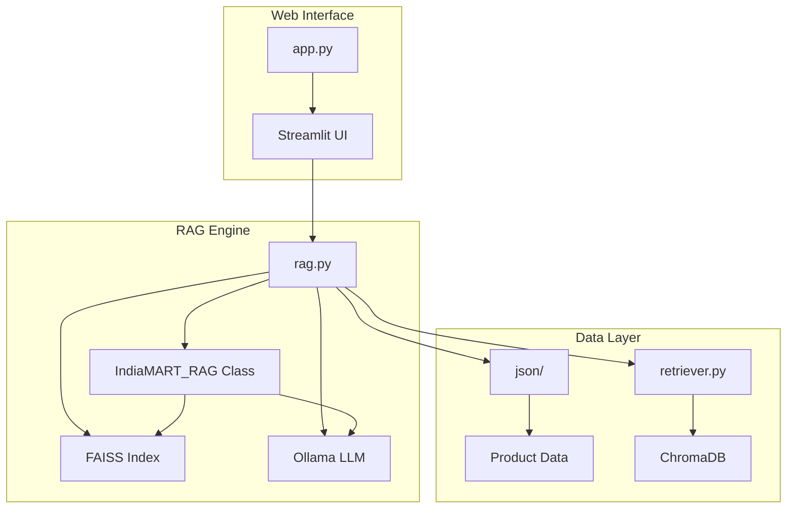
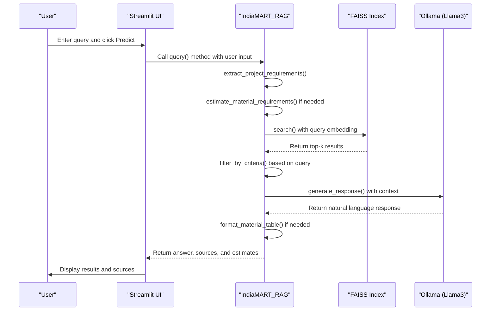
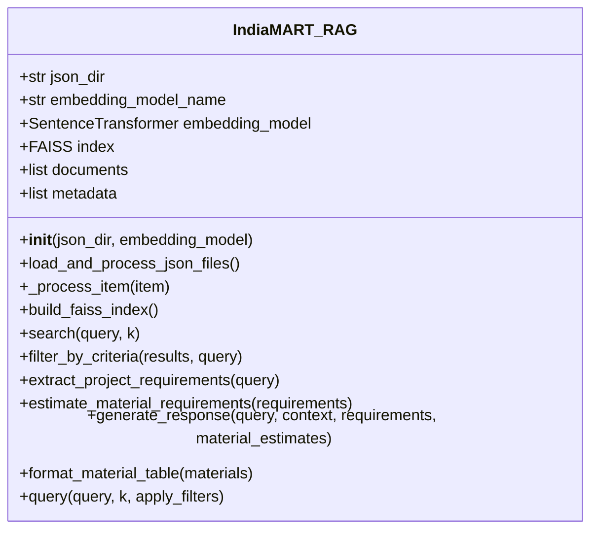
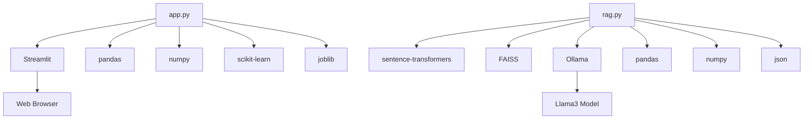

# Web Interface

<cite>
**Referenced Files in This Document**   
- [app.py](file://seek/app.py)
- [rag.py](file://seek/rag.py)
</cite>

## Table of Contents
1. [Introduction](#introduction)
2. [Project Structure](#project-structure)
3. [Core Components](#core-components)
4. [Architecture Overview](#architecture-overview)
5. [Detailed Component Analysis](#detailed-component-analysis)
6. [Dependency Analysis](#dependency-analysis)
7. [Performance Considerations](#performance-considerations)
8. [Troubleshooting Guide](#troubleshooting-guide)
9. [Conclusion](#conclusion)

## Introduction
The Streamlit web interface provides a user-friendly frontend for interacting with a Retrieval-Augmented Generation (RAG) system designed for construction procurement. The application enables users to input project specifications and receive intelligent responses that include product recommendations, vendor details, and material cost estimates. Built using Streamlit, the interface connects to a backend RAG engine that leverages FAISS for similarity search and Ollama with the Llama3 model for natural language response generation. The system is specifically tailored for construction material procurement from IndiaMART, with capabilities to extract project requirements, filter vendors based on criteria like location and ratings, and generate detailed material estimation tables.

## Project Structure
The project follows a modular structure with distinct components for data processing, retrieval, and web interface. The main application files are located in the `seek` directory, with `app.py` serving as the Streamlit frontend and `rag.py` containing the core RAG engine implementation. The JSON directory contains product data scraped from IndiaMART, organized by product category. Supporting scripts handle data ingestion, scraping, and retrieval functionality. The architecture separates concerns between data collection (`details.py`, `link-scrap.py`), vector storage and retrieval (`retriever.py`, `ingest.py`), and the user interface layer (`seek/app.py`), creating a clean separation between frontend presentation and backend processing.

**Diagram sources**
- [app.py](file://seek/app.py)
- [rag.py](file://seek/rag.py)

**Section sources**
- [app.py](file://seek/app.py)
- [rag.py](file://seek/rag.py)

## Core Components
The core components of the web interface include the Streamlit application (`app.py`) and the RAG engine (`rag.py`). The Streamlit app handles user input collection, form validation, and result presentation, while the RAG engine processes queries, performs similarity searches, applies filters based on user criteria, and generates natural language responses. The system integrates machine learning models for both classification and regression tasks, with deterministic mapping as a fallback for MasterItemNo prediction. Key functionality includes project requirement extraction from natural language queries, material estimation based on project specifications, and source attribution for all retrieved information.

**Section sources**
- [app.py](file://seek/app.py#L1-L110)
- [rag.py](file://seek/rag.py#L1-L435)

## Architecture Overview
The architecture follows a client-server model where the Streamlit application acts as the client interface to a RAG-based backend system. When a user submits a query, the interface captures the input and passes it to the RAG engine, which processes the request through several stages: requirement extraction, document retrieval, filtering, response generation, and result formatting. The system uses FAISS for efficient similarity search across embedded product data, with filtering applied based on criteria extracted from the query. The final response is generated by the Llama3 language model via Ollama, incorporating both retrieved context and material estimates when applicable. The architecture supports asynchronous operations through Streamlit's execution model and provides proper attribution by including source URLs in the response.

**Diagram sources**
- [app.py](file://seek/app.py#L64-L100)
- [rag.py](file://seek/rag.py#L372-L409)

## Detailed Component Analysis

### Streamlit UI Component
The Streamlit UI component provides a simple form-based interface for users to input project details and receive predictions. It includes text inputs for project location, select boxes for market and project type, number inputs for building size and floor count, and a predict button to initiate processing. The interface uses Streamlit's caching mechanism (`@st.cache_resource`) to efficiently load machine learning models and preprocessors, improving performance across sessions. Error handling is implemented to ensure required fields are filled before processing, and results are displayed in a clear format with markdown styling.

**Section sources**
- [app.py](file://seek/app.py#L55-L100)

### RAG Engine Component
The RAG engine is implemented as the `IndiaMART_RAG` class in `rag.py`, providing comprehensive functionality for construction procurement queries. The engine extracts project requirements such as power capacity, built-up area, and project volume from natural language queries using regular expressions. It searches a FAISS index of product embeddings, applies filters for criteria like location, GST registration date, ratings, availability, and fire retardant properties, then generates responses using the Llama3 language model. The system also estimates material requirements based on project specifications and formats them in a markdown table for display.

**Diagram sources**
- [rag.py](file://seek/rag.py#L11-L409)

## Dependency Analysis
The web interface has several key dependencies that enable its functionality. Streamlit provides the web interface framework, while pandas and numpy support data manipulation. The system relies on scikit-learn for preprocessing and machine learning models, joblib for model persistence, and sentence-transformers for generating text embeddings. FAISS enables efficient similarity search, and Ollama provides access to the Llama3 language model for response generation. The architecture shows tight coupling between the UI and RAG components, with the Streamlit app directly instantiating and calling methods on the RAG engine. External dependencies are well-managed through clear interfaces, allowing for potential replacement of components like the vector database or LLM provider.

**Diagram sources**
- [app.py](file://seek/app.py#L1-L10)
- [rag.py](file://seek/rag.py#L1-L10)

## Performance Considerations
The application implements several performance optimizations to ensure responsive user experience. Streamlit's `@st.cache_resource` decorator caches expensive resources like machine learning models and preprocessors, preventing reloading on each interaction. The FAISS index provides efficient similarity search with O(log n) complexity, enabling fast retrieval from the product database. Text embeddings are precomputed during index building, reducing query-time processing. The system limits search results to a configurable number (k parameter) to balance comprehensiveness with performance. For material estimation, calculations use simple arithmetic based on construction norms, ensuring instant response times. The architecture could benefit from additional optimizations such as query result caching and asynchronous processing for long-running operations.

**Section sources**
- [app.py](file://seek/app.py#L20-L31)
- [rag.py](file://seek/rag.py#L85-L95)

## Troubleshooting Guide
Common issues with the web interface typically relate to missing dependencies or data files. Ensure all required Python packages are installed via requirements.txt, and verify that the `json` directory contains the necessary product data files. The application requires pre-trained machine learning models (`lgb_classifier.pkl`, `lgb_regressor.pkl`, etc.) to be present in the working directory. If the RAG engine fails to initialize, check that the JSON data directory path is correctly configured and that all JSON files are valid. For Ollama integration issues, verify that the Ollama server is running and accessible. When debugging, examine the console output for error messages related to file loading, model initialization, or API connectivity. The deterministic mapping functionality depends on the presence of `deterministic_mapping.pkl`, which should be generated from training data.

**Section sources**
- [app.py](file://seek/app.py#L22-L30)
- [rag.py](file://seek/rag.py#L13-L15)

## Conclusion
The Streamlit web interface provides an effective frontend for a specialized RAG system targeting construction procurement. By combining form-based input with natural language query capabilities, the interface accommodates different user preferences and use cases. The integration with the RAG engine enables sophisticated functionality including requirement extraction, vendor filtering, and material estimation, all presented through a simple and intuitive interface. The system demonstrates a practical application of retrieval-augmented generation in a domain-specific context, providing users with actionable information supported by verifiable sources. Future enhancements could include improved error handling, enhanced UI customization options, and expanded material estimation capabilities.